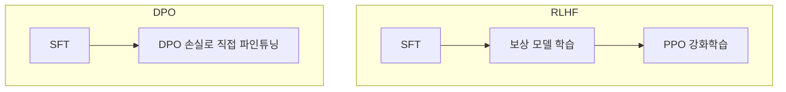

# Direct Preference Optimization: Your Language Model is Secretly a Reward Model (Rafailov et al., 2023)

## 핵심 기여

Stanford의 Rafailov 등이 2023년 발표한 DPO(Direct Preference Optimization)는 RLHF의 복잡한 3단계 파이프라인에서 **별도의 보상 모델(reward model)과 PPO 강화학습을 제거**하고, 선호도 데이터로부터 직접 언어 모델을 최적화하는 단순하고 안정적인 알고리즘을 제안했다. RLHF의 최적 정책과 보상 함수 사이의 닫힌 형태(closed-form) 관계를 수학적으로 도출한 것이 핵심.

## 방법

### 핵심 수학적 통찰

RLHF의 KL-정규화 목표 함수의 최적해는 다음과 같이 표현 가능:

$$r^*(x, y) = \beta \log \frac{\pi^*(y|x)}{\pi_{ref}(y|x)} + \beta \log Z(x)$$

여기서 $Z(x)$는 분배 함수(partition function)다. 이를 Bradley-Terry 선호도 모델에 대입하면 명시적 보상 모델 없이 바로 정책 $\pi_\theta$를 학습하는 손실 함수 도출:

$$\mathcal{L}_{DPO}(\pi_\theta; \pi_{ref}) = -\mathbb{E}_{(x, y_w, y_l)}\left[\log \sigma\left(\beta \log \frac{\pi_\theta(y_w|x)}{\pi_{ref}(y_w|x)} - \beta \log \frac{\pi_\theta(y_l|x)}{\pi_{ref}(y_l|x)}\right)\right]$$

- $y_w$: 선호(winning) 응답
- $y_l$: 비선호(losing) 응답
- $\beta$: KL 제약 강도 (높을수록 참조 모델에 가깝게 유지)

### 파이프라인 비교

## 결과 및 영향

- 감정 제어(sentiment control), 요약, 대화 등 태스크에서 PPO 기반 RLHF와 동등하거나 우수한 성능
- 학습 안정성 대폭 향상 (PPO의 불안정한 강화학습 루프 제거)
- 구현 단순화: 단일 GPU에서도 실용적 실험 가능
- Llama, Mistral, Qwen 등 오픈소스 모델의 지시 파인튜닝(instruction fine-tuning)에 사실상 표준으로 채택됨

## 한계

- 선호도 데이터(`(prompt, chosen, rejected)` 쌍)의 품질에 극도로 민감
- 참조 모델(reference model, $\pi_{ref}$)을 메모리에 상주시켜야 해 VRAM 2배 요구
- 분포 이탈(out-of-distribution) 응답에 대한 보상 과대추정(reward over-optimization) 문제
- RLHF의 온라인(online) 피드백 수집 능력이 없어 정적 데이터셋에만 의존
- 후속 연구(SimPO, ORPO 등)가 DPO의 단점을 개선 중

## 실무 적용 관점

- `beta` 파라미터: 0.1~0.5 범위가 일반적. 너무 낮으면 참조 모델에서 너무 멀어짐, 너무 높으면 학습이 거의 안 됨
- 선호도 데이터 수집 전략이 결과를 결정 - GPT-4 judge 방식이나 인간 비교 주석 모두 사용됨
- TRL(Transformers Reinforcement Learning) 라이브러리가 DPO를 공식 지원해 실습 진입장벽 낮음
- 온라인 DPO 변형(RLHF 루프와 결합)도 연구 중 - 정적 데이터 의존성 해소

## 관련 문서

- [[InstructGPT RLHF 파이프라인]]
- [[RLHF 인간 선호도 강화학습 원논문 (Christiano et al.)]]
- [[kl-divergence]]
- [[Constitutional AI (Anthropic)]]
