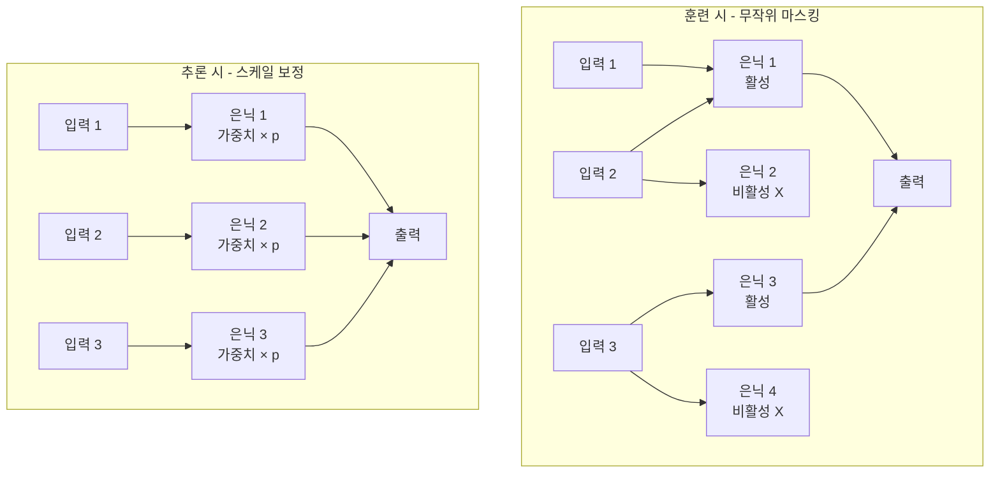
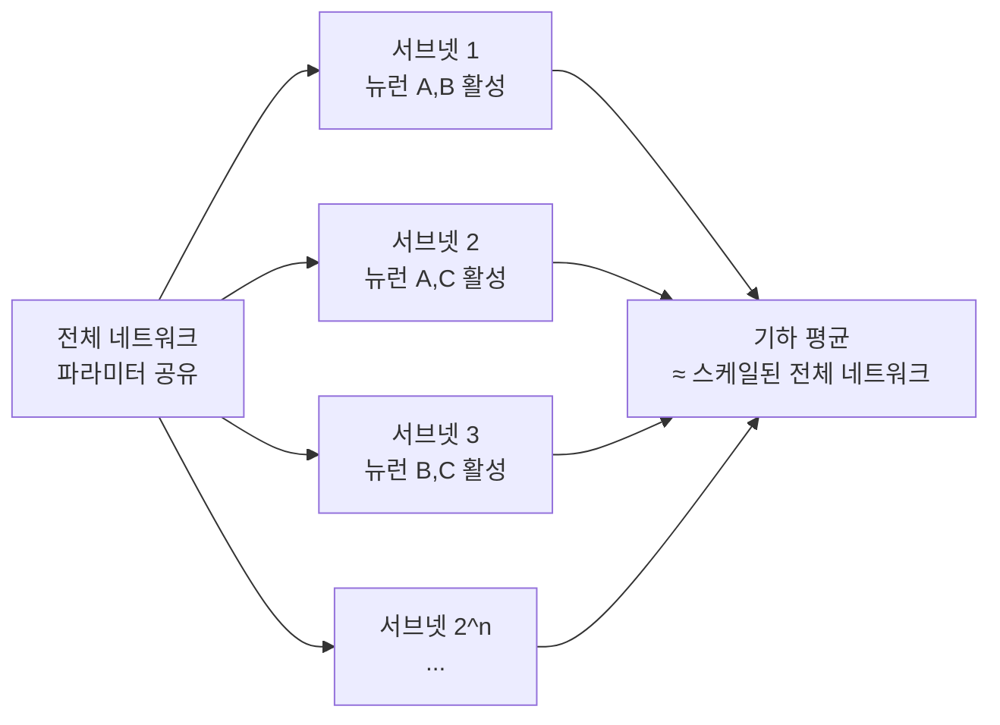

# Dropout 원논문: 신경망의 과적합 방지를 위한 단순하지만 효과적인 방법

## 메타데이터

| 항목 | 내용 |
|------|------|
| 제목 | Dropout: A Simple Way to Prevent Neural Networks from Overfitting |
| 저자 | Nitish Srivastava, Geoffrey Hinton, Alex Krizhevsky, Ilya Sutskever, Ruslan Salakhutdinov |
| 소속 | University of Toronto |
| 학회/저널 | Journal of Machine Learning Research (JMLR), 2014 |
| 권호 | Vol. 15, pp. 1929-1958 |
| 인용 수 | 약 4만+ (2026 기준) |

## 핵심 기여

- **Dropout 기법 제안**: 훈련 시 각 뉴런을 확률 $p$로 무작위 비활성화(drop)하여 과적합 방지
- **앙상블 해석 제시**: Dropout을 $2^n$개의 부분 네트워크(sub-network)를 동시에 훈련하는 효율적 앙상블로 이론화
- **공동 적응(co-adaptation) 억제**: 특정 뉴런 조합이 함께 동작하는 패턴을 무작위로 파괴하여 더 강건한 표현 학습 유도
- **다양한 도메인 검증**: MNIST, CIFAR-10, ImageNet, 음성 인식, 텍스트, 유전체 데이터까지 일관된 성능 향상 시연

## 배경 및 문제 정의

### 과적합의 구조적 원인

신경망의 표현력은 파라미터 수가 많을수록 증가한다. 그러나 같은 이유로 과적합(overfitting) 위험도 증가한다. 특히 훈련 데이터가 적을 때 네트워크는 데이터의 실제 패턴이 아닌 노이즈를 암기한다.

Hinton은 2012년 금융 사기 탐지 관련 인터뷰에서 아이디어를 착안했다고 밝혔다:
> "은행들이 직원 간 공모를 방지하기 위해 무작위로 직원들을 순환 배치한다. 신경망도 뉴런들이 서로 공모하지 못하도록 무작위로 비활성화하면 어떨까?"

### 기존 정규화의 한계

- **L1/L2 정규화**: 파라미터 크기를 제한하지만, 표현 용량 자체는 감소
- **조기 종료(Early Stopping)**: 일반화 오류 최솟값을 정확히 찾기 어려움
- **데이터 증강**: 도메인 지식이 필요하고 모든 문제에 적용 불가
- **앙상블**: 복수의 모델 훈련이 필요해 계산 비용이 $k$배 증가

Dropout은 이 모두를 단일 모델 훈련 비용으로 달성한다.

## 방법

### 기본 메커니즘

각 훈련 스텝에서 각 뉴런(입력 레이어 포함)을 확률 $1-p$로 일시 비활성화한다.

훈련 시:
$\tilde{y}_i = m_i \cdot y_i, \quad m_i \sim \text{Bernoulli}(p)$

여기서 $m_i \in \{0, 1\}$은 마스크, $p$는 뉴런 유지 확률이다. 일반적으로:
- 은닉층: $p = 0.5$
- 입력층: $p = 0.8 \sim 1.0$



### 추론 시 가중치 스케일링

훈련 시 각 뉴런은 평균적으로 $p$ 확률로 활성화된다. 추론 시 모든 뉴런을 사용하므로, 기대값을 맞추기 위해 가중치에 $p$를 곱한다.

$w_{test} = p \cdot w_{train}$

**역 드롭아웃(Inverted Dropout)**: 현대 구현에서는 훈련 시 활성화 값을 $1/p$로 나누어 추론 시 스케일 조정 없이도 동일한 기대값을 유지한다. 이것이 PyTorch, TensorFlow의 기본 구현이다.

```python
import torch
import torch.nn as nn

class ManualDropout(nn.Module):
    """역 드롭아웃 직접 구현 (교육 목적)"""

    def __init__(self, p: float = 0.5):
        super().__init__()
        if not 0 <= p <= 1:
            raise ValueError(f"드롭아웃 확률은 0~1 사이여야 함: {p}")
        self.p = p

    def forward(self, x: torch.Tensor) -> torch.Tensor:
        if not self.training or self.p == 0:
            return x
        # 역 드롭아웃: 마스크 생성 후 1/(1-p)로 스케일
        keep_prob = 1 - self.p
        mask = torch.bernoulli(torch.full_like(x, keep_prob))
        return mask * x / keep_prob  # 기대값 보존
```

### 앙상블 해석

$n$개의 뉴런이 있는 네트워크에서 드롭아웃은 $2^n$가지 가능한 서브네트워크를 암묵적으로 훈련한다. 각 서브네트워크는 파라미터를 공유하므로 개별 모델 훈련 비용 없이 앙상블 효과를 얻는다.

추론 시 전체 네트워크에 $p$ 스케일을 적용하는 것은 모든 $2^n$개 서브네트워크 예측의 기하 평균을 근사하는 것으로 해석된다.



### 공동 적응 억제

드롭아웃 없이 훈련하면 뉴런들이 특정 조합(co-adaptation)으로 함께 동작하도록 특화된다. 예를 들어 뉴런 A가 특정 패턴을 감지하면 항상 뉴런 B가 그것을 증폭하는 방식이다. 이런 공동 의존성은 특정 훈련 샘플에만 유효한 취약한 특성이다.

무작위 비활성화는 어떤 뉴런이 같이 있을지 보장할 수 없게 만들어, 각 뉴런이 다른 뉴런에 독립적으로도 유용한 표현을 학습하도록 강제한다.

## 실험 및 결과

### 주요 데이터셋 성능

| 데이터셋 | Dropout 없음 | Dropout 적용 | 개선 |
|---------|-----------|------------|------|
| MNIST | 160 오류 | 110 오류 | -31% |
| CIFAR-10 | 12.61% 오류 | 11.68% 오류 | -7% |
| SVHN (거리 번호판) | 3.95% 오류 | 3.02% 오류 | -24% |
| ImageNet (AlexNet) | 48.2% Top-1 오류 | 40.5% Top-1 오류 | -16% |

### 드롭아웃 확률 $p$의 영향

논문 실험에서 $p = 0.5$가 은닉층에서 최적에 가장 가까웠으며, 너무 높은 드롭아웃(p가 낮음, 즉 많은 뉴런 제거)은 학습 속도를 너무 늦추었다.

### 앙상블과의 비교

10개 독립 신경망 앙상블과 단일 드롭아웃 네트워크를 비교했을 때, 드롭아웃이 앙상블의 87~96% 성능을 단일 모델 추론 비용으로 달성했다.

## 드롭아웃의 다양한 변형

| 변형 | 핵심 아이디어 | 주요 용도 |
|------|------------|---------|
| Spatial Dropout | 채널 전체를 제거 (CNN용) | 합성곱 레이어 |
| Variational Dropout | 동일한 마스크를 시퀀스 전체에 적용 | RNN, LSTM |
| Concrete Dropout | 드롭아웃 확률 $p$를 학습 파라미터로 | 베이지안 딥러닝 |
| DropConnect | 가중치를 제거 (뉴런이 아닌) | 완전연결 레이어 |
| Stochastic Depth | 레이어 전체를 제거 | 깊은 ResNet |
| DropBlock | CNN에서 연속된 블록을 제거 | 합성곱 레이어 (Spatial Dropout 개선) |

### Variational Dropout (RNN용)

표준 드롭아웃을 시계열 RNN에 적용하면 시간 단계마다 다른 마스크가 생성되어 기억이 과도하게 손실된다. Variational Dropout은 같은 마스크를 전체 시퀀스에 재사용한다.

```python
class RNNWithVariationalDropout(nn.Module):
    """Variational Dropout이 적용된 RNN"""

    def __init__(self, input_size: int, hidden_size: int, dropout_p: float = 0.5):
        super().__init__()
        self.rnn = nn.GRU(input_size, hidden_size, batch_first=True)
        self.dropout_p = dropout_p
        self._mask: torch.Tensor | None = None

    def _get_mask(self, batch_size: int, size: int, device: torch.device) -> torch.Tensor:
        """시퀀스 전체에 재사용할 마스크 생성"""
        mask = torch.bernoulli(
            torch.ones(batch_size, 1, size, device=device) * (1 - self.dropout_p)
        )
        return mask / (1 - self.dropout_p)  # 역 드롭아웃

    def forward(self, x: torch.Tensor) -> torch.Tensor:
        if self.training:
            mask = self._get_mask(x.size(0), x.size(2), x.device)
            x = x * mask  # 동일 마스크를 전체 시퀀스에 적용
        return self.rnn(x)[0]
```

## 한계 및 비판

### 학습 시간 증가
드롭아웃이 없을 때보다 수렴에 2~3배 더 많은 에폭이 필요하다. 이는 매 스텝 다른 서브네트워크를 훈련하기 때문이다.

### 작은 데이터셋에서 효과 감소
데이터가 충분히 크면 드롭아웃의 효과가 줄어든다. 대규모 데이터셋에서는 데이터 자체의 정규화 효과가 충분하다.

### 적절한 $p$ 탐색 필요
최적 드롭아웃 확률은 작업과 아키텍처에 따라 다르며, 하이퍼파라미터 탐색이 필요하다.

### Batch Normalization과의 상충
배치 정규화(Batch Normalization)가 도입된 이후, 두 기법을 함께 사용하면 오히려 성능이 저하되는 경우가 관찰됐다(Li et al., 2019). 분산 이동(variance shift) 문제 때문이다. Transformer 계열 아키텍처에서 드롭아웃은 Attention 가중치와 FFN 레이어에만 선택적으로 적용된다.

## 후속 연구 및 영향

- **DropConnect** (Wan et al., 2013): 뉴런이 아닌 연결 가중치를 무작위 제거
- **Stochastic Depth** (Huang et al., 2016): ResNet에서 레이어 전체를 무작위 제거
- **Attention Dropout** (Vaswani et al., 2017): Transformer 어텐션 가중치에 드롭아웃 적용
- **베이지안 해석** (Gal & Ghahramani, 2016): 드롭아웃을 가우시안 프로세스 근사로 해석, MC Dropout으로 불확실성 추정에 활용

### MC Dropout (Monte Carlo Dropout)

추론 시에도 드롭아웃을 켜둔 상태로 $T$번 포워드 패스를 수행하고, 예측의 분산을 불확실성으로 사용한다.

$\text{불확실성} \approx \text{Var}[f^1(x), f^2(x), ..., f^T(x)]$

의료 진단, 자율주행 등 불확실성 정량화가 중요한 분야에서 실용적으로 활용된다.

## 실무 적용 관점

### 언제 드롭아웃을 쓰는가
- **완전연결 레이어**: 드롭아웃의 가장 효과적인 적용처. $p = 0.5$ 권장
- **CNN 합성곱 레이어**: 일반 드롭아웃보다 Spatial Dropout 또는 DropBlock 권장
- **Transformer**: Attention 가중치와 FFN 사이에 작은 $p$ 값으로 적용 ($p = 0.1$)
- **배치 정규화와 함께**: 배치 정규화 이후에 드롭아웃을 배치하면 상충 감소

### PyTorch 사용

```python
import torch.nn as nn

class MLP(nn.Module):
    """드롭아웃이 포함된 다층 퍼셉트론"""

    def __init__(self, input_dim: int, hidden_dim: int, output_dim: int, dropout_p: float = 0.5):
        super().__init__()
        self.net = nn.Sequential(
            nn.Linear(input_dim, hidden_dim),
            nn.ReLU(),
            nn.Dropout(p=dropout_p),      # 드롭아웃 레이어
            nn.Linear(hidden_dim, hidden_dim),
            nn.ReLU(),
            nn.Dropout(p=dropout_p),
            nn.Linear(hidden_dim, output_dim)
        )

    def forward(self, x: torch.Tensor) -> torch.Tensor:
        return self.net(x)

# 훈련/추론 모드 전환 (중요!)
model = MLP(784, 512, 10)
model.train()   # 드롭아웃 활성화
output = model(x)

model.eval()    # 드롭아웃 비활성화 (추론 시)
with torch.no_grad():
    prediction = model(x)
```

**중요**: `model.eval()`을 호출하지 않으면 추론 시에도 드롭아웃이 작동하여 결과가 매번 다르게 나온다.

## 관련 문서

- [[regularization]] - L1/L2 정규화, 조기 종료 등 정규화 기법 전반
- [[ensembles]] - 앙상블 학습과 Dropout의 관계
- [[overfitting]] - 과적합 원인과 다양한 대응 방법
- [[batch-norm-original-paper]] - 드롭아웃과 상충하는 배치 정규화
- [[resnet-original-paper]] - 잔차 연결 네트워크에서의 드롭아웃 활용
