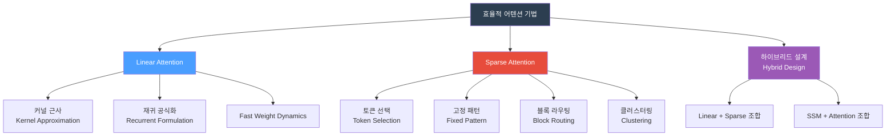

# Efficient Attention Mechanisms for Large Language Models: A Survey

## 핵심 기여

기존 Transformer의 Self-Attention은 시퀀스 길이 $n$에 대해 $O(n^2)$ 계산 복잡도를 가져 긴 컨텍스트 처리에 병목이 된다. 이 서베이는 이를 해결하는 **효율적 어텐션 기법 전체를 2대 범주로 체계화**한다:

1. **Linear Attention**: 소프트맥스 어텐션을 근사하거나 재정식화
2. **Sparse Attention**: 전체 어텐션 행렬 중 중요한 부분만 선택적으로 계산

## 분류 체계

## Linear Attention 범주

### 커널 근사 (Kernel Approximation)

소프트맥스 어텐션 $\text{softmax}(QK^T/\sqrt{d})V$를 커널 함수 $\phi$로 근사:

$$\text{Attention}(Q,K,V) \approx \frac{\phi(Q)(\phi(K)^T V)}{\phi(Q)\phi(K)^T \mathbf{1}}$$

연산 순서를 바꿔 $O(n^2) \to O(n)$으로 감소. 대표 기법: Performer, Random Feature Attention.

- **장점**: 이론적 근사 보장 존재
- **단점**: 커널 선택에 따라 성능 편차 큼

### 재귀 공식화 (Recurrent Formulation)

어텐션을 숨겨진 상태(hidden state)의 재귀 업데이트로 재해석:

$$h_t = f(h_{t-1}, k_t, v_t), \quad o_t = g(h_t, q_t)$$

이 관점에서 Linear Attention = 특수한 형태의 RNN. 대표 기법: Linear Transformer, RetNet, GLA.

- **장점**: 추론 시 $O(1)$ 상태 크기로 처리 가능 (KV 캐시 불필요)
- **단점**: 학습 시 병렬화에 제약

### Fast Weight Dynamics

어텐션 가중치를 동적으로 업데이트하는 메모리 메커니즘. 외부 메모리 행렬 $W$를 헤비안 학습으로 업데이트:

$$W_t = W_{t-1} + k_t^T v_t$$

대표 기법: Fast Weight Programmers, DPFP.

## Sparse Attention 범주

### 토큰 선택 (Token Selection)

쿼리마다 전체 키 중 상위 $k$개만 선택해 어텐션 계산:

$$\text{TopK-Attn}(q, K, V) = \text{softmax}(\text{top-k}(qK^T))V$$

대표 기법: Longformer의 global attention, BigBird.

### 고정 패턴 (Fixed Pattern)

어텐션 마스크를 미리 정해진 구조로 고정:
- **윈도우 어텐션**: 로컬 $w$ 토큰과만 어텐션
- **스트라이드 어텐션**: 매 $s$ 번째 토큰과 전역 어텐션
- **슬라이딩 윈도우**: Mistral에서 사용

### 블록 라우팅 (Block Routing)

토큰 단위가 아닌 블록 단위로 라우팅. 입력에 따라 어떤 블록에 어텐션할지 동적 결정.

대표 기법: MoE-Attention, Mixture of Attention Heads.

### 클러스터링 (Clustering)

유사한 쿼리/키를 클러스터로 묶어 클러스터 내부에서만 어텐션:

$$\text{Cluster-Attn}(Q,K,V) = \text{for each cluster } c: \text{softmax}(Q_c K_c^T)V_c$$

대표 기법: Reformer (LSH Attention), Clustered Attention.

## 하이브리드 설계

두 범주를 결합하거나 SSM(State Space Model)과 어텐션을 혼합하는 방향:

| 설계 패턴 | 대표 기법 | 특징 |
|-----------|----------|------|
| Linear + Full Attention | Mamba-2 + Attention | 주기적으로 전체 어텐션 삽입 |
| Sparse + Dense | LongFormer | 로컬 sparse + 글로벌 토큰 |
| SSM + Attention | Jamba, Zamba | Mamba 레이어 + Attention 레이어 교차 |

## 비교 요약

| 기법 | 시간 복잡도 | 공간 복잡도 | 전체 컨텍스트 접근 | 학습 병렬화 |
|------|------------|------------|-------------------|------------|
| 표준 Self-Attention | $O(n^2)$ | $O(n^2)$ | 완전 | 완전 |
| Linear Attention (재귀) | $O(n)$ | $O(d^2)$ | 제한적 | 제한적 |
| Sparse Attention | $O(n \log n)$ | $O(n)$ | 부분 | 완전 |
| 하이브리드 | $O(n)$~$O(n \log n)$ | $O(n)$ | 선택적 | 대부분 가능 |

## 의의 및 한계

**의의**
- 수백 개의 기법을 2대 범주로 통일하는 분류 체계 제공
- 실무자가 문제 특성에 맞는 기법을 선택할 수 있는 가이드
- 하이브리드 설계의 트렌드를 체계적으로 정리

**한계 (서베이 논문의 특성)**
- 개별 기법의 성능은 태스크·하드웨어에 따라 다를 수 있음
- 새로운 기법이 빠르게 등장해 커버리지 한계 존재
- 실제 하드웨어 최적화 관점(FlashAttention 등 IO-aware 기법)은 일부만 다룸

## 실무 적용 관점

긴 컨텍스트(128K+ 토큰) 처리가 필요한 에이전트 시스템이나 RAG 파이프라인을 설계할 때 어텐션 방식 선택의 기준점으로 활용할 수 있다. 추론 속도가 중요하면 재귀 Linear Attention, 정확도가 중요하면 Sparse Attention + Full Attention 하이브리드를 우선 검토하면 된다.

## 관련 문서

- [[flashattention-4-paper]]
- [[attention-is-all-you-need-paper]]
- [[chunkkv-paper]]
- [[context-folding-paper]]
