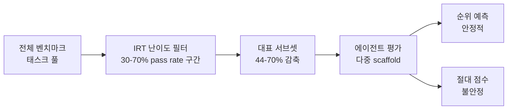

# Efficient Benchmarking of AI Agents (2603.23749)

> "representative task subset이 rank fidelity를 유지하면서 평가 비용을 44-70% 감축할 수 있다."

에이전트 평가는 interactive rollout, 도구 사용, 다단계 추론이 필요해 단일 LLM 호출 평가 대비 수십~수백 배 비싸다. 이 논문은 **난이도 기반 태스크 서브셋 선택**만으로 평가 비용을 크게 줄이면서도 리더보드 순위 예측 능력을 유지하는 optimization-free 프로토콜을 제안한다.

## 핵심 기여

- **IRT(Item Response Theory) 영감 필터**: 교육 심리학의 문항 반응 이론을 AI 에이전트 평가에 적용. 30-70% 통과율(pass rate) 구간의 중간 난이도 태스크가 에이전트 판별력이 가장 높음
- **Optimization-free 프로토콜**: 가중치 학습 없이 과거 pass rate 분포만으로 서브셋 선택
- **8개 벤치마크 검증**: Terminal-Bench 2.0 + HAL(Holistic Agent Leaderboard) 7개, scaffold 33개 + 모델 설정 70개 이상에서 평가

## 평가 파이프라인

전체 태스크 풀에서 IRT 필터를 통해 서브셋을 추출하면 평가 비용을 대폭 줄이면서 순위는 유지할 수 있지만, 절대 점수 예측에는 한계가 있다.

## 주요 발견

| 지표 | 결과 |
|------|------|
| 태스크 감축률 | 44-70% |
| 순위 예측 안정성 | 안정적 (scaffold 변화, 시간적 분포 이동에 내성) |
| 절대 점수 예측 | 불안정 |
| 무작위 샘플링 대비 | 시드 간 분산 낮음 (더 일관적) |
| 탐욕적 선택 대비 | 분포 이동(distribution shift) 상황에서 더 강건 |

## 핵심 비대칭성: 순위 vs 절대 점수

이 논문의 가장 중요한 발견은 **rank-order 예측과 absolute score 예측이 근본적으로 다르다**는 점이다.

- 리더보드 목적이라면 순위 안정성만 있으면 충분
- scaffold가 다른 환경에서 절대 점수는 신뢰할 수 없어도 상대 순위는 신뢰 가능
- 모델/프레임워크 반복 개발 사이클에서 정확한 점수보다 빠른 순위 피드백이 더 유용

## 실무 적용 관점

- **에이전트 개발 팀**: 매 이터레이션마다 전체 벤치마크를 돌리는 대신 IRT 서브셋으로 빠른 순위 체크
- **벤치마크 설계자**: 태스크 구성 시 통과율 분포를 의도적으로 설계해 평가 효율 높이기
- **평가 민주화**: 비용 장벽을 낮춰 소규모 팀도 경쟁력 있는 에이전트 평가 가능

## 한계

- 절대 성능 수치가 중요한 사용 사례(예: 프로덕션 릴리즈 기준)에는 부적합
- 서브셋 선택을 위한 초기 pass rate 수집 비용 필요
- 시간이 지남에 따라 새 모델 등장 시 서브셋 재보정 필요

## 관련 문서

- [[long-horizon-agent-benchmarks]] -- 메타 벤치마크 생태계 개요 (GAIA 2, SWE-EVO 등)
- [[omnicode-swe-benchmark-paper]] -- OmniCode: SWE 에이전트 다국어 종합 벤치마크
- [[agent-benchmark-comparison-2026-04]] -- 2026년 4월 에이전트 벤치마크 비교 summary
- [[ai-benchmarks-overview]] -- AI 벤치마크 개요 concept
- [[terminal-bench-2-0]] -- Terminal-Bench 2.0 상세 (HAL 플랫폼)
- [[item-response-theory-benchmarking]] -- IRT의 AI 평가 적용 패턴 (concept)
