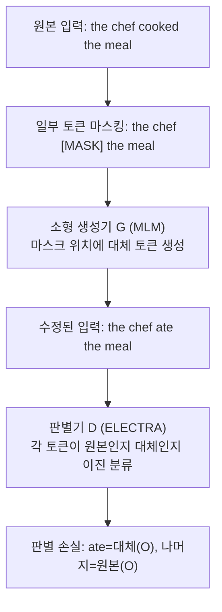
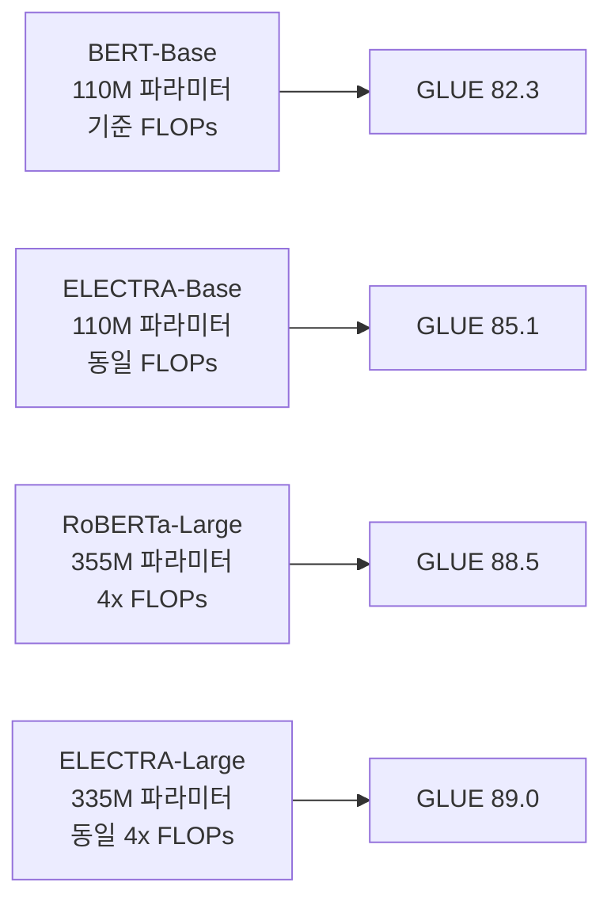

# ELECTRA 원논문 (Clark et al., 2020)

## 메타데이터

| 항목 | 내용 |
|------|------|
| 제목 | ELECTRA: Pre-training Text Encoders as Discriminators Rather Than Generators |
| 저자 | Kevin Clark, Minh-Thang Luong, Quoc V. Le, Christopher D. Manning |
| 소속 | Stanford University, Google Brain |
| 연도 | 2020 |
| arXiv | 2003.10555 |
| 학회 | ICLR 2020 |

---

## 핵심 기여

- **대체 토큰 탐지(Replaced Token Detection, RTD)**: MLM(마스크 언어 모델링)을 대체하는 새로운 사전학습 목표. 생성기(generator)가 만든 그럴듯한 대체 토큰을 탐지기(discriminator)가 판별
- **모든 토큰 위치에서 학습**: MLM이 전체 시퀀스의 15% 마스크 위치만 학습하는 반면, RTD는 모든 토큰 위치에서 학습 신호를 생성
- **계산 효율성**: RoBERTa와 유사한 성능을 4배 적은 계산량(FLOPs)으로 달성
- **소형 모델에서 극적인 효율성**: ELECTRA-Small이 GPU 1개로 4시간 학습 후 GPT보다 우수한 성능
- **GAN에서 영감**: 생성기-판별기 구조를 NLP 사전학습에 적용했으나 실제 GAN 훈련(적대적 손실)은 사용하지 않음

---

## 배경 및 문제 정의

### MLM의 비효율성

BERT의 MLM은 전체 시퀀스의 **15%만 마스크**하고 해당 위치만 예측한다. 나머지 85% 위치는 학습 신호를 전혀 생성하지 않는다.

예를 들어 512 토큰 시퀀스에서:
- 학습 대상 위치: 약 77개
- 학습 신호 미사용 위치: 약 435개

이는 데이터 효율 측면에서 근본적인 낭비다.

### 왜 단순히 마스킹 비율을 높이지 않는가?

마스킹 비율을 높이면 문맥 정보가 너무 부족해져서 의미있는 예측이 어려워진다. 논문에서 15% → 30%로 늘리면 성능이 오히려 저하됨을 보였다.

---

## 방법

### RTD 개요



위 다이어그램에서 "ate"는 생성기가 "cooked" 대신 생성한 그럴듯한 대체 토큰이다.

### 생성기 (Generator)

- ELECTRA 탐지기보다 작은 MLM 모델
- 마스크된 위치에 그럴듯한 토큰 생성:

$$p_G(x_t | \mathbf{x}) = \frac{\exp(e(x_t)^T h_G(\mathbf{x})_t)}{\sum_{x'} \exp(e(x')^T h_G(\mathbf{x})_t)}$$

- 생성기는 독립적으로 MLM 손실로 학습

### 판별기 (Discriminator, ELECTRA 본체)

각 토큰 위치 $t$에서 이진 분류:
- 0: 원본 토큰 (original)
- 1: 대체된 토큰 (replaced)

$$D(\mathbf{x}, t) = \text{sigmoid}(w^T h_D(\mathbf{x})_t)$$

판별기 손실:

$$\mathcal{L}_{Disc} = -\sum_{t=1}^{n} \left[ \mathbf{1}[x_t^{replace} = x_t] \log D(\mathbf{x}^{replace}, t) + \mathbf{1}[x_t^{replace} \neq x_t] \log(1 - D(\mathbf{x}^{replace}, t)) \right]$$

### 전체 손실

$$\mathcal{L} = \mathcal{L}_{MLM}(G) + \lambda \cdot \mathcal{L}_{Disc}(D)$$

논문에서 $\lambda = 50$을 사용 (판별기 손실을 강조).

### GAN과의 차이점

| 항목 | GAN | ELECTRA |
|------|-----|---------|
| 생성기 목표 | 판별기 속이기 (적대적) | MLM 손실 최소화 (협력적) |
| 판별기 목표 | 실제/가짜 구분 | 원본/대체 구분 |
| 기울기 흐름 | 생성기로 역전파 | 생성기로 역전파 안 함 |
| 이산 토큰 문제 | 존재 (GAN의 고질적 문제) | 없음 (별도 학습) |

생성기에서 판별기로 기울기가 흐르지 않는 이유는 토큰 샘플링이 이산적이라 미분 불가능하기 때문이다.

---

## 실험 및 결과

### 계산량 대비 성능 (GLUE)



### 소형 모델 비교

| 모델 | 파라미터 | 학습 시간 | GLUE |
|------|---------|---------|------|
| ELMo | 94M | 수일 | 71.0 |
| GPT | 117M | 30일 (GPU) | 78.8 |
| BERT-Small | 14M | 4일 | 75.1 |
| **ELECTRA-Small** | **14M** | **4시간 (GPU 1개)** | **79.9** |

ELECTRA-Small이 GPT보다 성능이 높으면서 학습 시간은 180배 빠르다.

### SQuAD 결과

| 모델 | SQuAD 1.1 F1 | SQuAD 2.0 F1 |
|------|------------|------------|
| BERT-Large | 93.2 | 83.1 |
| RoBERTa-Large | 94.6 | 89.4 |
| ALBERT-XXLarge | 95.0 | 92.2 |
| **ELECTRA-Large** | **96.1** | **92.7** |

### 절제 실험: 왜 RTD가 효율적인가

| 모델 변형 | GLUE |
|--------|------|
| MLM (BERT 방식) | 82.3 |
| RTD (15% 위치만) | 84.1 |
| **RTD (100% 위치)** | **85.1** |

전체 토큰에서 학습 신호를 받는 것이 핵심 요인임을 확인.

---

## 한계 및 후속 연구

### 원논문의 한계

- **생성기 크기 의존성**: 생성기가 너무 강하면 판별기가 탐지하기 어려운 완벽한 대체 토큰을 만들어 학습이 어려워짐. 생성기는 판별기의 1/4 ~ 1/3 크기가 최적
- **추론 시 생성기 불필요**: 사전학습 후 판별기만 사용. 생성기는 학습 시에만 필요
- **언어 생성 불가**: 인코더 전용이므로 텍스트 생성 태스크에 직접 사용 불가
- **미묘한 의미 차이 탐지 어려움**: 원본과 의미가 유사한 대체 토큰을 원본으로 잘못 탐지하는 노이즈 레이블 문제

### 주요 후속 연구

| 연구 | ELECTRA와의 관계 |
|------|---------------|
| DeBERTa (He et al., 2020) | 분리된 어텐션으로 ELECTRA 능가 |
| ELECTRA-style 학습 | 한국어, 중국어 등 다국어 ELECTRA 변형 다수 |
| MC-BERT | 의미론적으로 더 어려운 대체 토큰 생성 |

---

## 실무 적용 관점

### 언제 ELECTRA를 사용하는가

- **계산 자원 제약이 있는 사전학습**: 동일 FLOPs에서 BERT보다 일관되게 우수
- **소형 모델 요구 사항**: ELECTRA-Small이 훨씬 큰 모델과 경쟁하는 성능
- **언어 이해 태스크**: 분류, QA(Question Answering), NER 등 인코더 전용 태스크

### Hugging Face로 ELECTRA 사용

```python
from transformers import ElectraTokenizer, ElectraForSequenceClassification
import torch

tokenizer = ElectraTokenizer.from_pretrained("google/electra-large-discriminator")
model = ElectraForSequenceClassification.from_pretrained(
    "google/electra-large-discriminator",
    num_labels=2,
)

# 입력 처리 (판별기만 사용)
inputs = tokenizer(
    "ELECTRA는 모든 토큰 위치에서 학습한다.",
    return_tensors="pt",
    truncation=True,
    max_length=512,
)

with torch.no_grad():
    outputs = model(**inputs)
    logits = outputs.logits
```

---

## 관련 문서

- [[bert-paper]] - ELECTRA가 RTD로 대체한 MLM 방식을 정의한 모델
- [[roberta-paper]] - ELECTRA와 비슷한 성능을 훨씬 더 많은 계산으로 달성
- [[albert-paper]] - 파라미터 공유로 다른 방향의 효율화를 추구
- [[gan]] - ELECTRA가 영감을 받은 생성적 적대 신경망
- [[masked-language-modeling]] - ELECTRA가 대체한 사전학습 목표
- [[xlnet-paper]] - AR+AE를 결합한 또 다른 BERT 한계 극복 시도
