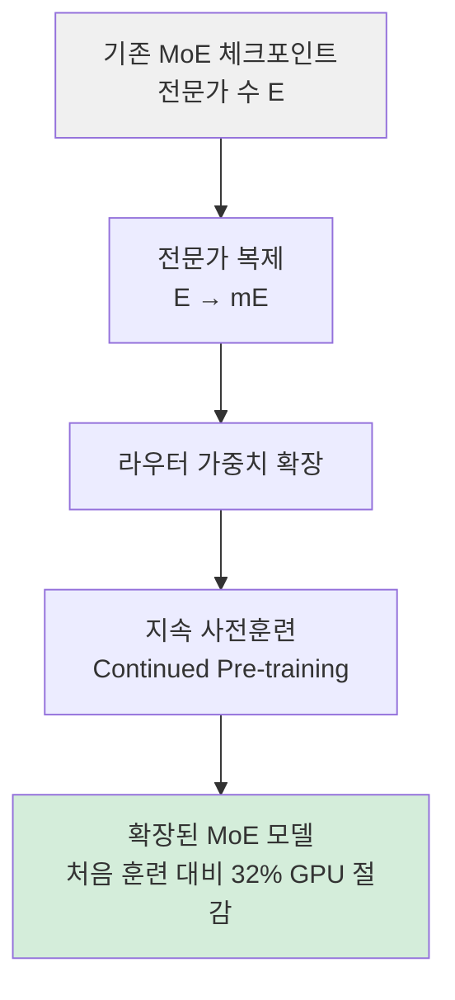

# 전문가 업사이클링으로 MoE 컴퓨트 효율 프론티어 이동

## 논문 메타데이터

| 항목 | 내용 |
|------|------|
| arXiv ID | 2604.19835 |
| 저자 | Chaitanya Dwivedi, Binxuan Huang, Himanshu Gupta, Pratik Jayarao, Neeraj Varshney, Bing Yin (Amazon) |
| 연도 | 2026 |
| 분야 | 모델 아키텍처 / 학습 효율 |

## 핵심 기여

기존 [[mixture-of-experts-moe-llms]] 모델의 전문가 수를 $E \to mE$로 점진적으로 확장하는 **전문가 업사이클링(Expert Upcycling)** 기법을 제안한다. 처음부터 훈련(training from scratch)하는 것 대비 GPU 시간을 **32% 절감**하면서도 동등한 성능의 MoE 모델을 얻을 수 있다.

## 배경: 왜 업사이클링인가

MoE 아키텍처는 LLM 스케일링의 사실상 표준으로 자리 잡았다. 그러나 전문가 수를 늘리려면 보통 처음부터 재훈련해야 한다는 비용 문제가 있었다. 이 논문은 **이미 훈련된 MoE 체크포인트를 재활용(upcycle)** 해서 더 큰 전문가 구성으로 확장하는 방법을 제시한다.

위 파이프라인에서 기존 전문가 파라미터를 그대로 복제하고 라우터만 재초기화한 뒤 지속 사전훈련을 수행하면 처음부터 훈련하는 것보다 훨씬 적은 컴퓨트로 목표 품질에 도달한다.

## 방법

### 전문가 복제 (Expert Replication)
- 기존 $E$개 전문가를 각각 $m$개로 복사해 $mE$개 전문가 풀 구성
- 초기화 시 파라미터 노이즈를 소량 추가해 다양성 확보 (선택적)

### 라우터 확장
- 토큰-전문가 라우팅 가중치를 새로운 전문가 수에 맞게 확장
- 기존 라우팅 분포를 유지하면서 새 슬롯에 균등 초기화

### 지속 사전훈련
- 복제된 체크포인트에서 계속 훈련을 이어받아 전문가 간 차별화 유도
- 동일 데이터 혼합 또는 도메인 강조 데이터로 가능

## 실험 결과

- 처음부터 훈련하는 MoE 베이스라인 대비 **GPU 시간 32% 절감**
- 최종 모델 품질은 동등하거나 소폭 우수
- 다양한 $m$ 값(복제 배수)에서 일관적으로 효과 확인

## 한계

- 지속 사전훈련에 사용할 코퍼스 품질에 민감할 수 있다
- 업사이클링 전 기저 모델 품질에 의존적 — 저품질 체크포인트는 효과 감소 가능
- 전문가 복제 후 라우터 재수렴까지의 훈련 단계가 필요 (즉각 효과 없음)

## 실무 적용 관점

이미 배포된 MoE 체크포인트를 확장할 때 처음부터 재훈련하지 않아도 된다는 점이 핵심이다. 특히 컴퓨트 예산이 제한된 팀에서 **기존 모델을 더 큰 MoE로 업그레이드**하는 실용적 경로를 제공한다. 오픈소스 MoE 모델(Mixtral, DeepSeek-MoE 등)을 기반으로 도메인 특화 확장에도 응용 가능하다.

## 관련 문서

- [[mixture-of-experts-moe-llms]] - MoE 아키텍처 일반 개념
- [[alloc-moe-inference]] - MoE 추론 시 예산 인식 전문가 할당 (2604.08133)
- [[domain-expert-moe]] - MoE에서 도메인별 전문가 자연 발생 분석
