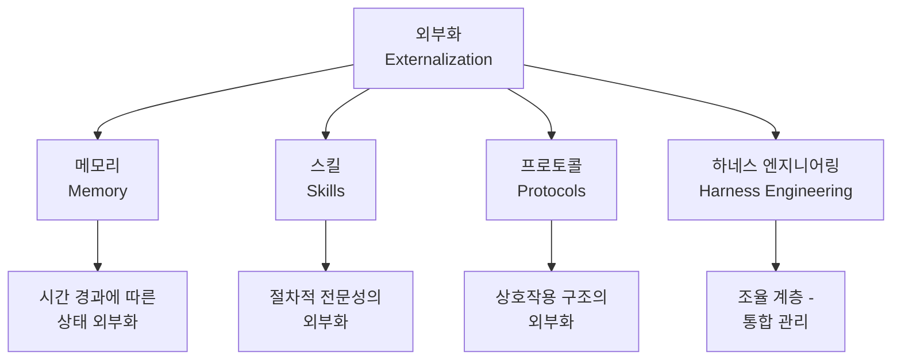

# 외부화(Externalization)를 통한 LLM 에이전트 발전의 통합 리뷰

## 핵심 기여

**"외부화(externalization)"를 LLM 에이전트 발전의 통합 원리**로 제시한 서베이 논문이다. 기존에 모델 가중치 내부에 암묵적으로 존재하던 능력들이 점차 런타임 외부 인프라로 이전되고 있다는 관찰을 체계화하여, 에이전트 시스템 설계의 4대 축을 정의한다.

핵심 주장:
- LLM 에이전트는 모델 가중치 변경보다 **런타임 환경 재구성**으로 발전하고 있음
- 이 재구성의 본질은 내부 능력의 **외부화**
- 4대 축: 메모리, 스킬, 프로토콜, 하네스 엔지니어링

## 문제 정의

LLM 에이전트 연구가 메모리, 도구 사용, 멀티 에이전트 등 개별 축에서 독립적으로 진행되면서, 이들을 관통하는 **통합 원리**가 부재했다. 이 논문은 "외부화"라는 렌즈를 통해 분절된 연구 흐름을 하나의 프레임워크로 통합한다.

## 방법론: 외부화의 4대 축

위 다이어그램은 외부화의 4대 축과 각 축이 담당하는 역할을 보여준다.

### 1. 메모리(Memory) - 시간에 걸친 상태 외부화

모델이 단일 컨텍스트 윈도우 내에서만 "기억"하던 것을 외부 저장소로 이전한다.

- 단기 메모리: 작업 컨텍스트, 스크래치패드
- 장기 메모리: 벡터 DB, 키-값 저장소
- 에피소딕 메모리: 과거 상호작용 기록

### 2. 스킬(Skills) - 절차적 전문성의 외부화

모델 파라미터에 암묵적으로 인코딩된 절차적 지식을 **명시적이고 재사용 가능한 스킬 단위**로 추출한다.

- 도구 호출 패턴의 정형화
- 스킬 라이브러리 관리 및 검색
- 스킬 진화 및 버전 관리

### 3. 프로토콜(Protocols) - 상호작용 구조의 외부화

에이전트 간, 에이전트-사용자 간의 상호작용 규칙을 외부 프로토콜로 정의한다.

- 메시지 포맷 및 라우팅 규칙
- 멀티 에이전트 협업 프로토콜
- 사용자-에이전트 인터페이스 계약

### 4. 하네스 엔지니어링(Harness Engineering) - 통합 조율 계층

나머지 3개 축을 **거버넌스 있는 실행 환경**으로 통합 관리하는 계층이다.

- 실행 오케스트레이션
- 안전장치 및 감사(audit) 메커니즘
- 메모리/스킬/프로토콜의 생명주기 관리

## 파라메트릭 vs 외부화 트레이드오프

| 측면 | 파라메트릭(모델 내부) | 외부화(런타임 인프라) |
|------|----------------------|---------------------|
| 레이턴시 | 낮음 (직접 생성) | 높을 수 있음 (검색/조회 필요) |
| 유연성 | 낮음 (재학습 필요) | 높음 (런타임 교체 가능) |
| 추적 가능성 | 낮음 (블랙박스) | 높음 (외부 상태 감사 가능) |
| 일반화 | 학습 분포 내 | 도메인별 커스텀 가능 |
| 거버넌스 | 어려움 | 구조적 제어 가능 |

## 미래 방향

- **자기 진화 하네스(Self-evolving Harness)**: 하네스 자체가 사용 패턴에 따라 자동 최적화
- **공유 에이전트 인프라**: 조직/팀 단위로 메모리, 스킬, 프로토콜을 공유하는 인프라
- **모델-인프라 공진화(Co-evolution)**: 모델과 외부 인프라가 상호 적응하며 발전

## 한계 및 향후 연구

- 평가 방법론: 외부화 수준을 정량적으로 측정하는 메트릭 부재
- 거버넌스: 외부화된 구성요소의 신뢰성/안전성 보장 체계 미확립
- 모델-인프라 경계: 어떤 능력을 내부에 두고 어떤 능력을 외부화할지의 최적 분할 기준 미정립

## 실무 관점

- **에이전트 아키텍처 설계** 시 "무엇을 외부화할 것인가"를 체계적으로 판단하는 프레임워크로 활용
- [[anthropic-harness-design]]의 이론적 배경으로 참고 가능
- [[agent-skills-specification]]을 설계할 때 스킬 외부화 원리를 적용하면 확장성 확보에 유리
- 프로덕션 에이전트에서 하네스 엔지니어링 계층을 명시적으로 분리하면 디버깅과 거버넌스가 용이해짐

## 관련 문서

- [[agent-memory-systems]] - 메모리 외부화의 구체적 구현
- [[agent-skills]] - 스킬 외부화 개념
- [[anthropic-harness-design]] - 하네스 엔지니어링 사례
- [[orchestrator-worker-pattern]] - 프로토콜 외부화의 실현 패턴
- [[skillclaw-paper]] - 스킬의 집단적 진화 프레임워크
- [[evolution-of-agentic-patterns]] - 에이전틱 패턴의 발전 흐름
