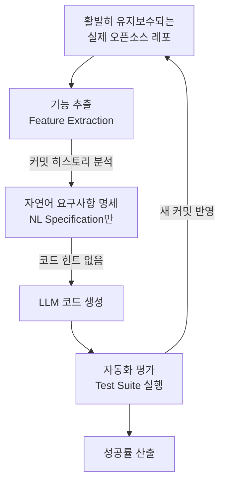
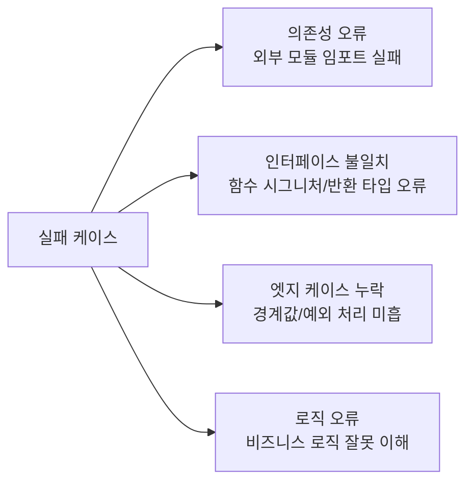

# FeatBench: Realistic Feature-level Code Generation Evaluation

## 핵심 기여

**FeatBench**는 활발히 유지보수되는 실제 오픈소스 레포지토리에서 추출한 **기능 수준(feature-level) 코드 생성 벤치마크**다. 기존 코드 생성 벤치마크(HumanEval, MBPP 등)가 고립된 함수 완성 태스크를 사용하는 것과 달리, FeatBench는 실제 소프트웨어 개발 맥락에서 요구되는 **기능 단위 구현**을 평가 대상으로 삼는다.

### 현실 격차 (Reality Gap)

| 벤치마크 | 최고 모델 성공률 | 태스크 성격 |
|----------|----------------|------------|
| HumanEval | 84~89% | 독립 함수 완성 |
| MBPP | 80~87% | 단순 프로그래밍 문제 |
| **FeatBench** | **29.94%** | **실제 레포 기능 구현** |

최고 성능 모델도 FeatBench에서 **29.94%**만 해결 - HumanEval 대비 약 60%p의 현실 격차가 존재한다. 이는 현재 LLM의 코드 생성 능력이 실제 소프트웨어 개발 요구사항과 크게 괴리되어 있음을 시사한다.

## 벤치마크 설계

### 평가 파이프라인

#### 핵심 설계 원칙

**1. 자연어 요구사항만 제공 (No Code Hints)**
- 기존 코드베이스의 관련 함수, 클래스 시그니처 등 코드 힌트를 일절 제공하지 않음
- 모델은 자연어 기능 명세만을 보고 전체 구현을 생성해야 함
- 실제 개발자가 요구사항 문서를 받고 코드를 작성하는 상황과 동일

**2. 진화하는 벤치마크 (Evolving Benchmark)**
- 레포지토리가 업데이트될 때마다 새 기능 태스크가 자동으로 추가
- 정적 벤치마크의 훈련 데이터 오염(contamination) 문제에 저항
- 모델이 테스트 데이터를 암기하더라도 시간이 지나면 새 태스크에 노출됨

**3. 실제 테스트 스위트로 평가**
- 레포지토리의 기존 테스트 코드를 평가 기준으로 사용
- 모델이 생성한 코드를 실제 레포 환경에서 실행하여 통과 여부 판정
- Partial credit 없음 - 테스트 전체 통과 여부로만 판정

### 태스크 특성

| 특성 | FeatBench | HumanEval |
|------|-----------|-----------|
| 코드 길이 | 평균 50~200줄 | 평균 5~20줄 |
| 외부 의존성 | 레포 내 다른 모듈 참조 필요 | 독립적 |
| 맥락 이해 | 전체 코드베이스 컨텍스트 필요 | 불필요 |
| 오염 저항성 | 진화형 (높음) | 고정 (낮음) |

## 실험 결과 분석

### 모델별 성능 패턴

- **성능 상한**: 최고 모델 29.94% - 현재 LLM의 기능 수준 코드 생성 한계를 드러냄
- **모델 간 격차**: HumanEval에서 5~10%p 차이나는 모델들이 FeatBench에서는 더 큰 폭으로 차별화됨 - 더 정밀한 모델 변별력
- **실패 패턴**: 외부 의존성 import 오류, 인터페이스 불일치, 엣지 케이스 미처리 순으로 실패 빈도 높음

### 실패 유형 분류

## 실무적 의미

1. **벤치마크 다변화의 필요성**: HumanEval 점수만으로 코딩 에이전트를 선택하면 현실 성능을 크게 과대평가
2. **에이전트 설계 시사점**: 코드베이스 탐색(codebase navigation) 능력이 기능 수준 구현에서 핵심
3. **평가 기준 재정의**: RAG 기반 코드 컨텍스트 주입, 도구 사용(tool use)이 FeatBench 점수를 얼마나 높이는지가 향후 연구 과제

## 한계

- 현재 Python 중심 레포지토리에 편중 - TypeScript, Go, Rust 등 다언어 확장 필요
- 자동화 테스트가 없는 레포지토리의 기능은 포함 불가
- 기능 난이도가 레포마다 균등하지 않아 샘플링 편향 가능

## 관련 문서

- [[long-horizon-agent-benchmarks]] - 장기 호라이즌 에이전트 벤치마크 비교
- [[swe-bench-ecosystem-2026]] - SWE-bench 생태계와 코드 에이전트 평가 현황
- [[coding-agent]] - 코딩 에이전트의 아키텍처와 전략
