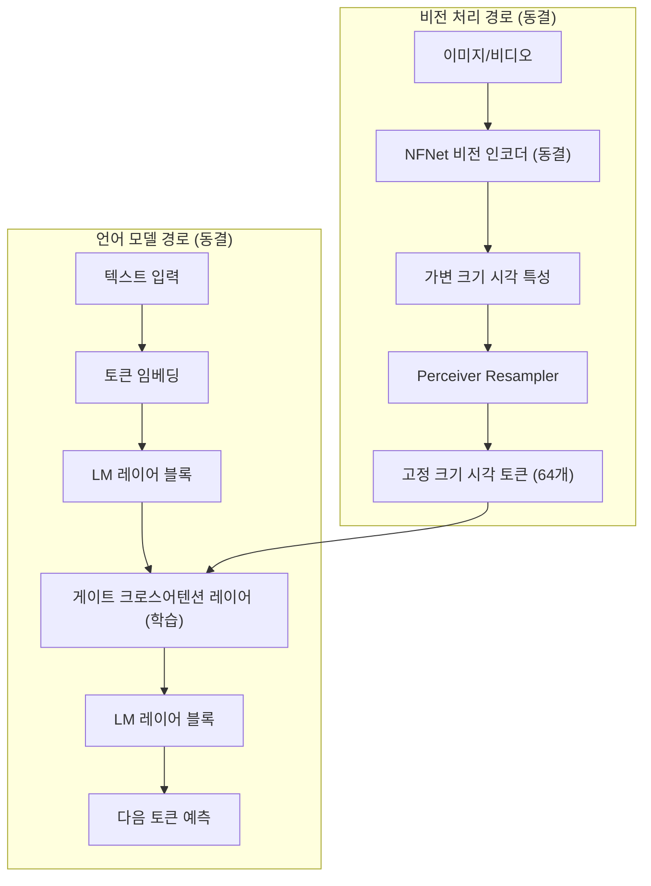
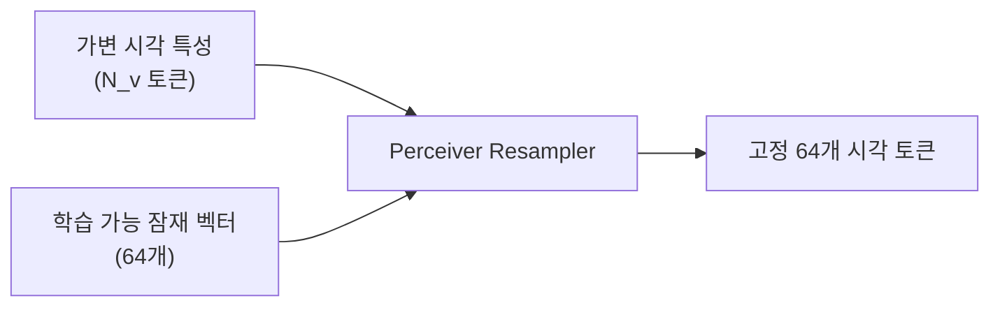

# Flamingo 원논문 (Alayrac et al., 2022)

## 메타데이터

| 항목 | 내용 |
|------|------|
| 제목 | Flamingo: a Visual Language Model for Few-Shot Learning |
| 저자 | Jean-Baptiste Alayrac, Jeff Donahue, Pauline Luc, Antoine Miech, Iain Barr, Yana Hasson, Karel Lenc, Arthur Mensch, Katie Millican, Malcolm Reynolds, Roman Ring, Eliza Rutherford, Serkan Cabi, Tengda Han, Zhitao Gong, Sina Samangooei, Marianne Monteiro, Jacob Menick, Sebastian Borgeaud, Andrew Brock, Aida Nematzadeh, Sahand Sharifzadeh, Mikolaj Binkowski, Ricardo Barreira, Oriol Vinyals, Andrew Zisserman, Karen Simonyan |
| 소속 | DeepMind |
| 연도 | 2022 |
| arXiv | 2204.14198 |
| 학회 | NeurIPS 2022 |

---

## 핵심 기여

- **시각-언어 멀티모달 통합**: 사전 학습된 대규모 언어 모델(LLM)과 사전 학습된 비전 인코더를 **동결(frozen)** 상태로 유지하면서 두 모달리티를 연결하는 경량 크로스어텐션 레이어만 학습
- **게이트 크로스어텐션 (Gated Cross-Attention)**: 새로 삽입된 크로스어텐션 레이어에 $\tanh$ 게이팅을 적용해 학습 초기 LLM의 언어 능력을 보존
- **Perceiver Resampler**: 가변 크기의 비전 특성을 고정 크기 토큰 집합으로 압축하는 경량 어텐션 모듈
- **in-context few-shot 비전-언어 학습**: 텍스트 few-shot과 유사하게, 프롬프트에 이미지-텍스트 쌍을 여러 개 포함하는 방식으로 새 태스크에 적응
- **웹 규모 멀티모달 학습**: 웹에서 수집한 이미지-텍스트 인터리브 데이터(M3W)와 이미지-텍스트 쌍(ALIGN, LTIP) 활용

---

## 배경 및 문제 정의

### 멀티모달 모델 이전의 한계

2022년 이전 시각-언어 모델들의 공통 문제:

1. **태스크별 파인튜닝 필요**: 이미지 캡셔닝, VQA(Visual Question Answering), 이미지 분류 등 각 태스크마다 별도 학습
2. **거대 LLM의 언어 능력 소실**: LLM 전체를 파인튜닝하면 광범위한 언어 지식이 손상
3. **가변 이미지 수 처리 불가**: 단일 이미지만 처리하거나 고정 수의 이미지만 처리

### Flamingo의 핵심 가설

> "이미 강력한 LLM과 비전 인코더가 있다면, 두 모달리티를 연결하는 인터페이스만 학습해도 충분하다."

---

## 방법

### 전체 아키텍처



위 다이어그램은 동결된 비전 인코더와 LLM 사이에 학습 가능한 크로스어텐션 레이어가 삽입되는 구조를 보여준다.

### Perceiver Resampler

비전 인코더 출력은 이미지 크기와 해상도에 따라 가변 크기다 (예: 144~1296 특성 토큰). Flamingo는 이를 항상 64개의 고정 크기 출력으로 압축한다.



Perceiver Resampler는 학습 가능한 64개 잠재 벡터를 쿼리로, 비전 인코더 출력을 키/값으로 하는 크로스어텐션을 수행한다:

$$X_f = \text{Attention}(Q_{learned}, K_{V_f}, V_{V_f})$$

### 게이트 크로스어텐션 (Gated Cross-Attention)

표준 자기어텐션 레이어와 피드포워드 레이어 앞에 삽입:

$$Y = \tanh(\alpha) \cdot \text{CrossAttention}(X, X_f) + X$$

여기서 $\alpha$는 학습 가능한 스칼라 파라미터로, **$\alpha = 0$으로 초기화**된다. 학습 시작 시 $\tanh(0) = 0$이므로 크로스어텐션 기여가 0이 되어 LLM 원래 출력을 그대로 통과시킨다. 학습이 진행되면서 $\alpha$가 증가하며 점진적으로 시각 정보를 통합한다.

### 인터리브 이미지-텍스트 처리

Flamingo는 텍스트 중간에 이미지가 삽입된 형식을 처리:

```
<image_1> 이 이미지는 고양이를 보여준다. 
<image_2> 이 이미지에는 무엇이 있나요? 답: 강아지
<image_3> 이 이미지에는 무엇이 있나요? 답:
```

각 이미지는 Perceiver Resampler를 통해 고정 크기 토큰으로 변환되고, 텍스트와 함께 LLM에 공급된다. 크로스어텐션은 각 텍스트 토큰이 **가장 최근 앞에 등장한 이미지**만 참조하도록 마스킹된다.

### 학습 데이터

| 데이터셋 | 유형 | 규모 |
|---------|------|------|
| M3W (Multimodal Massively Multilingual Web) | 웹 크롤링 인터리브 | 43M 웹페이지 |
| ALIGN | 이미지-텍스트 쌍 | 1.8B |
| LTIP (Long Text & Image Pairs) | 고품질 이미지-텍스트 쌍 | 312M |

---

## 실험 및 결과

### 모델 크기

| 모델 | 비전 인코더 | 언어 모델 | 총 파라미터 |
|------|----------|---------|-----------|
| Flamingo-3B | NFNet-F6 | Chinchilla 1.4B | 3.2B |
| Flamingo-9B | NFNet-F6 | Chinchilla 7B | 9.3B |
| **Flamingo-80B** | NFNet-F6 | Chinchilla 70B | **80B** |

### few-shot 성능 (Flamingo-80B)

| 태스크 | 0-shot | 4-shot | 32-shot | 이전 SOTA |
|--------|--------|--------|---------|---------|
| VQAv2 | 56.3 | 63.1 | 67.6 | 80.0 (파인튜닝) |
| COCO 캡셔닝 CIDEr | 65.7 | 93.1 | 113.8 | 138.2 (파인튜닝) |
| TextVQA | 35.0 | 39.4 | 44.3 | 72.1 (파인튜닝) |
| OK-VQA | 50.6 | 57.4 | 61.0 | 55.7 (파인튜닝 없이) |

### 핵심 발견

- **few-shot 이득 일관성**: 거의 모든 태스크에서 0-shot -> 4-shot -> 32-shot 순으로 일관된 성능 향상
- **파인튜닝 없이 파인튜닝 수준 경쟁**: OK-VQA에서 Flamingo-80B 32-shot이 파인튜닝된 기존 모델을 능가
- **비디오 이해**: 비디오 QA 태스크에서도 few-shot 학습으로 강력한 성능

---

## 한계 및 후속 연구

### 원논문의 한계

- **대규모 계산 요구**: 80B 파라미터 모델로 접근성 제한
- **이미지 생성 불가**: 순수 이해(이미지 -> 텍스트) 모델, 이미지 생성 불가
- **공간적 추론 약점**: 객체 위치나 공간 관계 관련 질문에서 상대적 취약
- **환각(hallucination)**: 이미지에 없는 내용을 생성하는 경향
- **비영어 다국어 지원 미흡**: 학습 데이터 대부분이 영어

### 주요 후속 연구

| 연구 | Flamingo와의 관계 |
|------|----------------|
| BLIP-2 (Li et al., 2023) | Q-Former로 Perceiver Resampler를 대체, 더 효율적 |
| LLaVA (Liu et al., 2023) | 단순 선형 투영으로 Flamingo를 오픈소스화 |
| OpenFlamingo | Flamingo 오픈소스 복제 |
| InstructBLIP (Dai et al., 2023) | 인스트럭션 파인튜닝으로 Flamingo 능가 |
| GPT-4V (OpenAI, 2023) | 상업용 멀티모달 모델의 완성 |

---

## 실무 적용 관점

### 역사적 의의

Flamingo는 현대 멀티모달 LLM 설계 패턴의 원형을 확립했다:

1. **동결 비전 인코더 + 동결 LLM + 경량 커넥터** - LLaVA, BLIP-2 등 대부분의 후속 연구가 이 패턴 채택
2. **in-context few-shot 비전-언어** - 태스크별 파인튜닝 없이 프롬프트로 적응
3. **인터리브 멀티모달 입력** - 텍스트 중간에 이미지를 삽입하는 형식

### OpenFlamingo 사용 예시

```python
# pip install open-flamingo
from open_flamingo import create_model_and_transforms
import torch
from PIL import Image

model, image_processor, tokenizer = create_model_and_transforms(
    clip_vision_encoder_path="ViT-L-14",
    clip_vision_encoder_pretrained="openai",
    lang_encoder_path="anas-awadalla/mpt-7b",
    tokenizer_path="anas-awadalla/mpt-7b",
    cross_attn_every_n_layers=4,
)

# 이미지 로드
image = Image.open("cat.jpg").convert("RGB")
image_tensor = image_processor(images=image, return_tensors="pt").pixel_values

# few-shot 프롬프트 구성
tokenizer.padding_side = "left"
lang_x = tokenizer(
    "<image> 이 이미지에는 무엇이 있나요? 답변:",
    return_tensors="pt",
)

# 추론
with torch.no_grad():
    generated_tokens = model.generate(
        vision_x=image_tensor.unsqueeze(1).unsqueeze(0),
        lang_x=lang_x["input_ids"],
        attention_mask=lang_x["attention_mask"],
        max_new_tokens=20,
    )
answer = tokenizer.decode(generated_tokens[0])
```

---

## 관련 문서

- [[multimodal-llm]] - 시각-언어 멀티모달 모델 전반 개요
- [[blip-paper]] - Flamingo와 비슷한 시기 발표된 대안적 멀티모달 접근법
- [[cross-attention]] - Flamingo의 게이트 크로스어텐션 개념
- [[perceiver]] - Perceiver Resampler의 기반 아키텍처
- [[in-context-learning]] - few-shot 프롬프팅으로 새 태스크 적응
- [[llava-paper]] - Flamingo를 오픈소스화한 경량 후속 연구
- [[vision-transformer]] - Flamingo가 사용하는 NFNet 비전 인코더의 배경
