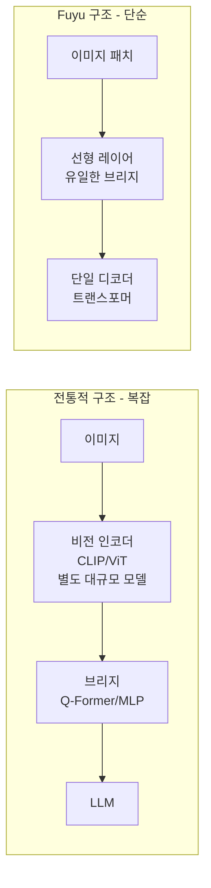
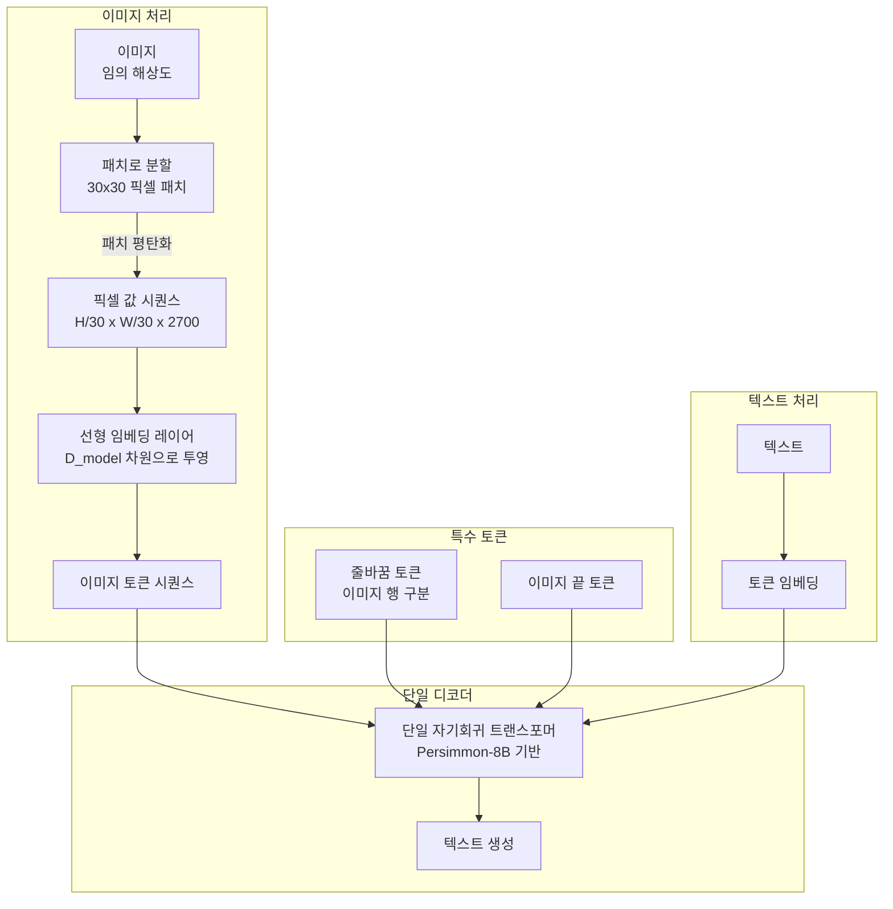
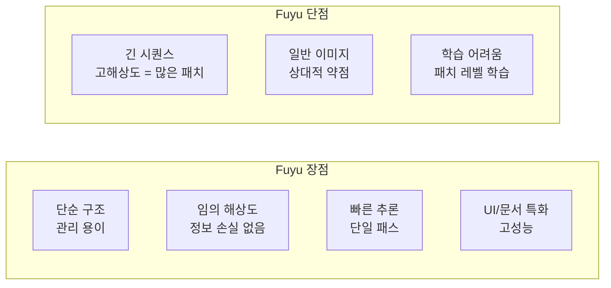
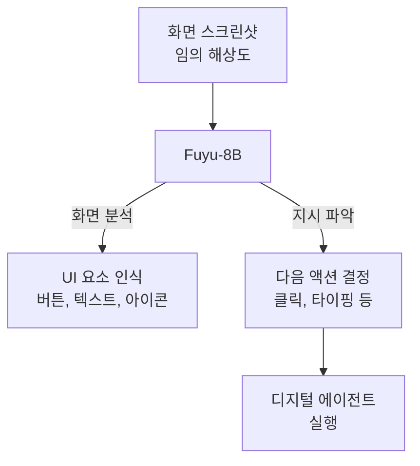

# Fuyu-8B: A Multimodal Architecture for AI Agents (Bavishi et al., 2023)

## 메타데이터

| 항목 | 내용 |
|------|------|
| 저자 | Rohan Bavishi, Erich Elsen, Curtis Hawthorne, Maxwell Nye, Augustus Odena, Arushi Somani, Sağnak Taşırlar (Adept AI) |
| 연도 | 2023 |
| 학회/저널 | 블로그 포스트 / 비공개 논문 (2023년 10월) |
| 모델 공개 | https://huggingface.co/adept/fuyu-8b |

## 핵심 기여

- **비전 인코더 없는 단순 설계**: CLIP, ViT 등 별도 비전 인코더 없이 이미지 패치를 선형 레이어로 직접 디코더에 입력. 아키텍처 단순화의 극단적 사례
- **임의 해상도 이미지 처리**: 사전 정의된 고정 해상도 없이 다양한 크기의 이미지를 그대로 처리 가능 (이미지 크기 조정 불필요)
- **디지털 에이전트 최적화**: UI 스크린샷, 차트, 문서 등 디지털 환경 특화 설계. GUI 이해와 디지털 에이전트 태스크에 적합
- **빠른 추론**: 비전 인코더가 없어 단일 모델 전방향 패스로 처리. 별도 인코딩 오버헤드 없음
- **설계의 투명성**: 블로그를 통해 설계 결정 근거를 상세히 공개, 단순성의 장단점을 솔직하게 설명

## 배경과 문제 정의

### 기존 멀티모달 아키텍처의 복잡성

2023년 중반까지 대부분의 멀티모달 모델은 다음 구조를 가졌다:



이 복잡성은 다음 문제를 낳는다:
- 비전 인코더가 고정 해상도를 강제 (예: 224x224)
- 두 모델을 별도로 관리 및 업그레이드
- 추론 파이프라인 복잡도 증가
- 학습 시 비전 인코더의 동결/해동 결정 문제

### Adept AI의 목표

Adept AI는 **컴퓨터를 사용하는 AI 에이전트** 개발을 목표로 한다. 이 에이전트가 화면을 이해하려면:
- 다양한 UI 레이아웃 처리 (고정 해상도 불가)
- 빠른 스크린샷 처리 (에이전트 반응 속도)
- 텍스트, 아이콘, 버튼 등 UI 요소 정확 인식

이러한 요구사항이 인코더-free 단순 설계로 이어졌다.

## 방법

### 아키텍처: 단순함의 미학



핵심 포인트: 이미지 패치 → 선형 레이어 → 디코더. 그게 전부다.

### 입력 시퀀스 구성

이미지와 텍스트를 하나의 시퀀스로 표현:

```
[행1_패치1][행1_패치2]...[행1_패치_W][줄바꿈]
[행2_패치1][행2_패치2]...[행2_패치_W][줄바꿈]
...
[행H_패치1]...[행H_패치_W][이미지끝]
[텍스트 질문 토큰들]
```

**임의 해상도 처리 방법**:
- 이미지를 30x30 패치로 분할
- 각 행의 끝에 특수 "줄바꿈" 토큰 삽입
- 이미지 끝에 "이미지 끝" 토큰 삽입
- 다양한 크기 → 다양한 길이의 시퀀스로 자연스럽게 처리

**위치 인코딩 개선**:
표준 1D 위치 인코딩 대신 각 패치의 **y 좌표(행 인덱스)**를 위치로 사용. 이미지의 2D 공간 구조를 더 잘 반영한다.

### 모델 기반: Persimmon-8B

Fuyu-8B는 Adept가 자체 개발한 Persimmon-8B 언어 모델을 기반으로 한다:
- 8B 파라미터 디코더 전용 트랜스포머
- RoPE (Rotary Position Embedding) 사용
- Flash Attention 지원
- 오픈소스 공개

### 학습 목표

표준 언어 모델링 손실(다음 토큰 예측):

$$\mathcal{L} = -\sum_{i=1}^{L}\log P(x_i | x_{<i})$$

단, **이미지 패치 토큰에 해당하는 위치에서는 손실을 계산하지 않음**. 즉, 모델은 이미지 패치를 예측하는 것이 아니라 이미지를 보고 텍스트를 생성하는 것만 학습한다.

## 실험 및 결과

### 멀티모달 벤치마크 성능

**텍스트 VQA (TextVQA, 문서/사인/텍스트 이미지 이해)**

| 모델 | TextVQA |
|------|---------|
| BLIP-2 (FlanT5-XXL) | 51.7 |
| InstructBLIP (Vicuna-13B) | 68.8 |
| LLaVA-1.5 (7B) | 58.2 |
| **Fuyu-8B** | **74.2** |

Fuyu가 TextVQA에서 특히 강한 성능을 보인다. 이는 인코더-free 설계와 UI/문서 특화 학습 데이터의 시너지로 분석된다.

**차트 이해 (ChartQA)**

| 모델 | ChartQA |
|------|---------|
| BLIP-2 (FlanT5-XXL) | 33.5 |
| InstructBLIP (Vicuna-13B) | 60.0 |
| **Fuyu-8B** | **70.3** |

**AI2 다이어그램 (AI2D)**

| 모델 | AI2D |
|------|------|
| BLIP-2 | 40.6 |
| InstructBLIP | 52.6 |
| **Fuyu-8B** | **64.5** |

**일반 VQA (VQAv2 val)**

| 모델 | VQAv2 |
|------|-------|
| InstructBLIP (Vicuna-13B) | 73.7 |
| LLaVA-1.5 (7B) | 78.5 |
| **Fuyu-8B** | **74.2** |

일반 자연 이미지 VQA에서는 최고 수준보다는 다소 낮은 성능이지만, 문서/차트/UI 특화 태스크에서는 큰 강점.

### 해상도별 성능

| 이미지 해상도 | 다른 모델 | Fuyu-8B |
|-------------|---------|---------|
| 224x224 | 정상 | 정상 |
| 512x512 | 리사이즈 필요 | 직접 처리 |
| 1024x768 (UI 스크린샷) | 리사이즈 → 정보 손실 | 직접 처리 |

고해상도 이미지에서 Fuyu의 강점이 더 두드러진다.

### 속도 비교

| 단계 | BLIP-2 (예시) | Fuyu-8B |
|------|-------------|---------|
| 이미지 인코딩 (ViT) | 별도 전방향 패스 | 없음 |
| 브리지 모듈 | Q-Former 전방향 | 없음 |
| LLM/디코더 | 전방향 패스 | 단일 전방향 패스 |
| 총 지연 | 높음 | 낮음 |

비전 인코더 오버헤드 없이 단일 패스로 처리.

## 한계 및 후속 연구

### 한계

- **일반 이미지 이해 한계**: 자연 이미지 VQA(COCO-VQA 등)에서 ViT 기반 모델 대비 약점
- **이미지 품질 의존성**: 고해상도 이미지는 패치 수 급증 → 컨텍스트 길이 제한 문제
- **비공개 학습 데이터**: 구체적 학습 데이터 구성이 공개되지 않아 재현 어려움
- **사전학습 가중치 제한**: 8B 버전만 공개, 더 큰 버전 미공개
- **미세한 조작 약점**: 공간적 추론, 미세한 위치 파악이 ViT 기반 모델보다 약한 경향

### 아키텍처적 트레이드오프



### 후속 연구

- **Adept Act-1 / Fuyu-Heavy**: 공개되지 않은 더 큰 버전이 디지털 에이전트 태스크에 사용
- **유사 접근법**: Emu, IDEFICS 등도 인코더 없는 혹은 단순화된 구조 탐구
- **아키텍처 통합 트렌드**: Chameleon (Meta) 등 이미지 토크나이저를 텍스트 어휘에 통합

## 실무 적용 관점

### 디지털 에이전트 시스템 구축

Fuyu는 특히 **GUI 자동화, 웹 에이전트, RPA** 분야에서 강점을 가진다:



**텍스트/문서 집약 애플리케이션**:
- 청구서/영수증 OCR 및 파싱
- 차트/그래프 자동 해석
- UI 테스트 자동화
- 웹 스크래핑 자동화

```python
from transformers import FuyuProcessor, FuyuForCausalLM
from PIL import Image

processor = FuyuProcessor.from_pretrained("adept/fuyu-8b")
model = FuyuForCausalLM.from_pretrained("adept/fuyu-8b")

# 스크린샷에서 UI 요소 파악
image = Image.open("screenshot.png")  # 임의 해상도 그대로
text = "이 화면에서 '로그인' 버튼의 위치를 설명해주세요."

inputs = processor(text=text, images=image, return_tensors="pt")
generation_output = model.generate(**inputs, max_new_tokens=100)
response = processor.batch_decode(generation_output, skip_special_tokens=True)[0]
```

### 단순 아키텍처의 교훈

Fuyu의 가장 큰 기여는 **"비전 인코더가 반드시 필요하지 않을 수 있다"는 증명**이다. 특정 도메인(UI, 문서, 차트)에서 단순 선형 임베딩이 복잡한 ViT+브리지 구조를 능가할 수 있다.

이는 도메인 특화 멀티모달 시스템을 구축할 때 굳이 가장 복잡한 아키텍처를 선택할 필요가 없다는 실용적 교훈을 준다.

## 관련 문서

- [[multimodal-llm]] - 멀티모달 LLM 개념 전반
- [[image-tokenization]] - 이미지 토크나이징 방법 비교
- [[vit]] - 비전 트랜스포머 (Fuyu가 사용하지 않는 것)
- [[blip-2-paper]] - 비교: Q-Former 기반 복잡한 브리지
- [[llava-original-paper]] - 비교: MLP 프로젝터 방식
- [[kosmos-paper]] - 비교: Microsoft의 유사 시기 멀티모달 접근
