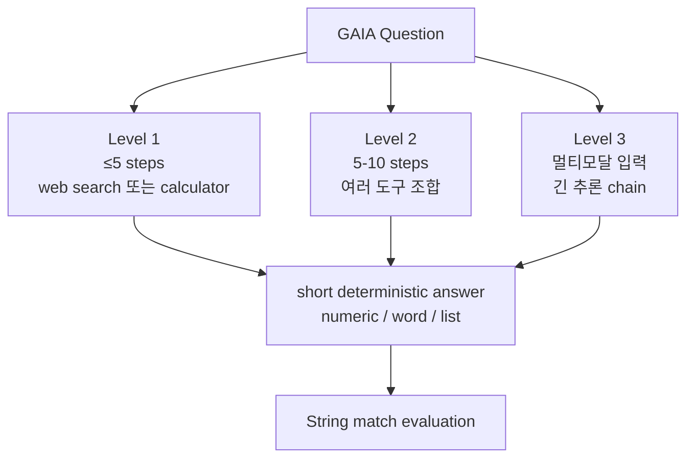

# GAIA: a benchmark for General AI Assistants (Mialon et al., 2023)

## TL;DR

GAIA는 **인간에게는 쉽고 AI에게는 어려운 466개 질문**으로 구성된 General AI Assistant 평가 벤치마크다. 인간 92% vs GPT-4+plugins 15% 라는 큰 격차로 "전문가가 어려워하는 task"를 잘 푸는 것이 아니라 **"평범한 인간이 잘하는 task"를 잘 푸는 것이 AGI의 척도**라는 평가 철학 전환을 제안했다. Level 1(5단계 이내) → Level 2(5-10단계) → Level 3(멀티모달 + 긴 추론) 3단계 난이도이며, 답이 짧고 결정적이어서 string match로 자동 평가가 가능하다. Hugging Face leaderboard로 표준화.

## 핵심 기여

1. **인간에게는 쉽고 AI에게는 어려운 466개 질문** — 인간 92% vs GPT-4 15%
2. **AGI 평가 철학 전환** — 전문가용 어려움이 아닌 평균적 인간 강점에 초점
3. **Multi-step real-world 질문** — 웹 브라우징, 멀티모달, 도구 사용, reasoning 종합
4. **Leaderboard 공개** — Hugging Face GAIA leaderboard 표준화
5. **3 difficulty levels** — Level 1 / 2 / 3

## 방법론

- **질문 작성 방식**: 인간 어노테이터가 실제 도구를 사용해 풀 수 있는 다단계 질문 작성
- **Answer format**: 짧고 결정적인 답 (숫자, 단어, 리스트) → 평가 자동화 용이
- **공개 정책**: 466개 중 166개 dev 공개, 300개 비공개 leaderboard

## 실험/결과

- **인간 평균**: 92% 정확도 (general human performer)
- **GPT-4 + plugins**: 15%
- **GPT-4 plain**: 6%
- **AutoGPT 등 초기 에이전트**: 한자릿수
- 2024-2025 발전에 따라 Level 1에서 60-70%까지 발전한 reports 있음

## 하네스 엔지니어링 관점

- **다중 도구 + 긴 추론** — agent harness가 검색, 파일 다운로드, 이미지 처리, 오디오 transcription, code execution 등을 통합 지원해야 함 ([[function-calling-tool-use]])
- **현실 시나리오의 복잡성** — [[swe-bench-paper]]가 단일 도메인(코드)인 반면 GAIA는 generalist 능력 측정. harness의 도구 다양성을 검증하는 데 적합
- **답이 짧은 결정적 형태** — LLM-as-judge 없이 string match 가능 → 평가 비용 낮음
- **Level 1 우선 타겟** — 자체 harness 개발 시 Level 1 → Level 2 → Level 3 단계적 검증
- **Contamination 위험 낮음** — 질문이 실제 인터넷에 존재하지 않는 신규 합성 ([[benchmark-contamination]])

## 한계 / 후속 연구

- **466 질문의 한계** — 통계적 안정성 일부 제약
- **Level 3 평가 어려움** — 멀티모달 입력 처리 인프라 요구
- 후속:
  - GAIA-2 (재구성, [[are-gaia2-paper]] 참조)
  - HumanEval-V2
  - BrowseComp

## 관련 자료

- HuggingFace: huggingface.co/gaia-benchmark
- [[are-gaia2-paper]] — GAIA 후속 연구
- [[agentbench-paper]] — 멀티 도메인 비교
- [[swe-bench-paper]] — 단일 도메인 비교
- [[long-horizon-agent-benchmarks]]
- [[agent-evaluation-framework]]
