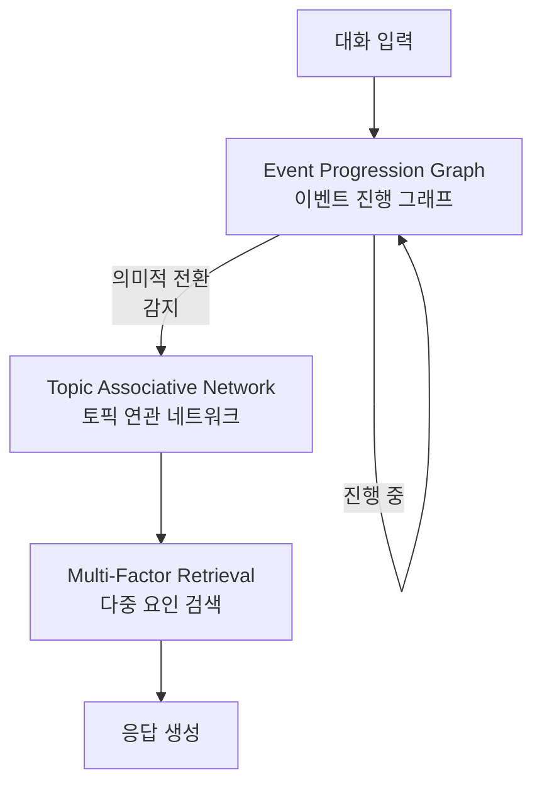

# GAM: 계층적 그래프 기반 에이전트 메모리

## 핵심 기여

LLM 에이전트의 메모리 시스템에서 **새 정보 획득(acquisition)**과 **기존 지식 유지(retention)** 사이의 근본적 갈등을 해결하는 프레임워크. 메모리 인코딩과 통합(consolidation)을 분리하는 계층적 그래프 구조를 제안한다.

핵심 성과:
- 스트림 기반 메모리의 빠른 업데이트 + 구조적 메모리의 장기 일관성을 동시에 달성
- LoCoMo, LongDialQA 벤치마크에서 SOTA 대비 추론 정확도 및 효율성 개선
- 의미적 전환 시점 기반의 선택적 통합으로 노이즈 간섭 최소화

## 문제 정의

기존 에이전트 메모리 시스템의 딜레마:

| 접근법 | 장점 | 한계 |
|--------|------|------|
| 스트림 기반(stream-based) | 빠른 업데이트, 실시간 반영 | 노이즈 간섭, 지식 불일관 |
| 구조적(structured) | 안정적 지식 보존 | 컨텍스트 변화 적응 어려움 |

두 접근법의 장점을 결합하면서 각각의 한계를 극복하는 것이 GAM의 목표다.

## 방법론: 인코딩-통합 분리 아키텍처

GAM의 핵심은 인간 기억의 인코딩-통합 과정에서 영감을 받은 **2단계 메모리 파이프라인**이다.

GAM은 진행 중인 대화를 Event Progression Graph로 격리하고, 의미적 전환 시점에만 Topic Associative Network로 통합하는 2단계 파이프라인이다.

### 1단계: Event Progression Graph (인코딩)

진행 중인 대화를 즉시 그래프 노드로 인코딩한다. 이 단계에서는:
- 새로운 대화 턴이 이벤트 노드로 추가됨
- 시간적 순서와 인과 관계가 엣지로 표현됨
- **장기 메모리와 격리**되어 노이즈 간섭을 방지

### 2단계: Topic Associative Network (통합)

의미적 전환(semantic shift)이 감지될 때만 실행:
- 이벤트 그래프의 정보를 토픽 단위로 클러스터링
- 기존 장기 기억의 관련 토픽과 병합
- **선택적 통합**으로 안정성 유지

### 검색: 그래프 가이드 다중 요인 전략

쿼리 시 그래프 구조를 활용한 다중 요인 검색:
- 토픽 관련성 (semantic relevance)
- 시간적 근접성 (temporal proximity)
- 그래프 구조적 거리 (structural distance)
- 이벤트 중요도 (event significance)

## 실험 결과

| 벤치마크 | 메트릭 | GAM 결과 |
|----------|--------|----------|
| LoCoMo | 추론 정확도 | SOTA 대비 개선 |
| LongDialQA | 대화 QA | 정확도 + 효율성 동시 개선 |

## 실무 적용 관점

- **장기 대화 에이전트**: 수백 턴 이상의 대화에서도 일관된 지식 유지 가능
- **멀티세션 에이전트**: 세션 간 지식 통합에 의미적 전환 기반 선택적 병합 적용 가능
- [[에이전트 메모리 시스템]]의 최신 진전으로, token-level / parametric / latent memory 분류에서 **구조적 외부 메모리** 범주에 해당

## 관련 문서

- [[에이전트 메모리 시스템]] -- 에이전트 메모리 유형 분류 (concept)
- [[Memory in the Age of AI Agents]] -- 에이전트 메모리 서베이 논문
- [[Mem0 유니버설 메모리 레이어]] -- 실무 메모리 레이어 구현체
- [[에이전틱 RAG]] -- 메모리와 검색의 교차 지점
