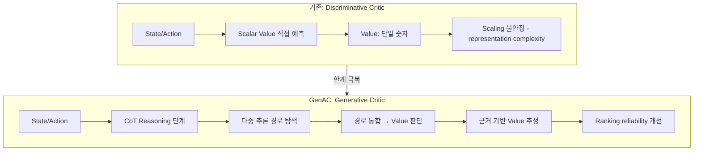

# Bringing Value Models Back: Generative Actor-Critic (GenAC, 2026)

arXiv 2604.10701. Zikang Shan, Han Zhong, Liwei Wang, Li Zhao 공저. LLM RL에서 "value model은 불필요하다"는 최근 value-free 트렌드 (GRPO 등)에 반론을 제기하며, CoT reasoning 기반 **Generative Actor-Critic (GenAC)** 을 제안하는 논문.

## 논문의 핵심 주장

> "Discriminative one-shot scalar critics cannot reliably scale to complex LLM RL settings — their representation complexity bottleneck is a fundamental, not incidental, limitation." — Shan et al., 2026

기존 discriminative scalar critic의 근본 한계를 실험적으로 증명하고, generative CoT critic으로 대체하면 ranking reliability와 OOD 일반화가 유의미하게 개선됨을 보인다.

## 핵심 구조: Discriminative vs Generative Critic



| 항목 | Discriminative | GenAC (Generative) |
|------|---------------|-------------------|
| 가치 추정 방식 | 단일 forward pass scalar | CoT reasoning 후 값 판단 |
| 표현 복잡도 | 고정 (representation bottleneck) | 추론 깊이로 확장 가능 |
| Scaling 안정성 | 모델 크기 증가 시 불안정 | 안정적 (실험 확인) |
| OOD 일반화 | 취약 | 개선 |

## In-Context Conditioning

Actor policy는 훈련 중 지속적으로 진화한다. 이로 인해 발생하는 문제:

```mermaid
sequenceDiagram
    participant Actor
    participant Critic

    Actor->>Critic: 초기 배포 시 정렬 O
    Note over Actor: 학습 진행으로 정책 진화
    Actor->>Critic: 이후 행동 샘플 제시
    Critic-->>Actor: 구식 value 기준으로 평가 (value drift)
    Note over Critic: In-Context Conditioning 적용
    Critic->>Actor: 현재 actor 샘플을 context로 수용
    Critic-->>Actor: 현재 정책 기준 calibrated value 제공
```

GenAC는 훈련 중 **현재 actor가 생성한 행동 샘플을 critic의 in-context**로 제공해 critic이 policy drift를 추적하도록 한다. 이는 기존 value function drift 문제의 실용적 해법이다.

## 경험적 결과

| 지표 | GenAC vs Discriminative | GenAC vs Value-free (GRPO 등) |
|------|------------------------|-------------------------------|
| Value approximation accuracy | 우위 | 우위 |
| Ranking reliability | 유의미 개선 | 우위 |
| OOD generalization | 개선 | 개선 |
| Downstream RL 성능 | 일관적 향상 | 일관적 향상 |

PPO + 표준 value model 대비 일관 우세. Value-free 방법 대비도 credit assignment 품질에서 우위.

## Value-free 트렌드에 대한 반론

현대 LLM RL 연구는 critic 없이 그룹 비교로 어드밴티지를 추정하는 방향(GRPO, DAPO 등)으로 이동했다. GenAC는 이 트렌드에 세 가지 반론을 제기한다:

1. **Scalar critic의 한계는 discriminative 구조의 문제**, value 자체의 문제가 아님
2. **CoT reasoning은 actor만이 아니라 critic에도 유효**하며 value 판단 품질을 높임
3. **In-context conditioning으로 policy drift를 추적**하면 value model이 훈련 내내 유효

> GRPO 계열 방법이 sampling efficiency 측면에서 우세하지만, 복잡한 credit assignment가 필요한 long-horizon 태스크에서 generative critic이 보완적 가치를 가진다.

## 이론적 기반: 왜 CoT Critic이 더 나은가

- **Representation complexity**: scalar critic은 state의 모든 가치 관련 정보를 단일 임베딩으로 압축해야 함 → 복잡한 상황에서 bottleneck
- **Human analogy**: 인간이 가치를 판단할 때도 "왜?"를 먼저 생각한 후 점수를 매김 → CoT가 이 과정을 모방
- **Multi-path exploration**: 다양한 CoT 경로를 탐색 후 통합하면 단일 추정보다 robust한 value 산출

## 실무 관점

- **PPO 기반 시스템 사용자**: discriminative scalar critic을 GenAC로 교체하면 long-horizon 태스크 성능 개선 기대
- **GRPO 사용자**: value-free 방법의 sample efficiency를 유지하면서 GenAC를 검증 단계에 보조 사용 가능
- **Actor-Critic 연구자**: in-context conditioning이 policy drift 문제의 실용적 해법으로 참조 가치

## 관련 문서

- [[credit-assignment-survey-paper]] -- credit assignment 전반 서베이. privileged asymmetric critic 맥락
- [[grpo]] -- value-free 트렌드의 대표. GenAC가 반론을 제기하는 기준선
- [[ppo-for-llms]] -- PPO + value model 기반 파이프라인. GenAC의 개선 대상
- [[process-reward-models]] -- 중간 단계 가치 평가. GenAC와 보완적 방향
- [[rlhf-pipeline]] -- RLHF 전통적 파이프라인 맥락
- [[long-horizon-rl-training-for-agents]] -- long-horizon 에이전트 RL 도전 과제
