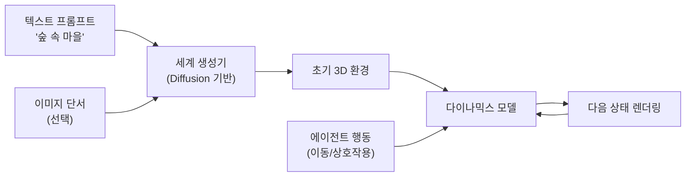

# Genie 3: Generative Interactive Environments (Google DeepMind, 2025)

## 핵심 기여

Google DeepMind가 발표한 Genie 3는 **텍스트 프롬프트 또는 이미지 단서로부터 실시간 조작 가능한 3D 인터랙티브 환경을 생성**하는 세계 모델(world model)이다. 전작 Genie 2(2D 비디오 기반)에서 한 단계 더 나아가 완전한 3차원 공간을 생성하며, 에이전트가 물리적으로 탐색하고 상호작용할 수 있는 환경을 자동으로 만들어낸다. AI 연구에서 시뮬레이션 환경 제작 비용을 획기적으로 낮추고, AI 에이전트 학습용 다양한 환경을 무한 생성할 수 있는 가능성을 열었다.

## 방법

### 핵심 아키텍처

Genie 3는 세 가지 핵심 모듈로 구성된다:

1. **세계 생성기 (World Generator)**: 텍스트/이미지 조건을 받아 초기 3D 환경 구조를 생성. 확산 모델(diffusion model) 기반
2. **다이나믹스 모델 (Dynamics Model)**: 에이전트의 행동(이동, 점프, 객체 조작)을 입력받아 다음 상태를 예측. 비디오 생성 모델과 유사한 형태
3. **비전 인코더 (Vision Encoder)**: 생성된 환경의 3D 구조를 일관된 관점으로 렌더링

### 환경 표현 방식

- 비디오 토큰 시퀀스로 환경을 표현하며, 새로운 프레임을 예측하는 방식으로 상호작용 구현
- 일관된 3D 물리(중력, 충돌)를 명시적으로 시뮬레이션하는 것이 아니라, 학습 데이터에서 내재화된 물리 규칙을 통해 현실적인 행동 결과를 근사
- 장면 내 객체의 조작 가능성(affordance)과 에이전트 행동 공간을 자연어로 명세 가능

### 학습 데이터

Genie 2에서처럼 인터넷 규모의 비디오 데이터(게임 플레이 영상, 실세계 탐색 영상 등)로 비지도 학습. 환경-행동 쌍의 레이블 없이 비디오의 시간적 연속성에서 다이나믹스를 학습.

## 결과

- 텍스트 설명("산악 지형의 고대 유적")에서 탐색 가능한 3D 공간을 수 초 내에 생성
- 생성된 환경에서 RL 에이전트를 학습시켰을 때, 동일 기반 환경에서 학습한 에이전트와 비슷한 정책 품질 달성
- 이미지 기반 조건(스케치, 참조 사진)에서도 일관된 3D 환경 생성 가능
- 환경 일관성(temporal consistency) 면에서 Genie 2 대비 크게 개선

## 한계

- **물리 일관성의 한계**: 확산 모델 기반이므로 복잡한 물리 상호작용(유체, 유연 물체)에서 비현실적 결과 발생 가능
- **장기 일관성 문제**: 오랜 시간 탐색 시 환경이 조금씩 변형(drift)되는 현상
- **해상도 및 복잡도**: 실제 게임 엔진(Unity, Unreal) 수준의 그래픽 충실도와는 차이
- **행동 공간 제한**: 자유형 물리 상호작용보다 사전 정의된 행동 범주 내에서 가장 안정적
- [교차검증 필요] 정확한 파라미터 수, 학습 데이터 규모 등 세부 수치는 공개된 기술 보고서에서 직접 확인 권장

## 실무 적용 관점

- **AI 에이전트 학습 환경 자동 생성**: 수작업으로 게임 레벨을 제작하는 대신, 텍스트로 명세해 무한한 변형 환경을 생성 — 에이전트 학습 데이터 다양성 확보
- **시뮬레이션-현실 갭**: 실제 로봇공학에서 "sim-to-real" 전이 연구의 새 도구가 될 가능성. 가상 환경에서 학습한 정책을 현실로 전이
- **게임/콘텐츠 생성**: 인디 게임 개발자가 프로토타입 수준의 환경을 빠르게 만드는 도구로 활용 가능
- Genie 계열은 범용 세계 모델(general world model) 연구의 중요한 마일스톤으로, [[world-model-architectures]]의 발전 방향을 이해하는 데 핵심 참조 문헌

## 관련 문서

- [[world-model-architectures]]
- [[diffusion-models]]
- [[long-horizon-rl-training-for-agents]]
- [[agentic-engineering]]
