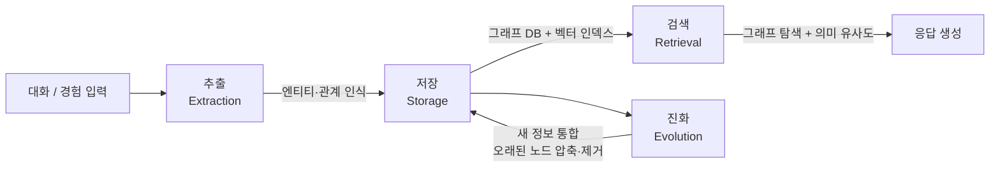

# Graph-based Agent Memory Survey: Taxonomy, Techniques, and Applications

arXiv 2602.05665 | 2026-02-05 | Chang Yang, Chuang Zhou, Yilin Xiao 외 15명

LLM 기반 에이전트가 장기 복잡 태스크(multi-turn dialogue, game playing, scientific discovery)를 수행하기 위해 필요한 메모리 시스템을 **그래프 구조** 관점에서 종합 정리한 서베이다. 메모리의 추출(extraction)부터 저장(storage), 검색(retrieval), 진화(evolution)까지 전체 라이프사이클을 분류 기준으로 삼는다.

## 핵심 기여

- 기존 에이전트 메모리 연구를 4차원 분류 체계로 정리
- Memory lifecycle 전 단계에서의 그래프 활용 기법 체계화
- GraphRAG, A-MEM, LiCoMemory, PlugMem, H-MEM 등 대표 구현 비교
- 미해결 과제(오픈 챌린지) 명시로 후속 연구 방향 제시

## 4차원 분류 체계

| 분류 차원 | 유형 |
|-----------|------|
| **시간 범위 (Temporal scope)** | 단기 기억(short-term) vs 장기 기억(long-term) |
| **내용 유형 (Content type)** | 지식 기반(knowledge-based) vs 경험 기반(experience-based) |
| **구조 (Structure)** | 비구조형(non-structural) vs 구조형(graph-based) |
| **구현 방식 (Implementation)** | 그래프 기반 아키텍처 접근들 |

## Memory Lifecycle

메모리의 4단계 라이프사이클이 이 서베이의 핵심 분류 축이다.

각 단계 설명:

- **추출**: 대화·경험에서 엔티티와 관계를 추출해 그래프 노드/엣지로 변환
- **저장**: 그래프 DB와 벡터 인덱스를 병용해 구조적·의미적 접근을 모두 지원
- **검색**: 그래프 탐색과 시맨틱 유사도를 결합한 하이브리드 검색
- **진화**: 새로운 정보를 기존 그래프에 통합하고 오래된 노드를 압축하거나 제거

## 왜 그래프 구조인가

벡터 DB 단독 방식 대비 그래프 구조가 우위인 이유:

- **관계 의존성 모델링**: 엔티티 간 다대다 관계를 자연스럽게 표현
- **계층 정보 구성**: 추상화 수준별 계층 구조 유지 가능
- **효율적 검색**: 노드/엣지 기반 목적지향 탐색으로 검색 범위 제한 가능
- **자기 진화(self-evolving)**: 노드·엣지 동적 추가·제거로 온라인 업데이트 용이

## 대표 구현 비교

| 시스템 | 핵심 방식 | 특징 |
|--------|-----------|------|
| **GraphRAG** | 엔티티·텍스트 청크 그래프 | 커뮤니티 요약 기반 계층 검색 |
| **A-MEM** | Zettelkasten 방식 동적 인덱싱 | 새 기억 추가 시 자동 링크 생성 |
| **LiCoMemory** | CogniGraph + 계층적 시맨틱 인덱싱 | 인지과학 기반 다층 의미 구조 |
| **PlugMem** | Knowledge-centric 그래프 | Task-agnostic, propositions 단위 저장 |
| **H-MEM** | Hierarchical Memory + 인덱스 라우팅 | 메모리 규모 확장에 최적화 |

## 응용 도메인

| 도메인 | 요구사항 | 관련 벤치마크 |
|--------|----------|--------------|
| Multi-turn dialogue | 장기 대화 일관성, 사용자 선호 유지 | LoCoMo, LongMemEval |
| Game playing agent | 장기 상태 추적, 전략 진화 | - |
| Scientific discovery | 반복 추론, 지식 누적 | - |
| Coding agent | 코드베이스 구조 이해·갱신 | SWE-bench |

## 오픈 챌린지

1. **시간적 일관성(temporal consistency)**: 이전 사실과 새 정보가 충돌할 때 그래프 일관성 유지 방법
2. **스케일 문제**: 수백만 엔티티를 가진 그래프에서 실시간 검색 지연 최소화
3. **노이즈 전파 방지**: 잘못된 추출 정보가 그래프 전체로 전파되는 문제
4. **검색 경계 설정**: Retrieval-augmented 접근과 순수 메모리 접근의 최적 경계 탐색

## 실무 적용 관점

- 장기 에이전트 시스템 설계 시 벡터 DB만으로는 관계 정보를 표현하기 어렵다. 그래프 DB 레이어를 추가하면 엔티티 간 경로 탐색이 가능해진다
- LoCoMo, LongMemEval 벤치마크가 이 서베이에서 반복 언급되므로 메모리 시스템 평가 시 기준 벤치마크로 활용할 수 있다
- Evolution 단계(노드 압축·제거)는 실무에서 TTL 기반 정책과 결합하면 메모리 비용을 제어할 수 있다

## 관련 문서

- [[agent-memory-systems]] -- 에이전트 메모리 시스템 허브 concept
- [[gam-agentic-memory-paper]] -- 계층적 그래프 기반 에이전트 메모리 (2604.12285)
- [[memory-in-the-age-of-ai-agents-paper]] -- 에이전트 메모리 대형 서베이 (2512.13564)
- [[plugmem-paper]] -- Task-agnostic knowledge-centric 메모리 모듈 (2603.03296)
- [[a-rag-paper]] -- 계층적 검색 기반 Agentic RAG
- [[temporal-knowledge-graph-memory]] -- Zep / Graphiti 시간 지식 그래프 메모리
