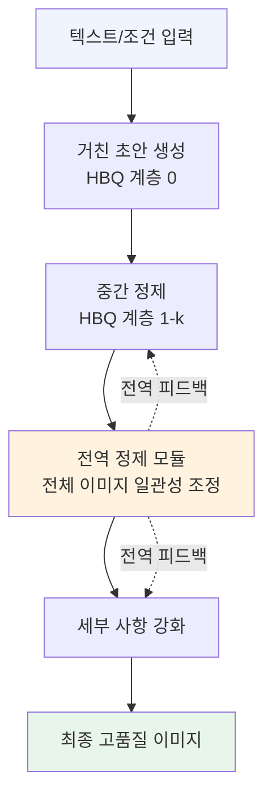
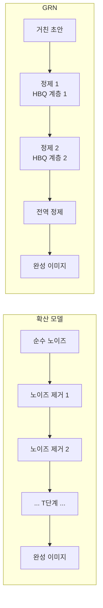

# GRN: 생성적 정제 네트워크 - 확산 이후의 시각 합성

## 패러다임 전환의 배경

현재 고품질 이미지 생성은 세 가지 주요 패러다임이 주도하고 있다:

1. **확산 모델(Diffusion Models)**: DDPM, Stable Diffusion, SDXL - 가우시안 노이즈를 점진적으로 제거하며 이미지 생성
2. **자기회귀 이미지 생성(Autoregressive Image Generation)**: DALL-E 계열 - 이미지를 토큰 시퀀스로 변환 후 언어모델처럼 생성
3. **플로우 매칭(Flow Matching)**: 확산의 개선판으로 더 빠른 샘플링

GRN(Generative Refinement Networks)은 이 세 패러다임과 구별되는 **네 번째 경로**를 제시한다. 핵심 질문: "처음부터 완성된 이미지를 만들려 하지 말고, 거친 초안에서 시작해 점진적으로 정제하면 어떨까?"

## 핵심 기술 1: 계층적 이진 양자화 (HBQ)

자기회귀 이미지 생성의 가장 큰 병목은 **이산 토큰화(discrete tokenization) 문제**다. 연속적인 픽셀 값을 이산 토큰으로 압축하면 정보 손실이 불가피하고, 어휘 크기(vocabulary size)가 커질수록 학습이 어려워진다.

GRN의 HBQ(Hierarchical Binary Quantization)는 이 딜레마를 계층적 이진 분해로 해결한다:

- **계층 0**: 이미지를 가장 거친 이진 표현으로 양자화 (전체적 구조 포착)
- **계층 1**: 계층 0의 잔차(residual)를 이진 양자화 (중간 세부 사항 추가)
- **계층 k**: 이전 계층들의 잔차를 반복적으로 정제

각 계층은 이진(0 또는 1) 결정만 내리므로 계산이 효율적이다. 전체 표현은 계층들의 조합으로 구성된다. 이는 이미지 압축의 웨이블릿(wavelet) 변환이나 오디오의 ResidualVQ와 개념적으로 유사하지만, 이진 결정에 집중한다는 점이 다르다.

## 핵심 기술 2: 전역 정제 메커니즘

HBQ로 거친 표현을 얻었다면, GRN의 전역 정제(global refinement) 메커니즘이 출력 품질을 높인다.

이 메커니즘은 인간 화가의 작업 방식에서 영감을 받았다:
1. 전체 구도를 먼저 스케치
2. 주요 색상 블록 배치
3. 세부 사항 정제
4. 최종 터치업

GRN의 정제 과정:

전역 정제 모듈의 핵심은 **전체 이미지를 한 번에 보고** 부분들 간의 일관성을 유지한다는 것이다. 확산 모델의 각 노이즈 제거 단계가 전역 구조를 암묵적으로 처리하는 것과 달리, GRN은 전역 정제를 명시적 단계로 분리한다.

## 기존 패러다임과의 비교

### 확산 모델 (DDPM/Stable Diffusion)

**확산 모델의 한계**:
- 수십~수백 단계의 노이즈 제거 필요 (느린 샘플링)
- 각 단계가 전체 이미지 해상도에서 작동 (계산 비효율)
- 연속적 잠재 공간이라 이산적 조건 제어가 어렵다

**GRN의 차이점**:
- 초안에서 시작하므로 시작점이 의미 있다 (랜덤 노이즈 vs 거친 스케치)
- 계층적 정제로 각 단계가 이전 단계를 명시적으로 참조
- HBQ 덕분에 이산 조건(클래스, 텍스트 토큰)과의 결합이 자연스럽다

### 자기회귀 이미지 생성 (DALL-E 계열)

이미지를 왼쪽 위에서 오른쪽 아래로 토큰 단위로 생성한다. 이미 생성된 부분을 수정할 수 없고, 전역 일관성 유지가 어렵다. GRN은 전역 정제 단계를 통해 이 한계를 극복한다.

### 플로우 매칭 (Flow Matching)

확산보다 적은 단계로 샘플링 가능하지만 여전히 노이즈에서 시작하는 연속 플로우 기반이다. GRN의 이산 계층 구조와 근본적으로 다른 접근이다.

## 왜 중요한가

이미지 생성 분야는 확산 모델의 지배 이후 새로운 패러다임이 등장하기 어렵다는 인식이 있었다. GRN은 두 가지 측면에서 주목할 만하다:

1. **이론적 참신성**: 이산 계층 양자화 + 전역 정제의 결합은 기존 세 패러다임과 구별되는 독립적인 설계 공간을 제시한다.

2. **확장 가능성**: 계층 수를 늘리면 품질을 높일 수 있고, 줄이면 속도를 높일 수 있다. 확산의 노이즈 제거 단계 수 조절과 유사한 제어 레버를 제공한다.

## 실무 적용 관점

- **편집 가능성(editability)**: 거친 초안 단계에서 구조를 수정하고 정제를 다시 실행하는 방식의 이미지 편집 파이프라인 가능성
- **계층적 조건 제어**: HBQ의 각 계층에 서로 다른 조건(전체 스타일, 세부 질감 등)을 주입하는 세밀한 제어
- **비디오 생성으로의 확장**: 프레임 간 시간적 일관성을 전역 정제 모듈로 처리하는 응용

## 한계 및 향후 연구

- HBQ의 양자화 계층 수와 품질 간 최적 트레이드오프 규명 필요
- 확산 모델 대비 대규모 텍스트-이미지 페어 학습에서의 성능 비교 미흡
- 전역 정제 모듈의 계산 비용이 전체 파이프라인에서 병목이 될 가능성
- 오픈소스 구현 부재로 독립 검증 어려움

## 관련 문서

- [[evolution-of-agentic-patterns]] - 새로운 패러다임의 등장 패턴
- [[context-folding]] - 계층적 압축의 다른 적용 사례
