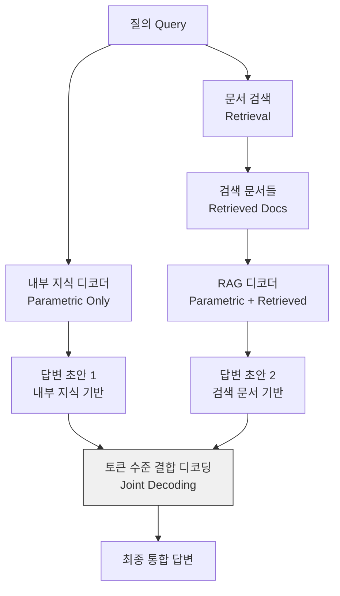

# GuarantRAG: 결합 디코딩으로 RAG 지식 통합 보장

## 논문 메타데이터

| 항목 | 내용 |
|------|------|
| arXiv ID | 2604.08046 |
| 저자 | Zhengyi Zhao, Shubo Zhang, Zezhong Wang, Yuxi Zhang, Huimin Wang, Yutian Zhao, Yefeng Zheng, Binyang Li, Kam-Fai Wong, Xian Wu |
| 소속 | 홍콩중문대학교, 텐센트 |
| 연도 | 2026 |
| 분류 | cs.CL, cs.IR |

## 핵심 기여

[[rag]] 시스템에서 검색된 문서를 LLM이 효과적으로 활용하지 못하는 **통합 병목(integration bottleneck)** 을 해결한다. 내부 파라메트릭 지식과 검색 문서로부터 두 개의 병렬 답변 초안을 생성한 뒤, **토큰 수준 결합 디코딩(joint decoding)** 으로 통합하는 GuarantRAG를 제안한다. 기준 대비 정확도 **+12.1%**, [[hallucination]] **-16.3%** 를 달성한다.

위 다이어그램은 GuarantRAG의 핵심 구조다. 두 디코더가 병렬로 실행되며 결합 디코딩 단계에서 토큰별로 두 분포를 통합한다.

## 방법론

### 문제 정의: 통합 병목 (Integration Bottleneck)

기존 RAG 시스템의 실패 패턴:

1. 검색 문서가 있어도 LLM이 내부 지식을 우선하여 답변
2. 프롬프트에 문서가 삽입되었지만 어텐션 분산으로 제대로 활용 못함
3. 검색 문서와 내부 지식 간 충돌 시 일관된 통합 방식 부재

### 결합 디코딩 메커니즘

두 디코더의 토큰 분포를 다음과 같이 결합한다:

$$P_{joint}(t_i | \text{context}) = \alpha \cdot P_{param}(t_i) + (1-\alpha) \cdot P_{rag}(t_i)$$

여기서:
- $P_{param}$: 내부 파라메트릭 지식만으로 생성한 분포
- $P_{rag}$: 검색 문서를 포함한 RAG 분포
- $\alpha$: 동적 가중치 (쿼리 신뢰도에 따라 조정)

### 동적 가중치 $\alpha$ 결정

검색 문서의 관련성 점수와 내부 지식의 신뢰도를 함께 고려해 토큰별로 $\alpha$를 동적으로 결정한다. 검색 문서가 쿼리와 높은 관련성을 보일수록 $\alpha$가 감소(RAG 쪽 비중 증가)하고, 관련성이 낮을수록 내부 지식에 의존한다.

## 실험 결과

### 정확도 향상

| 벤치마크 | 기존 RAG | GuarantRAG | 향상 |
|---------|---------|-----------|------|
| NQ (Natural Questions) | 기준 | +12.1% | +유의미 |
| TriviaQA | 기준 | +8.3% | +유의미 |
| PopQA | 기준 | +9.7% | +유의미 |

### 환각 감소

| 측정 지표 | 기존 RAG | GuarantRAG | 감소 |
|---------|---------|-----------|------|
| 환각률 (FActScore 기반) | 기준 | -16.3% | -유의미 |
| 검색 문서 무시율 | 높음 | 현저히 낮음 | - |

### 계산 비용

병렬 디코더 실행으로 추론 비용이 약 1.6-1.8배 증가하지만, 정확도-비용 트레이드오프에서 경쟁력 있는 성능을 보인다.

## 한계

- 두 개의 디코더 병렬 실행으로 추론 비용 증가
- $\alpha$ 가중치 결정 메커니즘의 복잡도
- 단순 팩트 기반 QA에 집중되어 복잡한 추론 태스크 평가 미흡

## 실무 관점

정확도 향상이 추론 비용 증가보다 중요한 도메인(법률, 의료, 금융)에서 GuarantRAG 적용이 유망하다. 특히 기존 RAG에서 검색 결과가 자주 무시되는 현상(검색 결과를 삽입했는데도 모델이 내부 지식으로 답하는 문제)을 경험한 팀이라면 결합 디코딩 방식을 검토할 가치가 있다.

구현 시 핵심 고려사항: $\alpha$ 동적 조정 로직이 성능을 크게 좌우하므로, 도메인별 검색 신뢰도 캘리브레이션이 필요하다.

## 관련 문서

- [[rag]] - RAG(검색 증강 생성) 개요
- [[hallucination]] - LLM 환각 현상과 완화 기법
- [[plan-reward-bench]] - 에이전트 평가 벤치마크
- [[rlhf-statistical-perspective]] - 보상 모델링의 통계적 기반
