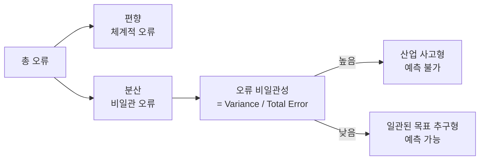

# The Hot Mess of AI: 오정렬은 모델 지능과 함께 어떻게 스케일하는가

## 핵심 기여

AI 시스템의 오류가 모델 지능과 작업 복잡성에 따라 어떻게 변화하는지를 **고전적 편향-분산(bias-variance) 프레임워크**로 분석한 Anthropic 정렬 연구. 프론티어 모델(Claude Sonnet 4, o3-mini, o4-mini, Qwen3)을 GPQA, SWE-Bench, 안전성 평가, 합성 최적화 벤치마크에서 테스트한다.

핵심 논지:

> AI 실패는 일관된 목표 추구(coherent goal pursuit)보다 **"산업 사고(industrial accidents)"**에 가깝다.

## 분석 프레임워크

오류를 고전 통계학의 편향-분산 분해로 구조화:

| 구성 요소 | 정의 | AI 맥락에서의 의미 |
|-----------|------|-------------------|
| **편향(Bias)** | 체계적, 일관된 오류 | 모델이 반복적으로 범하는 동일한 실수 |
| **분산(Variance)** | 예측 불가능한 비일관 오류 | 동일 입력�� 대해 실행마다 다른 결과 |
| **오류 ���일관성** | Variance / Total Error (0-1) | 오류의 무작위성 정도 |

오류 ��일관성이 높으면 "산업 사고"형(예측 불가), 낮으면 "일관된 목표 추구"형(예측 가능)이다. Anthropic 연구는 프론티어 모델의 복잡한 작업 오류가 전자에 가깝다고 주장한다.

## 핵심 발견

### 1. 추론 길이가 비일관성을 유발한다

확장된 추론(extended reasoning)과 순차적 행동이 **모든 테스트 도메인에서 오류 비일관성을 증가**시킨��. 즉, 더 오래 생각할수록 실수의 패턴이 더 무작위해진다.

### 2. 지능-일관성 관계는 불명확하다

| 작업 난이도 | 큰 모델의 오류 일관성 |
|-------------|---------------------|
| 쉬운 작업 | 더 일관 (편향 지배적) |
| 어려운 작업 | 비일관적이거나 악화 (분산 지배적) |

더 큰/똑똑한 모델이 반드시 더 일관된 오류를 보이지는 않는다.

### 3. 자연 추론 > 의도적 추론

- **자발적 확장 추론**(spontaneous extended reasoning)이 비일관성 급증의 주된 원인
- **의도�� 추론 예산 증가**(deliberate reasoning budget)는 일관성 향상에 제한적 효과

### 4. 앙상블의 부분적 효과

다중 샘플 집계(ensemble)로 분산 기반 오류를 줄일 수 있지만:
- 비가역적 에이전트 행동(되돌릴 수 없는 실행)에서는 실질적 적용 어려움
- 실시간 에이전트 시나리오에서는 제한적

## 정책 시사점

이 연구가 AI 안전 연구 방향에 주는 ���의:

| 기존 우려 | 이 논문의 제안 |
|-----------|---------------|
| 완벽한 오정렬 최적화기(misaligned optimizer) 제약 | 보상 명세(reward specification) 연구 우선 |
| 슈퍼인텔리전스의 일관된 위험 행동 방지 | 목표 오명세(goal misspecification) 문제 해결 |
| 모델이 갈수록 더 위험해진다 | 오류의 성격이 변한다 (일관 -> 비일관) |

## 실험 환경

- **모델**: Claude Sonnet 4, o3-mini, o4-mini, Qwen3
- **벤치마크**: GPQA (과학 QA), SWE-Bench (코딩), 안전성 평가, 합성 최적화
- **추가**: 합성 최적화 작업에 맞춤 훈련된 Transformer로 통제 실험

## 관련 문서

- [[편향-분산 트레이드오프]] -- 고전적 편향-분산 분해 기초
- [[정렬 가장(Alignment Faking)]] -- 모델이 정렬된 척 행동하는 현상
- [[보상 해킹(Reward Hacking)]] -- 보상 신호를 의도와 다르게 악용
- [[목표 일반화 실패(Goal Misgeneralization)]] -- 분포 밖에서 의도치 않은 목표 추구
- [[Sleeper Agents]] -- 안전 훈련에도 살아남는 백도어 행동
