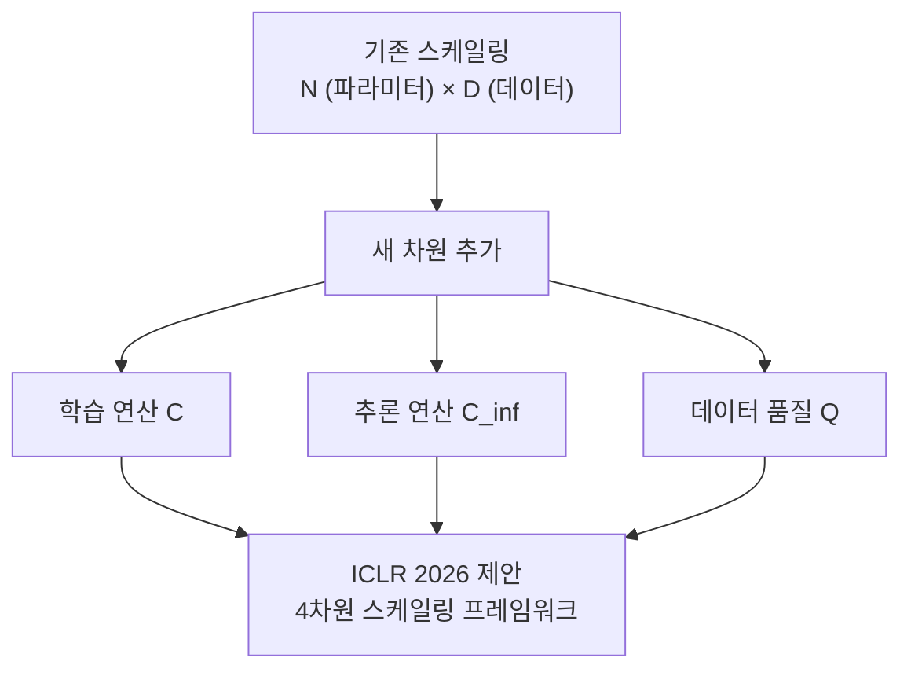

# ICLR 2026 하이라이트: 19,000편 시대의 AI 연구 주요 동향

## 개요

ICLR(International Conference on Learning Representations) 2026은 역대 최대 규모인 **약 19,000편의 논문 제출**을 기록하며, AI 연구가 양적 팽창과 질적 심화를 동시에 겪고 있음을 보여준 해였다. 수락률은 약 25~27% 수준으로 추정되며, 핵심 주제는 추론 능력 강화, 스케일링 법칙 재검토, 안전성/해석 가능성, 멀티모달 에이전트, 효율적 추론(inference efficiency) 다섯 가지로 압축된다.

## 주요 동향 1: 추론 모델의 부상과 테스트 타임 스케일링

가장 많은 논문이 집중된 주제는 **추론 시간(test-time compute)을 늘려 모델 성능을 높이는 방법**이었다. o1/o3 스타일의 긴 내부 추론(chain-of-thought)이 standard이 되면서, 연구 방향이 단순 파라미터 스케일링에서 추론 시간 투자로 이동했다.

- 다양한 Self-Consistency 변형: 가중 투표, 프로세스 리워드 모델(PRM)을 이용한 빔 서치
- Best-of-N 샘플링의 효율적 구현과 검증자(verifier) 학습
- [[scaling-laws]]의 "test-time compute" 축 확장 연구

## 주요 동향 2: 스케일링 법칙 재검토

Chinchilla 이후 정착된 스케일링 법칙이 추론 모델 시대에 맞게 수정되어야 한다는 연구들이 등장했다:

- 파라미터 수 + 데이터 + **추론 연산(inference FLOPs)** 세 번째 축 추가 제안
- 소형 모델 + 긴 추론 vs. 대형 모델 + 짧은 추론의 Pareto frontier 분석
- 모달리티별(언어, 비전, 코드) 스케일링 지수 차이 정량화

## 주요 동향 3: 안전성과 해석 가능성

규제 논의가 본격화되면서 Mechanistic Interpretability와 AI 안전성 관련 논문이 급증했다:

- **슈퍼포지션(Superposition)과 특성 추출**: Sparse Autoencoder(SAE)를 이용한 회로 수준 분석
- **정렬 취약성**: 파인튜닝 후 안전 정렬이 지워지는 현상(alignment tax) 정량화
- **프롬프트 주입 방어**: 멀티에이전트 환경에서의 적대적 입력 차단
- [[ai-reasoning-models]] 내부 추론 과정의 충실성(faithfulness) 검증

## 주요 동향 4: 효율적 추론 (Inference Efficiency)

긴 컨텍스트 처리와 낮은 지연 서빙이 실용적 필요로 대두되면서:

- KV 캐시 압축: 2비트 이하 극단 양자화(TurboQuant 등)
- 추론 시 불필요한 레이어/헤드 스킵(early exit, speculative decoding 변형)
- Sparse Attention 패턴의 하드웨어 친화적 구현
- FlashAttention 후속 연구들: IO 복잡도 추가 감소

## 주요 동향 5: 멀티모달 에이전트와 세계 모델

- 텍스트-이미지-비디오를 통합 토큰 공간으로 처리하는 Any-to-Any 모델
- 인터랙티브 3D 환경 생성 (Genie 3 계열)
- 현실 세계 조작을 위한 비전-언어-행동(VLA) 모델의 스케일링

## 주목할 Best Paper 후보 트렌드

| 영역 | 핵심 주제 |
|------|---------|
| 추론 | Test-Time 컴퓨트 최적 배분 이론 |
| 효율 | 극단 양자화 (1-2비트 KV 캐시) |
| 안전 | SAE 기반 개념 추출과 편향 수정 |
| 세계 모델 | 텍스트 조건 3D 환경 생성 |
| 이론 | 확산 모델 기억화 상전이 분석 |

[교차검증 필요] Best Paper 최종 수상작 목록은 ICLR 2026 공식 웹사이트에서 직접 확인 필요.

## 연구 공동체 변화

- 19,000편이라는 규모는 리뷰어 부족 문제를 심화시켜 리뷰 품질 논쟁이 지속
- 산업계(Google DeepMind, Meta FAIR, OpenAI, Anthropic) 출신 논문 비중이 40%를 넘어서며 학술계-산업계 경계가 더욱 흐려짐
- 중국 연구기관(Tsinghua, PKU, ByteDance, Baidu) 제출 비중 증가
- 재현성(reproducibility) 체크리스트가 더욱 엄격해짐

## 관련 문서

- [[scaling-laws]]
- [[ai-reasoning-models]]
- [[turboquant-paper]]
- [[diffusion-memorization-paper]]
- [[genie3-paper]]
- [[self-consistency-paper]]
