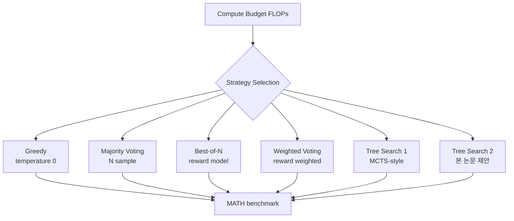

# Inference Scaling Laws (Wu et al., 2024)

## TL;DR

CMU 연구진이 **inference 측 scaling law를 정량화**한 논문. greedy / majority voting / best-of-N / weighted voting / tree search(2종)의 5개 추론 전략을 동일 FLOPs budget에서 비교한 결과, **Llemma-7B + 새 tree search 알고리즘이 모든 FLOPs 구간에서 Llemma-34B + majority voting을 능가**했다. "smaller model + better algorithm > larger model + naive inference"라는 강력한 메시지로 inference compute의 Pareto-optimal 분석을 제시했고, 동일 시기 Snell et al. ([[test-time-scaling-paper]])과 상호 보완하는 위치.

## 핵심 기여

1. **Inference scaling laws 공식화** — training scaling laws에 대응하는 inference 측 scaling 패턴
2. **5가지 추론 전략 비교** — greedy / majority voting / best-of-N / weighted voting / tree search 2종
3. **Pareto-optimal 분석** — 모델 크기 × 토큰 생성량의 cost-performance 곡선
4. **Llemma-7B + tree search > Llemma-34B + majority voting** — 작은 모델 + 정교한 추론이 모든 FLOPs 예산에서 능가
5. **Compute budget 단위 전략 선택** — 예산별 최적 전략이 다름

## 방법론

- **모델**: Llemma-7B, Llemma-34B (수학 특화 LLM)
- **벤치마크**: MATH dataset
- **전략**:
  - **Greedy**: temperature 0 단일 생성
  - **Majority voting**: N개 응답 중 다수결
  - **Best-of-N**: reward model로 best 선택
  - **Weighted voting**: reward 가중치로 응답 결합
  - **Tree search**: standard MCTS-style + 본 논문 제안 새 알고리즘
- **FLOPs 정확히 측정** — 동일 compute budget에서 비교

## 실험/결과

- **MATH benchmark**:
  - Llemma-7B + 새 tree search: **모든 FLOPs 구간**에서 Llemma-34B + majority voting 능가
  - Best-of-N과 weighted voting은 reward model 품질에 좌우
- **Insight**: tree search가 majority voting보다 budget 효율적
- **Smaller model + better algorithm > larger model + naive inference**

## 하네스 엔지니어링 관점

- **추론 전략 선택이 budget 결정에 직접 영향** — 단순 best-of-N으로 끝내지 말고 tree search 검토 ([[inference-time-scaling]])
- **Reward model 품질이 weighted/best-of-N의 한계 결정** — PRM/ORM 학습이 함께 고려되어야 함 ([[verifier-critic-models]])
- **Tree search의 harness 통합** — agent에서는 tool call space에 대해 tree search를 수행하는 패턴 적용 가능 (AlphaCode-style)
- **Production cost 분석** — 모델 크기 줄이고 inference compute로 보충하는 패턴이 정량화됨
- **[[test-time-scaling-paper]]와 상호 보완** — Snell은 PRM 중심, 본 논문은 algorithm space 중심
- harness가 추론 전략을 swappable하게 설계하면 task별 최적 전략 자동 선택 가능

## 한계 / 후속 연구

- **MATH 단일 도메인** — code/agent 도메인 일반화 검증 필요 ([[test-time-compute-agents-paper]]에서 보완)
- **Reward model 학습 비용** — best-of-N/weighted의 hidden cost
- 후속:
  - [[test-time-compute-agents-paper]] (arXiv:2506.12928) — agent 도메인
  - "The Art of Scaling Test-Time Compute" (arXiv:2512.02008)

## 관련 자료

- [[test-time-scaling-paper]] — 동시기 DeepMind/Berkeley 연구
- [[test-time-compute-agents-paper]] — agent 도메인 후속
- [[scaling-laws-paper]] — training-side scaling
- [[chinchilla-scaling-paper]]
- [[inference-time-scaling]]
- [[verifier-critic-models]]
- [[overthinking-test-time-compute]]
