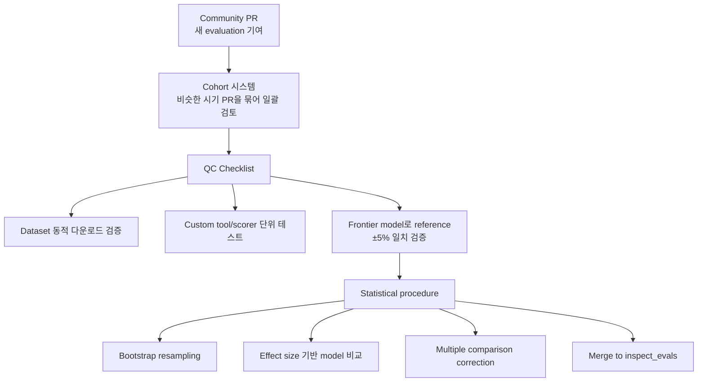

# Inspect Evals: Developing and Maintaining an Open-Source Repository of AI Evaluations (UK AISI, 2025)

## TL;DR

UK AI Security Institute (AISI)가 8개월간 운영한 **inspect_evals 오픈소스 저장소(70+ 커뮤니티 기여 평가)** 의 실전 보고서다. 핵심 인프라 인사이트는 (1) **Cohort management framework** — PR을 시기별로 묶어 일괄 검토, (2) **Statistical methodology** — bootstrap resampling으로 uncertainty quantification, **±5% reference deviation** 기준의 cross-model 비교, (3) **Reproducibility QC** — frontier model 기준 검증, dataset versioning, scorer 단위 테스트. AI 평가는 전통적 SW 개발과 다른 specialized infrastructure가 필요하다는 결론.

## 핵심 기여

1. **inspect_evals 운영 인사이트** — UK AISI가 8개월간 70+ 커뮤니티 기여 평가를 유지한 실전 보고서
2. **Cohort management framework** — 커뮤니티 PR을 안정적으로 받아들이는 구조화된 프로세스
3. **Statistical methodology** — 최적 resampling, cross-model 비교, uncertainty quantification
4. **Reproducibility QC** — 평가가 시간이 지나도 재현 가능하도록 시스템적 품질 관리
5. **Inspect AI 프레임워크의 실증** — 단순 도구가 아닌 평가 governance 시스템으로의 진화

## 방법론

- **Cohort 시스템**: 비슷한 시기에 들어온 PR들을 묶어 일괄 검토 — 단발 PR review보다 효율
- **Statistical procedure**:
  - Bootstrap resampling을 통한 uncertainty 추정
  - Effect size 기반 model 비교
  - Multiple comparison correction
- **QC checklist**:
  - Dataset 동적 다운로드 검증
  - Custom tool/scorer 단위 테스트 필수
  - Frontier model로 reference 결과 ±5% 일치 검증
- **Inspect AI 핵심 객체**: `Task`, `Solver`, `Scorer`, `Sample`, `Tool`

## Inspect AI 프레임워크 자체

- **개발 주체**: UK AI Security Institute (AISI)
- **출시**: 2024년 5월
- **MIT 라이선스, Python 기반**
- **주요 기능**:
  - 200+ pre-built evaluations
  - 웹 기반 Inspect View (모니터링/시각화)
  - VS Code Extension (작성/디버깅)
  - Tool calling: 커스텀, MCP, bash, python, text editing, web search, web browsing, computer-use
  - 멀티 에이전트 primitives
  - Docker/Kubernetes/Modal sandboxing

## 실험/결과

- **70+ evaluations** — 단일 인터페이스로 통합
- **±5% reference deviation 기준** — frontier model에서 검증된 평가만 채택
- **Community contribution scaling** — cohort 도입 후 PR throughput 향상
- 본 논문은 정량적 model 성능 비교보다 **infrastructure / process** 측면 분석 위주

## 하네스 엔지니어링 관점

- **자체 평가 harness 설계의 거의 표준 옵션** — 새 평가 인프라를 만들기보다 Inspect AI 채택 권장
- **Solver/Scorer 분리** — agent 정책(Solver)과 평가(Scorer)를 분리하는 디자인 패턴 ([[agent-evaluation-framework]])
- **Sandboxing 옵션 다양성** — Docker가 기본, Kubernetes로 스케일, Modal로 매니지드 옵션 ([[ai-agent-security]])
- **MCP integration** — Model Context Protocol 도구를 그대로 사용 가능
- **Inspect View** — 평가 trajectory를 사람이 검사하는 데 매우 유용. 사내 harness에서도 trace viewer 필수 ([[agent-observability-tracing]])
- **Reproducibility QC 패턴** — frontier model 기준 reference 검증, dataset versioning, scorer 단위 테스트
- **Cohort process** — 사내 evaluation suite 운영 시 PR 처리 패턴으로 활용 가능

## 한계 / 후속 연구

- **8개월 시점 데이터** — 운영 노하우는 시간에 따라 진화 중
- **Statistical method가 모든 평가에 적합하지는 않음** — 일부 평가는 binary success로 직접 측정
- **외부 contribution 의존** — 평가 품질이 기여자 풀에 의존
- 후속: AISI 자체 평가 표준 (Autonomous Systems Evaluation Standard) 발전

## 관련 자료

- 공식: inspect.aisi.org.uk
- GitHub: UKGovernmentBEIS/inspect_ai
- Evals 카탈로그: inspect.aisi.org.uk/evals
- [[metr-hcast-paper]] — 평가 표준화 맥락 공유
- [[agent-evaluation-framework]]
- [[agentbench-paper]] — multi-environment 평가 비교
- [[swe-bench-paper]] — 단일 도메인 평가
- [[component-level-agent-evaluation]]
- [[long-horizon-agent-benchmarks]]
- [[ai-agent-security]]
