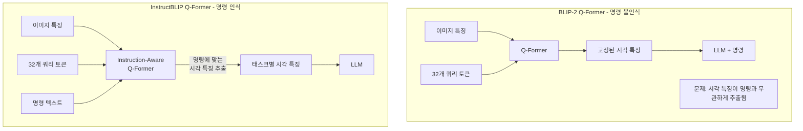
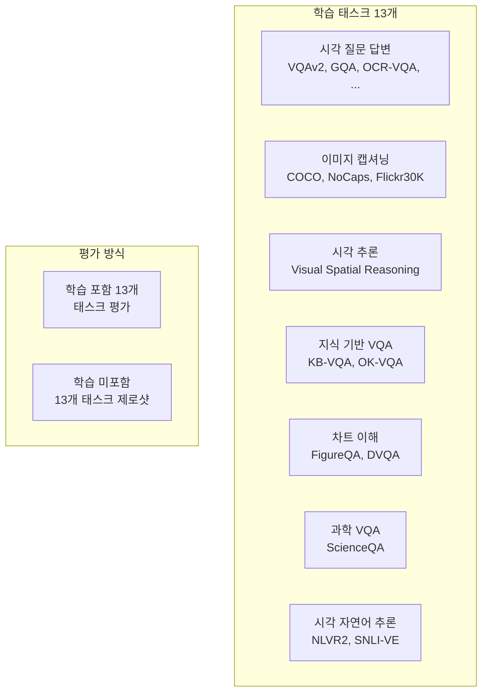
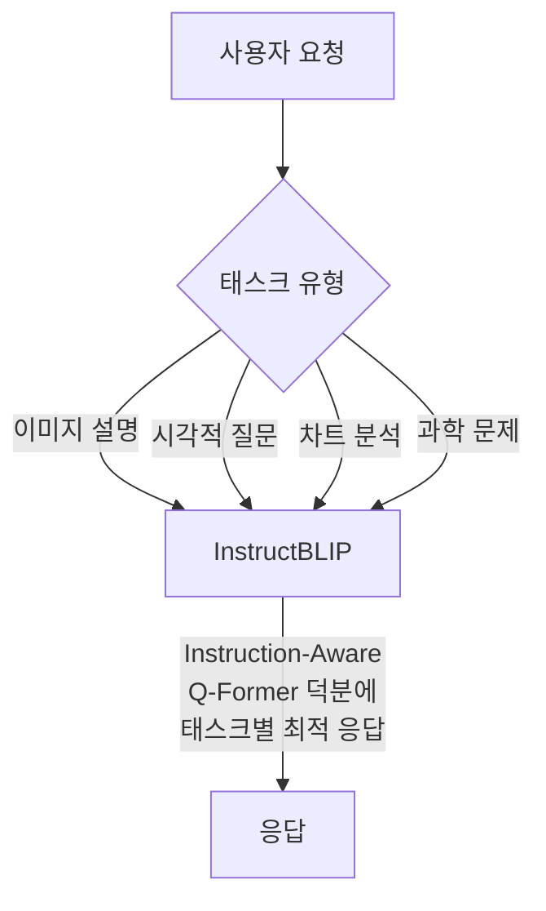

# InstructBLIP: Towards General Purpose Vision-Language Models with Instruction Tuning (Dai et al., 2023)

## 메타데이터

| 항목 | 내용 |
|------|------|
| 저자 | Wenliang Dai, Junnan Li, Dongxu Li, Anthony Tiong, Junqi Zhao, Weisheng Wang, Boxin Wang, Pascale Fung, Steven Hoi (Salesforce Research, HKUST) |
| 연도 | 2023 |
| 학회/저널 | NeurIPS 2023 |
| arXiv | 2305.06500 |
| 코드 | https://github.com/salesforce/LAVIS |

## 핵심 기여

- **Instruction-Aware Q-Former**: BLIP-2의 Q-Former를 명령(instruction) 텍스트를 인식하도록 확장. 쿼리 토큰이 이미지뿐 아니라 현재 명령도 고려해 태스크별 시각 특징 추출
- **13개 태스크 혼합 명령 튜닝**: 시각 질문 답변, 이미지 캡셔닝, 시각 추론 등 26개 데이터셋에서 13개 태스크를 통합 학습
- **제로샷 일반화 탁월**: 학습에 포함되지 않은 13개 홀드아웃(held-out) 태스크에서 강력한 제로샷 성능 달성
- **표준 멀티모달 명령 튜닝 벤치마크 수립**: 포괄적인 평가 프레임워크와 비교 실험 제공
- **FlanT5 및 Vicuna 백본 모두 지원**: 서로 다른 LLM 백본에서 일관된 성능 향상 확인

## 배경과 문제 정의

### BLIP-2의 미완성된 부분

BLIP-2는 강력한 시각-언어 사전학습을 제공했지만:
- **명령 따르기 능력 부재**: "이 이미지에서 사람의 감정을 설명해줘" 같은 명령에 직접 응답 어려움
- **태스크 특화 파인튜닝 필요**: 각 벤치마크마다 별도 파인튜닝 필요 → 범용 모델이 아님
- **Q-Former의 고정된 쿼리**: 이미지에서 추출하는 정보가 현재 질문/명령과 무관하게 항상 동일

### 명령 튜닝의 효과

텍스트 LLM에서 InstructGPT, FLAN 등이 보여준 것처럼, **명령 데이터로 파인튜닝하면 다양한 태스크에 범용적으로 적용 가능한 모델**이 된다. 이 아이디어를 시각-언어 모델로 확장하는 것이 InstructBLIP의 목표다.

## 방법

### 핵심 혁신: Instruction-Aware Q-Former

일반 BLIP-2 Q-Former와 InstructBLIP의 Q-Former 비교:



**기술적 구현**:
- 명령 텍스트가 Q-Former의 Self-Attention 레이어에 함께 입력
- 쿼리 토큰이 명령 텍스트 토큰과 상호작용 가능
- "어떤 색인가요?" → 색상 관련 시각 정보 집중 추출
- "이 이미지를 시로 표현해줘" → 분위기/감성 시각 정보 집중 추출

### 학습 데이터 구성

13개 태스크, 26개 데이터셋:



**중요한 점**: 13개 태스크는 학습에 포함, 나머지 13개는 홀드아웃으로 제로샷 평가.

### 명령 포맷 템플릿

다양한 명령 형식으로 동일 태스크를 표현해 다양성 확보:

```
[이미지] {명령 1}: "이 이미지에서 무엇이 보이나요?"
[이미지] {명령 2}: "이미지의 내용을 상세히 설명해주세요."
[이미지] {명령 3}: "이 사진에 무엇이 있나요? 자세히 설명해주세요."
```

같은 태스크에 대해 다양한 템플릿을 사용해 명령 표현 다양성을 확보한다.

### 학습 절차

BLIP-2 사전학습 가중치에서 시작해:
1. 동결: ViT 비전 인코더, LLM (FLAN-T5 또는 Vicuna)
2. 학습: Q-Former + 선형 프로젝션 레이어
3. 데이터: 26개 데이터셋 혼합, 명령 포맷으로 변환

## 실험 및 결과

### 학습된 태스크 성능

**VQAv2 (학습 데이터에 포함)**

| 모델 | val |
|------|-----|
| BLIP-2 (FlanT5-XXL) | 65.2 |
| InstructBLIP (FlanT5-XXL) | 68.2 |
| BLIP-2 (Vicuna-13B) | 65.0 |
| InstructBLIP (Vicuna-13B) | 71.2 |

**ScienceQA-IMG (학습 데이터에 포함)**

| 모델 | 정확도 |
|------|-------|
| GPT-4 | 82.7% |
| InstructBLIP (FlanT5-XXL) | 90.7% |
| InstructBLIP (Vicuna-13B) | 91.8% |

### 제로샷 태스크 (홀드아웃) 성능

**이 결과가 InstructBLIP의 핵심 기여**

| 태스크 | BLIP-2 | InstructBLIP | 향상 |
|--------|--------|-------------|------|
| MMBench | 45.7 | 59.1 | +13.4 |
| MM-Vet | 22.4 | 26.2 | +3.8 |
| LLaVA-Bench | - | 63.1 | - |
| POPE (할루시네이션 테스트) | - | 78.9 | - |

### Instruction-Aware Q-Former 절제 실험

| Q-Former 유형 | VQAv2 | ScienceQA |
|--------------|-------|-----------|
| 일반 Q-Former (BLIP-2) | 65.2 | 74.3 |
| Instruction-Aware Q-Former | 68.2 | 90.7 |

명령 인식 Q-Former가 ScienceQA에서 16.4 포인트나 향상. 명령에 맞는 정보 추출이 중요한 태스크에서 특히 효과적이다.

### 다양한 LLM 백본 성능

| LLM 백본 | 파라미터 | VQAv2 | ScienceQA |
|----------|---------|-------|-----------|
| FlanT5-XL | 3B | 65.5 | 79.9 |
| FlanT5-XXL | 11B | 68.2 | 90.7 |
| Vicuna-7B | 7B | 68.0 | 91.2 |
| Vicuna-13B | 13B | 71.2 | 91.8 |

LLM이 클수록 성능이 향상되지만, Vicuna-7B도 FlanT5-XXL(11B)과 비슷하거나 뛰어남. 명령 튜닝된 LLM(Vicuna)이 사전학습 후 파인튜닝된 LLM(FlanT5)보다 멀티모달 명령 따르기에 더 적합함을 시사한다.

## 한계 및 후속 연구

### 한계

- **특정 태스크 특화 성능**: 개별 태스크 특화 모델과 비교할 때 여전히 격차 존재
- **고해상도 이미지 한계**: 224x224 고정 해상도 제한 (BLIP-2로부터 상속)
- **비디오/오디오 미지원**: 정적 이미지만 처리
- **할루시네이션**: POPE 기준 78.9%로 개선 여지 있음
- **데이터 편향**: 영어 중심 데이터셋으로 다국어 성능 한계

### 후속 연구 방향

- 더 많은 태스크와 데이터 통합
- 고해상도 이미지 지원 (LLaVA-1.6 방식의 AnyRes)
- 비디오 이해 확장
- 할루시네이션 감소 (RLAIF, DPO 기반)

## 실무 적용 관점

### 범용 멀티모달 어시스턴트 구축

InstructBLIP은 단일 체크포인트로 다양한 멀티모달 태스크를 처리할 수 있는 **범용 멀티모달 어시스턴트**의 프로토타입이다:



**기업 활용 시나리오**:
- 제품 이미지 자동 설명 생성
- 문서/슬라이드 이미지의 내용 추출
- 과학/기술 이미지 분석 지원

```python
from transformers import InstructBlipProcessor, InstructBlipForConditionalGeneration
import torch

model = InstructBlipForConditionalGeneration.from_pretrained(
    "Salesforce/instructblip-vicuna-7b"
)
processor = InstructBlipProcessor.from_pretrained(
    "Salesforce/instructblip-vicuna-7b"
)

# 명령 기반 이미지 분석
inputs = processor(
    images=image,
    text="이 이미지에서 가장 중요한 시각적 요소를 3가지 설명해주세요.",
    return_tensors="pt"
).to("cuda")

outputs = model.generate(
    **inputs,
    do_sample=False,
    num_beams=5,
    max_length=256,
    repetition_penalty=1.5
)
response = processor.batch_decode(outputs, skip_special_tokens=True)[0].strip()
```

### Instruction-Aware 설계 원칙

InstructBLIP의 핵심 설계 원칙은 다른 멀티모달 태스크에도 적용 가능하다:

> 정보 추출 단계에서 최종 태스크를 고려하면 더 관련 있는 정보를 선별적으로 추출할 수 있다.

오디오 이해, 포인트클라우드 분석 등에서 "어떤 정보를 추출할지"를 쿼리 목표에 따라 동적으로 결정하는 구조는 범용 멀티모달 시스템에서 중요한 설계 원칙이다.

## 관련 문서

- [[blip-2-paper]] - InstructBLIP의 기반 아키텍처
- [[blip-paper]] - BLIP-2의 전신
- [[llava-original-paper]] - 유사 시기 멀티모달 명령 튜닝 접근법
- [[minigpt4-paper]] - 단순 프로젝션 레이어 접근법
- [[instruction-tuning]] - 명령 튜닝 개념
- [[multimodal-llm]] - 멀티모달 LLM 개념 전반
