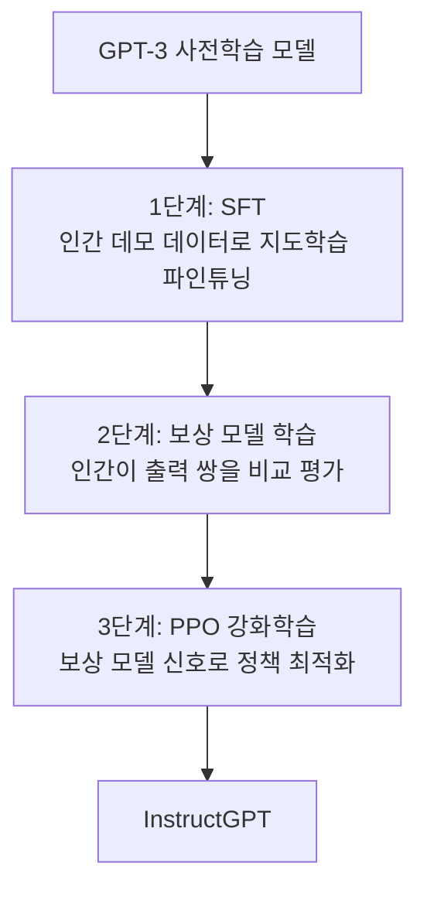

# Training Language Models to Follow Instructions with Human Feedback (InstructGPT, Ouyang et al., 2022)

## 핵심 기여

OpenAI가 2022년 발표한 InstructGPT는 GPT-3를 **인간 피드백으로부터의 강화학습(RLHF, Reinforcement Learning from Human Feedback)**으로 파인튜닝하여 지시 사항(instruction)을 따르게 만든 최초의 대규모 실용화 연구다. **1.3B InstructGPT가 175B GPT-3보다 인간 선호도 평가에서 우수**하다는 결과로 스케일이 아닌 정렬(alignment)의 중요성을 실증했다. ChatGPT의 직접 선조이며 현대 정렬 연구의 전환점이다.

## 방법

### 3단계 RLHF 파이프라인

**1단계 - SFT(Supervised Fine-Tuning)**: 라벨러(labeler)가 다양한 지시 프롬프트에 대해 고품질 응답을 직접 작성한 데모 데이터로 파인튜닝.

**2단계 - 보상 모델(Reward Model, RM) 학습**: 동일 프롬프트에 대한 여러 출력을 라벨러가 순위를 매기면, RM이 인간 선호도를 예측하도록 학습.

**3단계 - PPO(Proximal Policy Optimization)**: RM의 스칼라 보상 신호를 피드백으로 정책을 강화학습으로 최적화. KL 발산(KL divergence) 패널티로 원본 GPT-3에서 너무 멀어지지 않도록 제한.

### 보상 해킹 방지

- KL-페널티 항: $r = r_{RM}(x, y) - \beta \cdot \text{KL}(\pi_\theta \| \pi_{SFT})$
- 사전학습 데이터로의 혼합 학습으로 성능 저하(alignment tax) 완화

## 결과 및 영향

- 동일 프롬프트에서 InstructGPT 1.3B가 GPT-3 175B보다 85% 이상의 비율로 인간 선호
- 지시 따르기, 사실성, 무해성 모두 개선
- ChatGPT(2022.11)로 직결 - 1억 사용자 돌파하며 AI 대중화 촉발
- RLHF가 사실상 LLM 정렬의 표준 기법으로 자리잡음

## 한계

- 라벨러 편향이 보상 모델에 내재화됨 - 라벨러 집단이 대표성을 가지지 못할 경우 문제
- **보상 해킹(reward hacking)**: RM이 실제로 원하는 것과 다른 방향으로 최적화될 위험
- 고비용: 인간 라벨링 비용이 크고, PPO 학습이 불안정
- "무해하고 유용한" 두 목표가 충돌하는 정렬 세금(alignment tax) 문제 잔존

## 실무 적용 관점

- RLHF 파이프라인을 직접 구현하지 않더라도, SFT 단계만으로도 상당한 지시 따르기 향상 가능
- 보상 모델 품질이 최종 모델 품질을 결정 - 라벨 데이터 설계가 핵심
- DPO(Direct Preference Optimization)는 RLHF의 RM 학습과 PPO를 하나의 손실 함수로 단순화한 대안
- PPO 대신 GRPO(Group Relative Policy Optimization) 등 다양한 변형이 등장하고 있음

## 관련 문서
- [[cot-faithfulness-paper]] -- Lie to Me: 오픈 웨이트 추론 모델의 Chain-of-Thought 충실도 측정

- [[gpt-3-paper|GPT-3 퓨샷 학습]]
- [[dpo|DPO 직접 선호도 최적화]]
- [[Constitutional AI (Anthropic)]]
- [[RLHF 인간 선호도 강화학습 원논문 (Christiano et al.)]]
- [[reward-hacking-overoptimization]]
