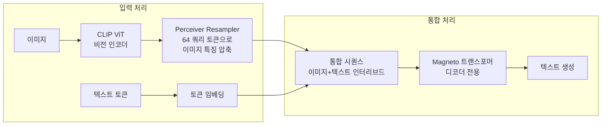
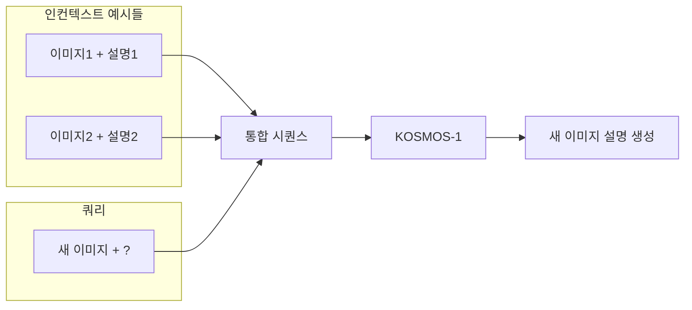
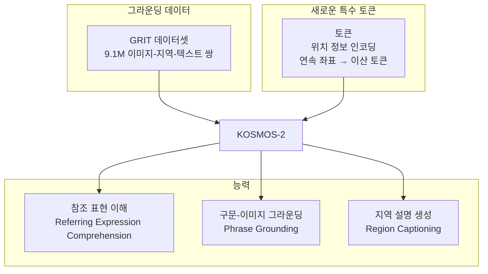
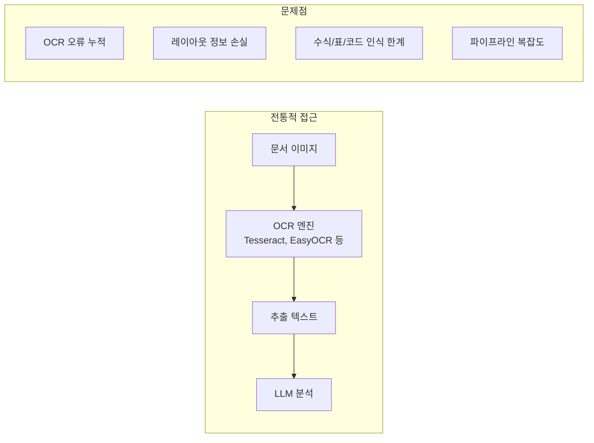
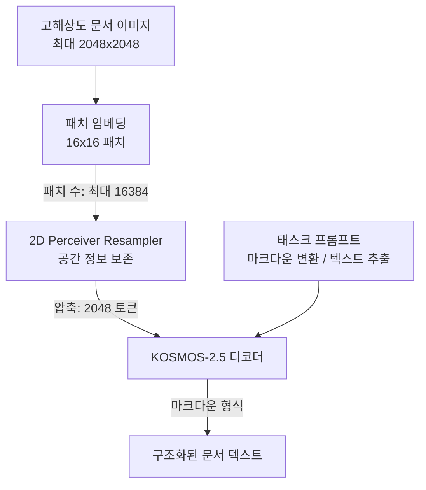
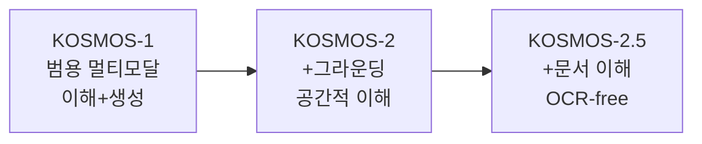
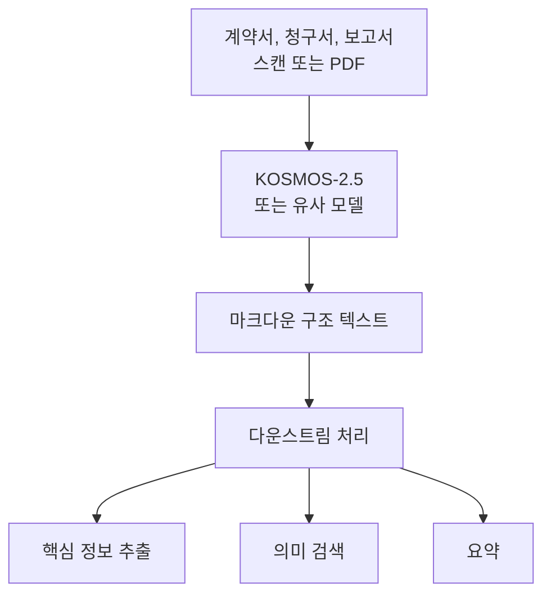

# KOSMOS 시리즈: 멀티모달 대형 언어 모델 (Microsoft, 2023)

## 메타데이터

| 논문 | arXiv | 주요 특징 |
|------|-------|---------|
| KOSMOS-1 | 2302.14045 | 첫 멀티모달 LLM, 멀티모달 인컨텍스트 학습 |
| KOSMOS-2 | 2306.14824 | 시각적 그라운딩(grounding), 바운딩 박스 |
| KOSMOS-2.5 | 2309.11419 | OCR-free 문서 이해, 텍스트-이미지 통합 |

| 항목 | 내용 |
|------|------|
| 주관 기관 | Microsoft Research |
| 연도 | 2023 |
| 코드 | https://github.com/microsoft/unilm (일부 공개) |

## 핵심 기여

- **멀티모달 인컨텍스트 학습(KOSMOS-1)**: 텍스트 예시뿐 아니라 이미지-텍스트 예시를 인컨텍스트로 제공해 새 태스크 적용하는 최초 시연
- **그라운딩 멀티모달 LLM(KOSMOS-2)**: 이미지 내 특정 영역을 언어로 참조하고 바운딩 박스와 연결하는 능력 통합
- **OCR-free 문서 이해(KOSMOS-2.5)**: OCR 엔진 없이 문서 이미지를 직접 마크다운 텍스트로 변환
- **텍스트-이미지 통합 표현**: 텍스트와 이미지 토큰을 동일한 트랜스포머 시퀀스로 처리하는 통합 아키텍처
- **대규모 멀티모달 사전학습**: 웹 크롤링 이미지-텍스트 쌍, 인터리브드 데이터로 수조 토큰 규모 학습

## KOSMOS-1: 멀티모달 GPT

### 배경과 목표

> "A picture is worth a thousand words"

KOSMOS-1 (2302.14045, 2023년 2월)은 **이미지와 텍스트를 모두 이해하고 생성할 수 있는 범용 멀티모달 LLM**을 목표로 했다. 핵심 질문: 텍스트 전용 언어 모델의 강력한 인컨텍스트 학습 능력을 이미지-텍스트 멀티모달로 확장할 수 있는가?

### 아키텍처

**Perceiver Resampler**: KOSMOS-1이 Q-Former 대신 사용하는 이미지 압축 모듈. 학습 가능한 64개 쿼리로 ViT의 수백 개 패치 특징을 압축.

**Magneto 트랜스포머**: Microsoft가 개발한 학습 안정화 트랜스포머 변형. Pre-LayerNorm과 Xavier 초기화 결합.

### 학습 데이터 (멀티모달 코퍼스)

| 데이터 유형 | 예시 | 규모 |
|------------|------|------|
| 텍스트만 | CommonCrawl, Wikipedia | 수천억 토큰 |
| 이미지-캡션 쌍 | LAION-2B, COYO-700M | 수백억 쌍 |
| 인터리브드 이미지-텍스트 | 웹 문서 (HTML) | 수십억 문서 |

인터리브드(interleaved) 데이터: 하나의 문서 안에 이미지와 텍스트가 교차 배치된 형태. 멀티모달 인컨텍스트 학습 능력의 핵심 소스.

### 멀티모달 인컨텍스트 학습

텍스트 예시 없이 이미지-텍스트 예시만으로 새 태스크를 수행. 예를 들어:
- 예시: [강아지 이미지 → "골든 리트리버"] x 3쌍 → 쿼리: [새 개 이미지] → 품종 맞추기

### KOSMOS-1 성능

| 태스크 | 설정 | 결과 |
|--------|------|------|
| IQ 테스트 (Raven's Progressive Matrices) | 제로샷 | 22.1% (GPT-4: 38.0%) |
| VQAv2 | 제로샷 | 51.0 |
| COCO 캡셔닝 | few-shot | 84.7 CIDEr |
| Winoground (시각-언어 구성성) | 제로샷 | 텍스트 전용 GPT 수준 |

## KOSMOS-2: 그라운딩과 지각

### 핵심 혁신

KOSMOS-2 (2306.14824, 2023년 6월)는 **언어와 이미지의 특정 영역을 직접 연결하는 그라운딩(grounding) 능력** 추가.

**위치 토큰 방식**:
이미지를 32x32 그리드로 나누어 1024개의 위치 토큰 `<loc_0>` ~ `<loc_1023>` 생성. 바운딩 박스를 $[x_1, y_1, x_2, y_2]$ 형태로 인코딩:

$$\text{bbox} = [\text{<loc}_{x_1 \times 32}\text{>}, \text{<loc}_{y_1 \times 32}\text{>}, \text{<loc}_{x_2 \times 32}\text{>}, \text{<loc}_{y_2 \times 32}\text{>}]$$

**능력 예시**:
- 입력: "이미지에서 빨간 공을 찾아줘" → 출력: 해당 영역 바운딩 박스
- 입력: 이미지 + 바운딩 박스 → 출력: "이것은 농구공입니다"

## KOSMOS-2.5: OCR-free 문서 이해

### 핵심 혁신

KOSMOS-2.5 (2309.11419, 2023년 9월)는 **문서 이미지를 OCR 없이 마크다운 텍스트로 변환**하는 멀티모달 리터럿(literate) 모델이다.

### 기존 OCR 파이프라인의 문제

**KOSMOS-2.5의 접근**: 문서 이미지를 직접 마크다운으로 변환, OCR 단계 완전 제거.

### 아키텍처: 고해상도 문서 처리

**두 가지 태스크 모드**:
1. **텍스트 스패닝(Text Spanning)**: 문서의 텍스트와 위치 좌표를 함께 출력 (OCR+레이아웃 추출)
2. **마크다운 생성(Markdown Generation)**: 제목, 표, 목록, 강조 등 마크다운 구조로 변환

### 학습 데이터

| 데이터 유형 | 규모 | 특성 |
|------------|------|------|
| IIT-CDIP 문서 이미지 | 6M+ | 스캔 문서 |
| PDF 렌더링 | 1M+ | 디지털 문서 |
| 학술 논문 | 수십만 | 수식, 표 포함 |
| 웹 스크린샷 | 수십만 | HTML 레이아웃 |

### KOSMOS-2.5 성능

| 벤치마크 | 메트릭 | KOSMOS-2.5 | 이전 SOTA |
|----------|--------|-----------|---------|
| DocVQA | ANLS | 85.7 | 84.5 |
| ChartQA | 정확도 | 66.4 | 65.1 |
| InfoVQA | ANLS | 51.4 | 50.0 |
| TextVQA | 정확도 | 78.2 | 77.9 |

OCR-free 방식으로 OCR 기반 파이프라인과 동등하거나 뛰어난 성능 달성.

## KOSMOS 시리즈의 통합 관점

각 버전이 이전 버전의 능력을 유지하면서 새 능력을 추가하는 누적적 발전 구조.

## 한계 및 후속 연구

### 공통 한계

- **공개 가중치 제한**: KOSMOS 시리즈의 완전한 학습 가중치가 완전히 공개되지 않아 재현 어려움
- **추론 비용**: 대규모 모델(수십억 파라미터)로 엣지/모바일 환경 배포 어려움
- **할루시네이션**: 문서 OCR 태스크에서 존재하지 않는 텍스트 생성 사례 보고
- **한국어/비영어 문서**: 영어 중심 학습으로 다국어 문서 이해 한계

### 후속 및 경쟁 연구

- **Florence-2** (Microsoft): KOSMOS 계열 후속으로 더 넓은 비전 태스크 통합
- **DocOwl** (Alibaba): 문서 이해 특화 멀티모달 모델
- **Donut**: KOSMOS-2.5와 유사한 OCR-free 문서 이해
- **GPT-4V/o**: 문서 이해 포함 범용 멀티모달

## 실무 적용 관점

### OCR-free 문서 처리 파이프라인

KOSMOS-2.5가 개척한 OCR-free 문서 이해는 엔터프라이즈 문서 처리에 큰 가능성을 가진다:

**실용적 고려사항**:
- 완전 공개 OCR-free 모델로는 Donut, TrOCR 등이 더 접근하기 쉬움
- KOSMOS-2.5 수준의 성능을 원하면 Azure AI Document Intelligence (클라우드 서비스) 활용 권장
- 오픈소스 대안: Nougat (Meta, 학술 논문 특화)

### 그라운딩의 활용처

KOSMOS-2의 그라운딩 능력:
- 의료 이미지에서 병변 위치 지정
- 문서에서 특정 정보 위치 표시
- 제조업 결함 검사 이미지 분석

## 관련 문서

- [[multimodal-llm]] - 멀티모달 LLM 개념 전반
- [[document-understanding]] - 문서 이해 태스크 개요
- [[ocr-free-models]] - OCR-free 접근법 비교
- [[blip-2-paper]] - 유사 시기 비전-LLM 결합 연구
- [[llava-original-paper]] - 오픈소스 멀티모달 접근법
- [[attention-is-all-you-need-paper]] - 트랜스포머 기반 아키텍처
