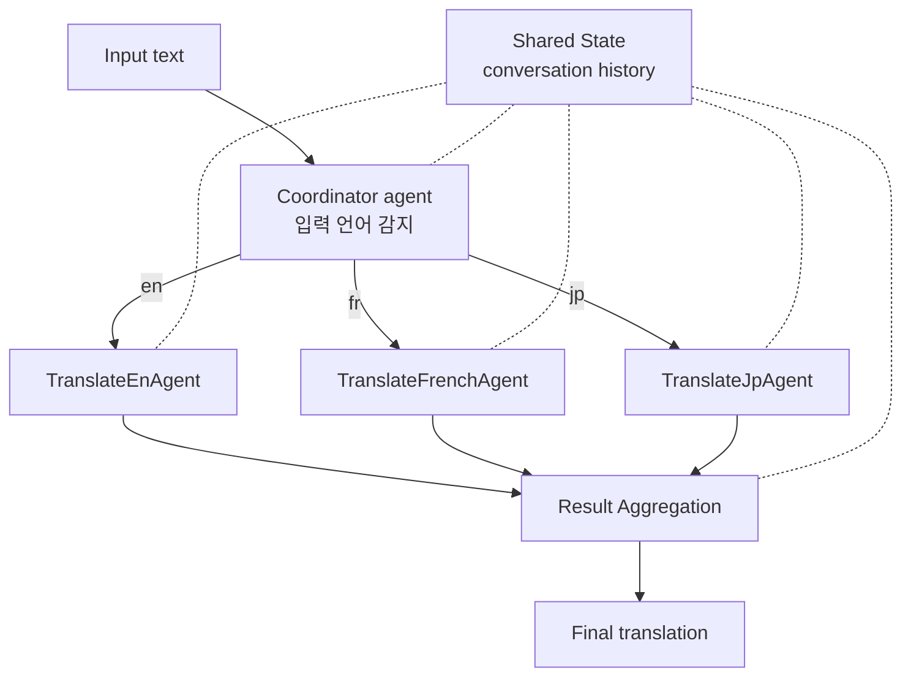

# Agent AI with LangGraph: A Modular Framework for Enhancing Machine Translation (Wang & Duan, 2024)

## TL;DR

이 논문은 **LangGraph state-machine 패턴을 다국어 번역 도메인에 적용한 학술적 사례 연구**다. TranslateEnAgent / TranslateFrenchAgent / TranslateJpAgent를 modular agent로 정의하고 graph-based orchestration으로 협력하게 하며, dynamic state management로 대화 맥락을 유지한다. GPT-4o 기반 case study와 architecture 분석 중심이라 정량 metric은 제한적이지만, **LangGraph의 state-machine 패턴이 production agent harness의 표준 옵션 중 하나임을 학술 문헌에 정립**한 reference로서 가치가 있다. 실제 LangGraph 학습은 공식 문서가 1차 source.

## 핵심 기여

1. **LangGraph state-machine 패턴의 학술적 사례** — 모듈러 에이전트 + graph 오케스트레이션
2. **다국어 번역 에이전트 합성** — TranslateEnAgent / TranslateFrenchAgent / TranslateJpAgent
3. **Dynamic state management** — 대화 맥락 유지를 그래프 상태로 표현
4. **Graph-based orchestration** — 노드 간 명시적 edge로 에이전트 협력 정의
5. **GPT-4o 통합** — 실제 LLM 기반 번역 정확도 향상 사례

## 방법론

- **LangGraph framework**:
  - StateGraph: shared state를 노드 간 전달
  - Node = function 또는 LLM call
  - Edge = transition rule (조건부, 무조건)
  - State = TypedDict로 정의된 dataclass
- **본 논문 구성**:
  - Coordinator agent가 입력 언어 감지
  - 적절한 TranslateXxAgent로 routing
  - Result aggregation 노드에서 최종 응답 합성
- **Conversation context**: state 안에 history를 저장해 multi-turn 지원

## 실험/결과

- 다국어 번역 시나리오에서 단일 LLM 대비 modular 접근의 장점 시연
- 정량 metric은 제한적이며 case study와 architecture 분석 중심
- Open-source 호환성과 확장성 입증

## 하네스 엔지니어링 관점

- **State machine으로 에이전트 흐름 표현** — [[react-paper]]-style free-form prompt 대비 (1) 디버깅 용이, (2) 결정성 향상, (3) 멀티 에이전트 통합 자연스러움
- **LangGraph가 production agent harness 표준 옵션** — LangChain 생태계 통합
- **Conditional edge** — LLM 출력에 따라 다음 노드 동적 선택. agent loop 종료 조건도 edge로 표현
- **Persistence/Checkpointing** — LangGraph는 SQLite/Postgres 체크포인터로 long-running agent resume 가능 ([[agent-interrupt-resume]])
- **MultiAgent 패턴**:
  - Supervisor pattern: 한 에이전트가 다른 에이전트 호출
  - Hierarchical: 그래프 안에 sub-graph
  - Collaborative: 동일 state를 여러 에이전트가 공유
- **LangSmith 통합** — trace 시각화 ([[agent-observability-tracing]])

## 한계 / 후속 연구

- 본 논문은 case study 중심 — 정량 비교 부족
- 단일 도메인(번역) 검증 — generality는 LangGraph 자체 ecosystem이 입증
- 최근(2025) LangGraph는 functional API, durable execution 등 대폭 진화 — 본 논문 시점 이후 변화 큼
- 후속: 본격적인 LangGraph design doc은 LangChain 공식 문서가 1차 source

## 관련 자료

- 공식 문서: docs.langchain.com/oss/python/langgraph/overview
- GitHub: langchain-ai/langgraph
- [[autogen-paper]] — Microsoft 비교 프레임워크 (conversation-based)
- [[openhands-paper]] — EventStream 비교 (event-stream based)
- LangGraph entity 페이지(tooling): langgraph, langgraph-1-0-ga, langgraph-durable-execution, langgraph-persistence, langgraph-quickstart
- [[react-paper]]
- [[agent-event-driven-pattern]]
- [[agent-interrupt-resume]]
