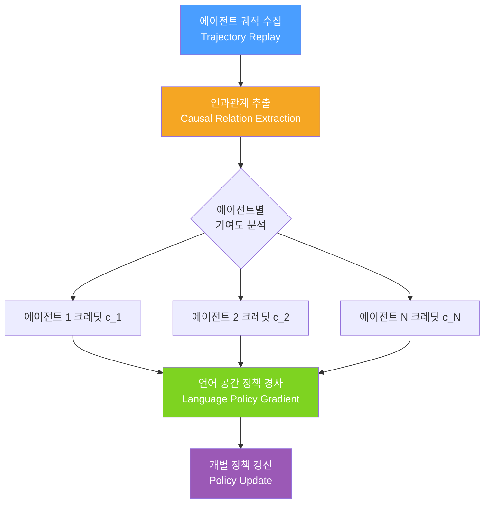

# LangMARL: Natural Language Multi-Agent Reinforcement Learning

## 핵심 기여

기존 다중 에이전트 강화학습(Multi-Agent Reinforcement Learning, MARL)의 핵심 난제인 **크레딧 배분 문제(credit assignment)**를 자연어 공간에서 해결한다. 각 에이전트가 공동 보상에 얼마나 기여했는지를 언어 수준의 인과관계 분석으로 추출하고, 이를 개별 에이전트의 밀집 피드백(dense feedback)으로 변환한다.

핵심 아이디어:
- 희소 보상(sparse reward) 환경에서 에이전트별 밀집 피드백 생성
- 언어 공간(language space)에서 직접 정책 경사(policy gradient) 수행
- 인과관계(causal relation)를 추출해 에이전트별 책임 분리

## 문제 배경: 크레딧 배분의 어려움

협동 MARL에서 보상은 팀 전체에 공유되는 경우가 많다. 이 때 특정 에이전트의 기여를 분리하기 어렵다.

| 상황 | 기존 방식 문제 |
|------|---------------|
| 희소 보상 | 어떤 에이전트 행동이 보상에 기여했는지 불분명 |
| 장기 의존성 | 수십 스텝 전 행동의 인과관계 추적 어려움 |
| 언어 행동 공간 | 연속 값이 아닌 텍스트 행동에 경사 적용 어려움 |

LangMARL은 이 세 가지 문제를 언어 기반 인과관계 분석으로 동시에 해결한다.

## 방법론

### 1단계: 궤적 리플레이 (Trajectory Replay)

에이전트들의 행동 궤적 $\tau = \{(s_t, a_t^1, a_t^2, ..., a_t^N, r_t)\}_{t=1}^T$를 기록한다. 각 타임스텝에서 모든 에이전트의 언어 행동과 공유 보상을 저장.

### 2단계: 인과관계 추출 (Causal Relation Extraction)

LLM을 활용해 각 에이전트의 행동이 최종 결과에 미친 인과적 영향을 분석한다:

$$c_i^t = \text{CausalExtract}(\tau, a_i^t) \in \mathbb{R}$$

이 과정은 **반사실적 추론(counterfactual reasoning)**에 기반한다: "에이전트 $i$가 이 행동을 하지 않았다면 결과가 어떻게 달라졌을까?"

### 3단계: 언어 정책 경사 (Language Policy Gradient)

수치 공간 대신 언어 토큰 확률에 직접 경사를 적용한다:

$$\nabla_\theta \mathcal{L}_i = \mathbb{E}_\tau \left[ \sum_t c_i^t \cdot \nabla_\theta \log \pi_\theta^i(a_i^t | s_t) \right]$$

여기서 $c_i^t$는 에이전트별 인과 크레딧으로, 기존 REINFORCE의 글로벌 보상 $R$ 대신 사용한다.

## 실험 설정

- **환경**: 협동 텍스트 게임, 멀티에이전트 의사결정 벤치마크
- **비교 대상**: IPPO, MAPPO, VDN 등 기존 MARL 알고리즘의 언어 버전
- **핵심 검증**: 희소 보상 조건에서의 학습 속도 및 최종 성능

## 의의 및 한계

**의의**
- LLM 기반 에이전트를 협동 과제에 적용할 때 크레딧 배분 문제를 실용적으로 해결
- 언어 공간에서의 RL이라는 새 연구 방향 제시
- 희소 보상 환경에서의 학습 효율 대폭 개선

**한계**
- 인과관계 추출에 LLM 추론 비용이 추가로 발생
- 에이전트 수가 많아질수록 크레딧 계산 복잡도 증가
- 인과 추출의 정확도가 LLM 능력에 의존

## 실무 적용 관점

오케스트레이터-워커(orchestrator-worker) 패턴에서 여러 워커 에이전트의 기여도를 추적하거나, 멀티에이전트 시스템을 RL로 개선하고 싶을 때 참고할 수 있다. 특히 팀 보상만 관측 가능한 현실적 시나리오(고객 만족도 점수 등)에 적합하다.

## 관련 문서

- [[orchestrator-worker-pattern]]
- [[long-horizon-rl-training-for-agents]]
- [[grpo]]
- [[agentic-rl-survey-paper]]
