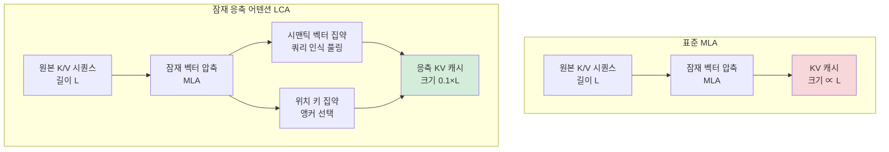

# 잠재 응축 트랜스포머: MLA 잠재 공간 압축으로 2.5배 속도, 90% KV 축소

## 논문 메타데이터

| 항목 | 내용 |
|------|------|
| arXiv ID | 2604.12452 |
| 저자 | Zeng You, Yaofo Chen, Qiuwu Chen, Ying Sun, Shuhai Zhang, Yingjian Li, Yaowei Wang, Mingkui Tan |
| 연도 | 2026 |
| 분야 | 아키텍처 / 긴 컨텍스트 |

## 핵심 기여

[[multi-head-latent-attention|MLA(Multi-head Latent Attention)]]의 잠재 공간(latent space) 내에서 직접 컨텍스트를 압축하는 **잠재 응축 어텐션(Latent-Condensed Attention, LCA)** 을 제안한다. 파라미터 추가 없이 긴 컨텍스트에서 **2.5배 추론 속도 향상**과 **KV 캐시 90% 축소**를 달성한다.

## 배경: MLA와 잠재 공간 압축

MLA는 DeepSeek 모델이 도입한 어텐션 변형으로, 키-값 쌍을 잠재 벡터(latent vector)로 압축해 [[kv-cache-optimization|KV 캐시]] 크기를 줄인다. 그러나 긴 컨텍스트에서 잠재 벡터 수가 여전히 시퀀스 길이에 비례해 증가한다는 한계가 있다.

LCA는 이 잠재 공간 자체를 추가로 압축한다 — 즉, "이미 압축된 표현을 더 압축"하는 2단계 압축이다.

## 방법

### 시맨틱 벡터 집약: 쿼리 인식 풀링 (Query-Aware Pooling)
- 잠재 벡터를 그냥 평균하지 않고, **현재 쿼리에 관련성이 높은 벡터를 더 높은 가중치로 집약**
- 추론 시점의 쿼리 정보를 활용해 압축 방향을 동적으로 결정
- 파라미터 추가 없이 어텐션 메커니즘 내에서 구현

### 위치 키 집약: 앵커 선택 (Anchor Selection)
- 위치 정보를 담당하는 키 벡터는 대표 앵커(anchor)만 선택적으로 유지
- 인접한 위치 키들의 중복성을 제거

## 실험 결과

| 지표 | 결과 |
|------|------|
| 추론 속도 | 기준 대비 **2.5배** |
| KV 캐시 크기 | **90% 축소** |
| 추가 파라미터 | 없음 |
| 성능 저하 | 경쟁력 있는 수준 유지 |

- 긴 컨텍스트(long context) 벤치마크에서 검증
- 파라미터 증가 없이 달성한다는 점에서 효율성 우수

## 한계

- 쿼리 인식 풀링의 품질이 쿼리-컨텍스트 분포에 민감할 수 있음
- 90% KV 축소에 따른 정보 손실이 일부 정밀 태스크에서 영향을 줄 수 있음
- MLA 기반 모델(DeepSeek 계열)에 특화되어 범용 어텐션에 직접 적용은 변환 필요

## 실무 적용 관점

128K 이상의 긴 컨텍스트를 처리해야 하는 서빙 환경에서, MLA 기반 모델에 LCA를 적용하면 KV 캐시 메모리 요구사항을 극적으로 줄일 수 있다. 특히 동시 처리 요청 수(concurrency)를 늘리거나, 제한된 GPU 메모리에서 더 긴 컨텍스트를 지원하는 데 유용하다. [[adaptive-kv-quantization]]과 달리 비트 폭 조정이 아닌 **벡터 수 자체를 줄이는** 접근이라 상호 보완적으로 적용 가능하다.

## 관련 문서

- [[multi-head-latent-attention]] - MLA 아키텍처 개념
- [[kv-cache-optimization]] - KV 캐시 최적화 전반
- [[adaptive-kv-quantization]] - 토큰 중요도 기반 적응형 KV 양자화 (2604.04722)
