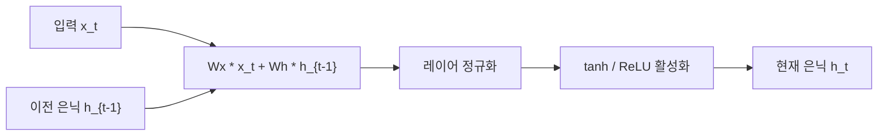

# Layer Normalization 원논문 (Ba et al., 2016)

## 메타데이터

| 항목 | 내용 |
|------|------|
| 제목 | Layer Normalization |
| 저자 | Jimmy Lei Ba, Jamie Ryan Kiros, Geoffrey E. Hinton |
| 연도 | 2016 |
| arXiv | 1607.06450 |
| 학회 | NeurIPS 2016 워크샵 (DLRL) |

---

## 핵심 기여

- **배치 독립 정규화**: 배치 정규화(Batch Normalization)가 가진 배치 크기 의존성을 제거하여 배치 크기가 1인 경우나 순환 신경망(RNN)에서도 안정적으로 동작
- **레이어 축 통계 계산**: 배치 축이 아닌 특성(feature) 축을 따라 평균과 분산을 계산하므로 각 샘플이 독립적으로 정규화됨
- **RNN 학습 안정화**: 시퀀스 길이에 무관하게 동일한 통계를 재사용할 수 있어 가변 길이 시퀀스에서 배치 정규화 대비 훨씬 안정적
- **Transformer 표준 컴포넌트 등극**: "Attention is All You Need" 이후 모든 현대 LLM(대규모 언어 모델, Large Language Model)의 표준 정규화 방법으로 자리잡음
- **학습 가능한 스케일/편향**: 각 특성 차원에 대한 스케일 $\gamma$와 편향 $\beta$ 파라미터를 학습하여 표현력 보존

---

## 배경 및 문제 정의

### 배치 정규화의 한계

배치 정규화(Batch Normalization, Ioffe & Szegedy 2015)는 미니배치 내의 동일 특성 위치에 있는 값들의 평균과 분산을 사용한다. 이 접근은 다음 세 가지 근본적인 문제를 지닌다:

1. **미니배치 크기 의존성**: 배치 크기가 작아지면 통계가 불안정해진다. 배치 크기 1에서는 분산이 0이 되어 적용 자체가 불가능하다.
2. **RNN 비호환**: 순환망에서는 시퀀스 각 스텝마다 독립적인 정규화 파라미터가 필요한데, 배치 정규화는 길이별로 다른 통계를 저장해야 해서 가변 길이 시퀀스 처리가 까다롭다.
3. **온라인 학습 불가**: 단일 샘플을 순차 처리하는 환경(강화학습, 스트리밍 추론)에서 미니배치를 구성하기 어렵다.

### 핵심 질문

> 배치 의존성 없이 동일한 학습 안정화 효과를 얻을 수 있는가?

---

## 방법

### 레이어 정규화 수식

입력 벡터 $\mathbf{a}^l \in \mathbb{R}^H$ (레이어 $l$의 H차원 활성화)에 대해:

**통계 계산 (레이어 축):**

$$\mu^l = \frac{1}{H} \sum_{i=1}^{H} a_i^l$$

$$\sigma^l = \sqrt{\frac{1}{H} \sum_{i=1}^{H} (a_i^l - \mu^l)^2}$$

**정규화 및 재스케일링:**

$$\bar{a}_i^l = \frac{a_i^l - \mu^l}{\sigma^l + \epsilon} \cdot \gamma_i + \beta_i$$

여기서 $\gamma_i, \beta_i$는 학습 가능한 스케일/편향 파라미터이며 $\epsilon$은 수치 안정성을 위한 소수값이다.

### 배치 정규화 vs 레이어 정규화 비교


위 다이어그램은 두 정규화 방식이 어느 축을 따라 통계를 계산하는지 대비한다.

### RNN에서의 레이어 정규화

RNN(Recurrent Neural Network) 셀 내부에서 레이어 정규화를 적용할 때는 은닉 상태 변환과 입력 변환 이후 활성화 직전에 삽입한다:



각 타임스텝 $t$에서 독립적으로 정규화하므로 시퀀스 길이에 무관하다.

### Transformer에서의 Pre-LN vs Post-LN

원논문 이후 Transformer 구조에서 레이어 정규화 위치에 관한 두 변형이 연구되었다:

| 방식 | 위치 | 특성 |
|------|------|------|
| Post-LN (원논문 스타일) | 잔차 연결 이후 | 원래 "Attention is All You Need" 구성, 학습 초기 불안정할 수 있음 |
| Pre-LN | 서브레이어 입력 직전 | GPT-2, GPT-3 채택, 더 안정적인 학습, 워밍업 없이도 수렴 가능 |

---

## 실험 및 결과

### 언어 모델링

| 모델 | 정규화 없음 | 배치 정규화 | 레이어 정규화 |
|------|------------|------------|--------------|
| LSTM(단일 레이어) | 기준 | 불안정 | **최고 성능** |
| LSTM(2레이어) | 기준 | 불안정 | **기준 대비 유의미한 향상** |

- Penn Treebank 언어 모델링에서 레이어 정규화가 배치 정규화 대비 일관되게 우수
- 특히 배치 크기가 작을수록 레이어 정규화의 우위가 두드러짐

### 기계 번역 (영어-독일어)

- 바닐라 순환망 대비 수렴 속도 약 2배 향상
- BLEU 점수에서도 소폭 개선

### 판독 이해 및 기타 태스크

- Skip-thought 벡터 학습에서 레이어 정규화 적용 시 성능 향상
- 순서 정렬(Order Embedding) 태스크에서 안정적인 수렴

---

## 한계 및 후속 연구

### 원논문의 한계

- **배치 정규화 대비 CNN 성능 열세**: 합성곱 레이어에서는 공간 방향(H x W)의 통계가 레이어 정규화보다 배치 정규화에서 더 적합한 경향
- **채널 단위 독립성 가정**: 모든 특성 채널이 동등하게 취급되어 채널 간 관계를 활용하지 못함
- **수식 단순성의 한계**: 극단적으로 크거나 작은 가중치 초기화에서는 추가 조정이 필요할 수 있음

### 주요 후속 연구

| 연구 | 핵심 아이디어 |
|------|-------------|
| RMSNorm (Zhang & Sennrich, 2019) | 평균 계산 제거, 분산만으로 정규화 - LLaMA, Mistral 채택 |
| GroupNorm (Wu & He, 2018) | 채널 그룹 단위 정규화 - CNN-LayerNorm 타협점 |
| PowerNorm (Shen et al., 2020) | 2차 모멘트 기반, 동적 정규화 |
| Pre-LN Transformer | 정규화 위치를 서브레이어 입력 전으로 이동 - 학습 안정성 대폭 개선 |

---

## 실무 적용 관점

### 언제 레이어 정규화를 사용하는가

- **Transformer / Attention 기반 모델**: 사실상 필수. GPT, BERT, T5 모든 변형이 사용
- **소형 배치 학습**: 배치 크기 8 이하, 또는 1인 경우
- **RNN / LSTM**: 가변 길이 시퀀스 처리 시
- **멀티모달 모델**: 배치 통계를 일관되게 유지하기 어려운 혼합 입력

### PyTorch 구현 예시

```python
import torch
import torch.nn as nn

# 기본 레이어 정규화: 마지막 차원(특성 차원)에 적용
layer_norm = nn.LayerNorm(normalized_shape=768)

# Transformer 인코더 블록 내 Pre-LN 적용 예시
class PreLNTransformerBlock(nn.Module):
    def __init__(self, d_model: int, n_heads: int):
        super().__init__()
        self.norm1 = nn.LayerNorm(d_model)
        self.norm2 = nn.LayerNorm(d_model)
        self.attn = nn.MultiheadAttention(d_model, n_heads, batch_first=True)
        self.ffn = nn.Sequential(
            nn.Linear(d_model, 4 * d_model),
            nn.GELU(),
            nn.Linear(4 * d_model, d_model),
        )

    def forward(self, x: torch.Tensor) -> torch.Tensor:
        # Pre-LN: 정규화 후 서브레이어, 잔차 연결
        normed = self.norm1(x)
        attn_out, _ = self.attn(normed, normed, normed)
        x = x + attn_out

        normed = self.norm2(x)
        x = x + self.ffn(normed)
        return x
```

### RMSNorm 대안 (LLaMA 스타일)

```python
class RMSNorm(nn.Module):
    """평균 계산을 생략한 경량 레이어 정규화 변형."""
    def __init__(self, d_model: int, eps: float = 1e-6):
        super().__init__()
        self.weight = nn.Parameter(torch.ones(d_model))
        self.eps = eps

    def forward(self, x: torch.Tensor) -> torch.Tensor:
        # 2차 모멘트(RMS)만 사용
        rms = x.pow(2).mean(-1, keepdim=True).add(self.eps).sqrt()
        return x / rms * self.weight
```

---

## 관련 문서

- [[transformer]] - 레이어 정규화가 표준으로 채택된 아키텍처
- [[normalization-layers]] - 배치 정규화, 레이어 정규화, 그룹 정규화 비교 개요
- [[batch-norm-original-paper]] - Ioffe & Szegedy 2015, 레이어 정규화가 개선하려 한 원조 논문
- [[attention-is-all-you-need-paper]] - 레이어 정규화를 Transformer에 통합한 논문
- [[bert-paper]] - BERT의 Post-LN Transformer 구조
- [[rmsnorm]] - LLaMA/Mistral이 채택한 레이어 정규화의 경량 변형
