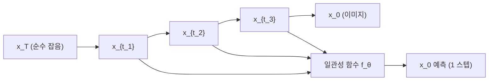
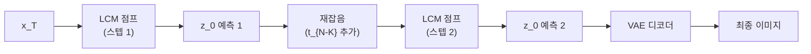
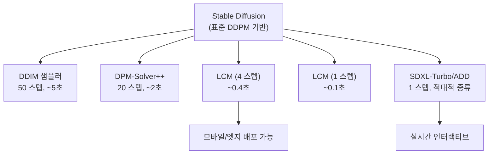

# LCM: 잠재 일관성 모델 (Latent Consistency Models)

## 논문 메타데이터

| 항목 | 내용 |
|------|------|
| 제목 | Latent Consistency Models: Synthesizing High-Resolution Images with Few-Step Inference |
| 저자 | Simian Luo, Yiqin Tan, Longbo Huang, Jian Li, Hang Zhao |
| 소속 | Tsinghua University |
| 발표 | arXiv 2023 (ICLR 2024 포스터) |
| arXiv | [2310.04378](https://arxiv.org/abs/2310.04378) |
| 공개 | 2023년 10월 |

## 한 줄 요약

기존 [[stable-diffusion]] 모델을 **증류(distillation)**해, 50 스텝이 필요했던 확산 생성을 **1~4 스텝**으로 압축하면서 품질을 거의 유지. 모바일과 실시간 인터랙티브 이미지 생성의 실용적 출발점.

---

## 핵심 기여

1. **잠재 공간에서의 일관성 증류**: Song et al.(2023)의 일관성 모델(Consistency Models, CM)을 픽셀 공간이 아닌 [[stable-diffusion]]의 잠재 공간(latent space)에 적용
2. **CFG 증류**: [[classifier-free-guidance-paper]]의 가이던스 스케일을 증류 과정에 통합해 별도 CFG 패스 없이 안내된 생성 달성
3. **LCM-LoRA 확장**: 나중에 발표된 LCM-LoRA(2023.11)는 단일 LoRA 모듈로 어떤 SD 파인튜닝 모델에도 적용 가능한 범용 가속기 제공
4. **1~4 스텝 생성**: 50 스텝 DDIM 대비 10~50배 빠른 생성, SDXL 1024px도 4 스텝으로 생성 가능

---

## 배경: 일관성 모델 (Consistency Models)

### 원본 CM (Song et al., 2023)

일관성 모델은 확산 ODE의 궤적 위 모든 점이 동일한 원점($\mathbf{x}_0$)에 수렴한다는 **일관성(consistency) 조건**을 학습한다:

$$f_\theta(\mathbf{x}_t, t) = f_\theta(\mathbf{x}_{t'}, t') \quad \text{for all } t, t' \text{ on same ODE trajectory}$$

즉, 궤적의 어느 중간 점에서 시작해도 동일한 최종 이미지로 수렴하는 함수를 학습.

**두 가지 학습 방식**:
- **일관성 학습(Consistency Training, CT)**: 처음부터 학습
- **일관성 증류(Consistency Distillation, CD)**: 기존 확산 모델에서 증류 (LCM이 채택)

### DDIM 궤적과 일관성



일관성 함수는 궤적 위 임의 점 $\mathbf{x}_t$에서 바로 $\mathbf{x}_0$로 점프하는 단축 경로를 제공한다.

---

## LCM 방법론

### 잠재 공간 적용

픽셀 공간 대신 VAE 잠재 공간에서 일관성 증류를 수행:

$$\mathbf{z} = \mathcal{E}(\mathbf{x}), \quad \mathbf{x} = \mathcal{D}(\mathbf{z})$$

- **장점**: 고해상도 이미지의 계산 비용을 잠재 공간의 낮은 차원으로 절감
- **연결**: [[stable-diffusion]]의 LDM(Latent Diffusion Model) 프레임워크와 자연스럽게 통합

### CFG 통합 증류

기존 CM은 비조건부 생성만 다뤘지만, LCM은 증류 과정에 CFG를 내재화:

일반 확산 모델의 가이던스 예측:
$$\hat{\epsilon}_w(\mathbf{z}_t, c) = \epsilon_\theta(\mathbf{z}_t, \varnothing) + w \cdot [\epsilon_\theta(\mathbf{z}_t, c) - \epsilon_\theta(\mathbf{z}_t, \varnothing)]$$

이 가이던스를 선생 모델(teacher)의 ODE 풀이에 적용하고, 학생 모델(LCM)이 이를 증류:

$$\mathcal{L}_\text{LCM} = \mathbb{E}_{c, w}\bigl[d\bigl(f_\theta(\mathbf{z}_{t_{n+1}}, c, w),\, f_{\theta^-}(\hat{\mathbf{z}}_{t_n}^{\Psi}, c, w)\bigr)\bigr]$$

$\hat{\mathbf{z}}_{t_n}^{\Psi}$는 CFG가 적용된 선생 ODE 솔버로 한 스텝 이동한 점, $\theta^-$는 지수이동평균(EMA) 파라미터.

### 멀티스텝 일관성 샘플링

1 스텝보다 더 나은 품질을 원할 때, 재잡음(re-noising) 후 다시 일관성 점프를 반복:



논문에서 제안하는 LCM 추론 알고리즘은 2~4 스텝이 품질과 속도의 최적 균형임을 보인다.

---

## 실험 및 결과

### LAION-5B 텍스트-이미지 생성 (512x512)

| 방법 | 스텝 수 | FID↓ | CLIP 점수↑ |
|------|---------|------|-----------|
| DDIM (기준) | 50 | 8.34 | 0.315 |
| DPM-Solver++ | 20 | 8.87 | 0.312 |
| **LCM (증류)** | **4** | **9.72** | **0.310** |
| **LCM (증류)** | **2** | **11.3** | **0.305** |
| LCM (증류) | 1 | 15.2 | 0.293 |

4 스텝 LCM은 50 스텝 DDIM 대비 12.5배 빠르면서 FID 차이 1.4, CLIP 점수 차이 0.005에 불과.

### 속도 벤치마크 (A100 GPU, 512x512)

| 방법 | 스텝 | 시간 |
|------|------|------|
| DDIM | 50 | ~5초 |
| LCM | 4 | ~0.4초 |
| LCM | 1 | ~0.1초 |

---

## LCM-LoRA: 범용 가속기 (2023.11 후속)

원본 LCM은 특정 SD 모델에 대해 증류된 별도 모델. **LCM-LoRA**는 증류된 가중치를 LoRA 형태로 저장해 어떤 SD 파인튜닝 모델에도 플러그인처럼 적용:

```python
from diffusers import DiffusionPipeline, LCMScheduler
import torch

# 1. 기반 SD 모델 로드
pipe = DiffusionPipeline.from_pretrained(
    "stabilityai/stable-diffusion-xl-base-1.0",
    torch_dtype=torch.float16,
)
pipe.scheduler = LCMScheduler.from_config(pipe.scheduler.config)

# 2. LCM-LoRA 추가 (어떤 SDXL 파인튜닝 모델에도 적용 가능)
pipe.load_lora_weights("latent-consistency/lcm-lora-sdxl")
pipe.fuse_lora()

# 3. 4 스텝으로 생성
image = pipe(
    prompt="a photorealistic cat sitting on a desk",
    num_inference_steps=4,
    guidance_scale=1.0,  # CFG 불필요 (이미 증류됨)
).images[0]
```

`guidance_scale=1.0` 주목: CFG가 이미 증류에 통합되어 있어 추론 시 추가 비용 없음.

---

## 한계 및 트레이드오프

### 1 스텝 품질 한계

1 스텝에서는 세부 텍스처, 복잡한 장면, 작은 글자 등이 뭉개진다. 실용적 최소값은 2~4 스텝.

### 프롬프트 추종 한계

매우 복잡한 프롬프트나 여러 객체가 포함된 장면에서 DDIM 50 스텝보다 프롬프트 추종 능력이 떨어진다.

### 다양성 감소

일관성 함수의 결정론적 특성상 동일 잡음에서 비슷한 이미지 생성 경향. 다양한 출력이 필요하면 더 많은 초기 잡음 샘플링 필요.

### 증류 비용

LCM 학습 자체는 전체 사전학습 대비 저렴하지만 (~48 A100 GPU-hours for SD-v1.5), 여전히 대규모 자원이 필요. 커뮤니티 파인튜닝 모델에는 LCM-LoRA 방식이 현실적.

---

## 확산 모델 속도 계층



---

## 후속 연구 및 영향

| 후속 연구 | 내용 |
|-----------|------|
| LCM-LoRA (Luo et al., 2023.11) | 범용 LoRA 가속기 |
| AnimateLCM | 비디오 생성에 LCM 적용 |
| SDXL-Lightning (ByteDance) | Adversarial CM 결합 |
| Hyper-SD | SDXL 전용 초고속 증류 |
| StreamDiffusion | 실시간 스트리밍 파이프라인에 LCM 통합 |

---

## 실무 적용 관점

### 어떤 경우에 LCM을 선택하는가

- **실시간 인터랙티브 앱**: 사용자가 프롬프트를 타이핑하며 미리보기 생성
- **모바일/엣지 배포**: 낮은 GPU 메모리, 낮은 TDP 환경
- **배치 생성 서비스**: 단위 시간당 처리량 극대화 (같은 GPU로 10배 이상 처리)
- **프로토타이핑**: 빠른 아이디어 시각화

### 언제 LCM을 쓰지 않는가

- 최고 품질이 필수인 상업적 이미지 생성 (SD 50 스텝 또는 FLUX.1 권장)
- 매우 복잡한 구성 요소가 있는 프롬프트
- 세밀한 텍스트 렌더링이 필요한 경우

### Diffusers 통합

```python
# LCM 스케줄러 = 일관성 기반 스텝 제어
from diffusers import LCMScheduler

scheduler = LCMScheduler.from_config(pipe.scheduler.config)
# num_inference_steps=4, guidance_scale=1.0 이 기본 권장 설정
```

---

## 관련 문서

- [[ddim-paper]] - LCM이 기반하는 확산 ODE 궤적 이론
- [[stable-diffusion]] - LCM이 증류 대상으로 삼는 기반 모델
- [[classifier-free-guidance-paper]] - LCM이 내재화하는 CFG 기법
- [[consistency-models]] - LCM의 이론적 기반 (Song et al., 2023)
- [[diffusion-models]] - 확산 모델 개념 전반
