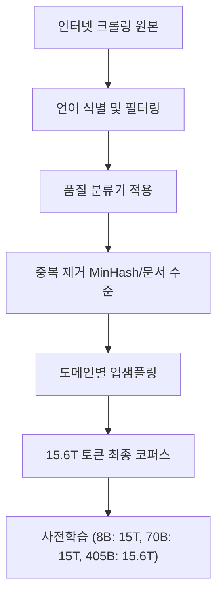
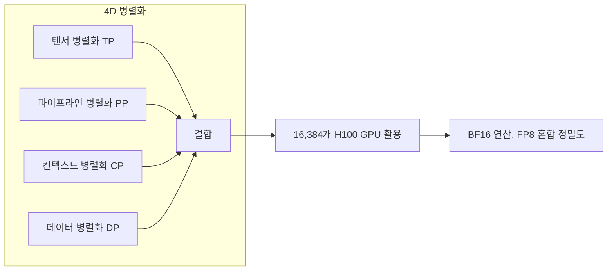

# The Llama 3 Herd of Models (Meta, 2024)

## 핵심 기여

Meta AI가 2024년 발표한 Llama 3 기술 보고서는 **405B 파라미터 플래그십 모델을 포함한 오픈 웨이트 LLM 패밀리**를 공개하며, 프론티어 모델 수준의 성능을 오픈소스 생태계에 가져왔다. 8B, 70B, 405B 세 가지 크기로 구성되며, Llama 3.1 기준 405B 모델은 GPT-4o, Claude 3.5 Sonnet 등 독점 모델과 대등한 성능을 보였다.

핵심 기여는 세 가지다: (1) **15.6조 토큰**이라는 전례 없는 규모의 사전학습 데이터, (2) **4D 병렬화**라는 분산 학습 인프라, (3) 멀티모달(이미지, 비디오, 오디오) 확장을 위한 체계적 파이프라인. [[llama-4]] 개발로 이어지는 연속선상에서 오픈 웨이트 모델의 기준점을 크게 높였다.

## 방법

### 사전학습 데이터 파이프라인

- **총 데이터**: 15.6조 토큰 (Llama 2의 약 7배)
- **언어 구성**: 영어 89.7%, 코드 8.4%, 기타 언어 1.9%
- **코드 전용 전처리**: 코드 관련 토큰을 별도로 처리하여 코딩 능력 강화

### 모델 아키텍처

Llama 3는 기존 Transformer Decoder-only 구조를 유지하면서 효율을 개선했다:

- **Grouped Query Attention (GQA)**: KV 헤드를 그룹화하여 추론 시 메모리 효율 향상
- **어휘 크기**: 128K 토크나이저 (Llama 2의 4배, 다국어 및 코드 커버리지 향상)
- **컨텍스트 길이**: 128K 토큰 (Llama 2의 16배)
- **RoPE 스케일링**: 긴 컨텍스트를 위한 theta 값 500,000으로 설정

### 4D 병렬화 (Distributed Training)

405B 모델 학습을 위해 [[distributed-training-overview]] 측면에서 네 가지 병렬화를 동시 적용했다:

- **텐서 병렬화(TP)**: 단일 레이어를 여러 GPU에 분산
- **파이프라인 병렬화(PP)**: 레이어 그룹을 파이프라인으로 구성
- **컨텍스트 병렬화(CP)**: 긴 시퀀스를 여러 GPU에 분할 (신규 도입)
- **데이터 병렬화(DP)**: 배치를 분산하여 처리

학습 클러스터: 16,384개 NVIDIA H100 80GB GPU, 400Gbps InfiniBand 상호연결.

### 포스트 트레이닝 파이프라인

사전학습 후 다단계 정렬 과정을 거쳤다:

1. **SFT (Supervised Fine-Tuning)**: 고품질 명령어 데이터로 미세조정
2. **거부 샘플링(Rejection Sampling)**: 보상 모델로 최고 품질 응답 선별
3. **DPO**: 직접 선호도 최적화로 인간 선호 반영
4. **안전성 조정**: Llama Guard 등 안전 분류기 통합

## 결과

### 벤치마크 성능 (405B 기준)

| 벤치마크 | Llama 3.1 405B | GPT-4o | Claude 3.5 Sonnet |
|----------|---------------|--------|-------------------|
| MMLU | 88.6% | 88.7% | 88.7% |
| HumanEval | 89.0% | 90.2% | 92.0% |
| MATH | 73.8% | 76.6% | 71.1% |
| GPQA | 51.1% | 53.6% | 59.4% |

405B는 독점 모델과 대등하거나 근접한 성능을 보이며, 8B와 70B도 동급 오픈소스 모델 중 최상위권이다.

## 한계

- **멀티모달**: 보고서에서 멀티모달 기능을 언급했으나, 초기 공개 시에는 텍스트 전용 모델만 배포됐다.
- **추론 비용**: 405B는 단일 서버 배포가 어려워 소규모 팀의 실제 활용에 진입장벽이 있다.
- **안전성 격차**: 독점 모델 대비 안전 필터링의 투명성과 강건성이 아직 검증 중이다.
- **라이선스 제약**: Llama 3 라이선스는 월 활성 사용자 7억 명 초과 기업에 Meta 승인을 요구한다.

## 실무 관점

Llama 3는 오픈소스 AI 생태계에 몇 가지 중요한 변화를 가져왔다:

- **Chinchilla 초과 학습**: Llama 3는 [[chinchilla-scaling-paper]]의 D=20N보다 훨씬 많은 토큰으로 학습됐다. 이는 추론 최적화를 위한 의도적 선택이다 - 학습 비용은 한번이지만 추론은 수십억 번 발생하기 때문이다.
- **8B의 실용성**: 8B 모델도 이전 세대 70B 수준의 성능을 내므로, 소규모 GPU 환경에서 프로덕션 배포가 현실적이 됐다.
- **파인튜닝 생태계**: 오픈 웨이트 덕분에 Llama 3 기반 도메인 특화 파인튜닝이 폭발적으로 증가했다.
- **4D 병렬화 공개**: 대규모 분산 학습 기법이 외부에 공개되면서 연구 커뮤니티의 대형 모델 실험이 가능해졌다.

## 관련 문서

- [[llama-4]] - Llama 3의 후속 세대, 멀티모달 통합 및 성능 개선
- [[distributed-training-overview]] - 4D 병렬화를 포함한 분산 학습 패턴 개요
- [[chinchilla-scaling-paper]] - Llama 3가 의도적으로 초과한 컴퓨팅 최적 학습 법칙
- [[mixtral-paper]] - 동급 오픈 웨이트 경쟁자, MoE 아키텍처로 다른 접근
