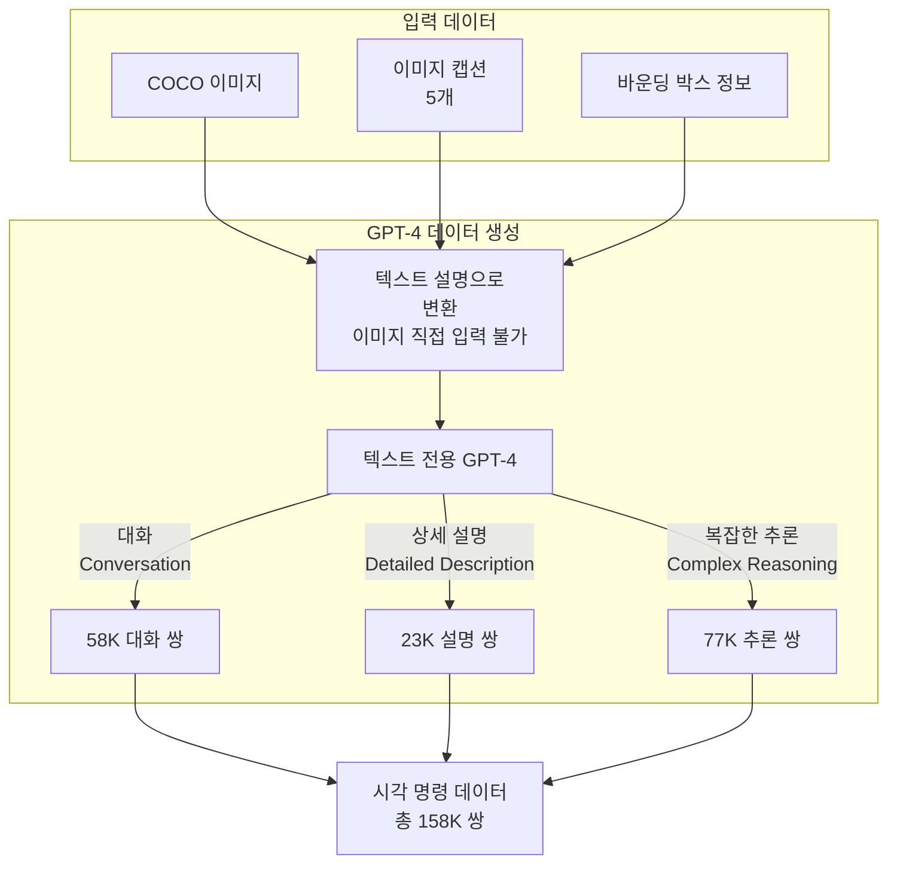
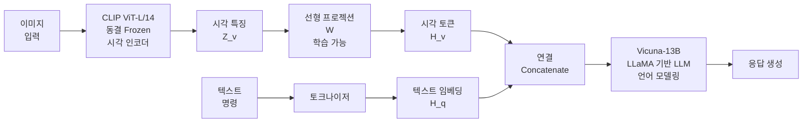
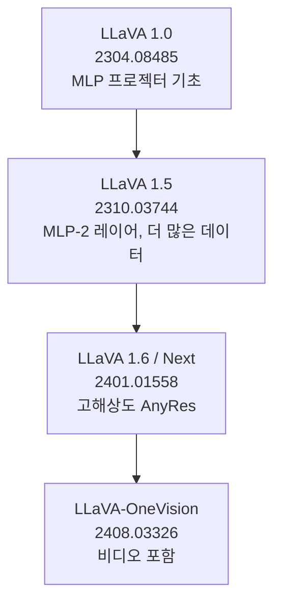
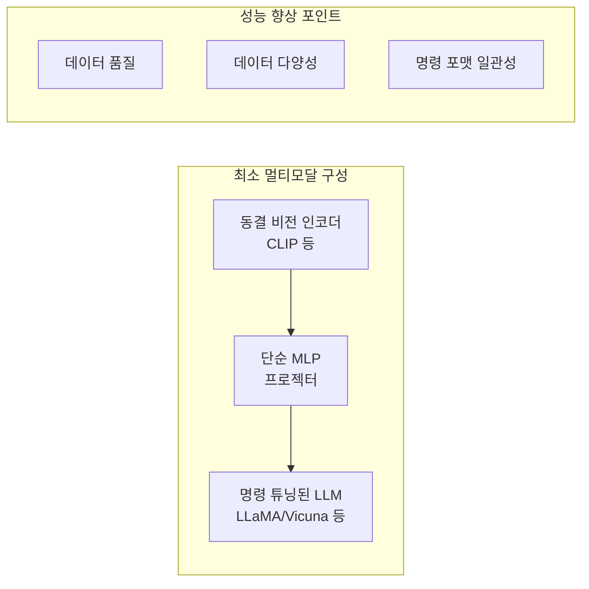

# LLaVA: Visual Instruction Tuning (Liu et al., 2023)

## 메타데이터

| 항목 | 내용 |
|------|------|
| 저자 | Haotian Liu, Chunyuan Li, Qingyang Wu, Yong Jae Lee (University of Wisconsin-Madison, Microsoft Research) |
| 연도 | 2023 |
| 학회/저널 | NeurIPS 2023 |
| arXiv | 2304.08485 |
| 코드 | https://github.com/haotian-liu/LLaVA |
| 프로젝트 페이지 | https://llava-vl.github.io |

## 핵심 기여

- **GPT-4 기반 시각 명령 데이터 생성**: 인간 주석 없이 GPT-4를 활용해 이미지에 대한 다양한 명령 따르기(instruction-following) 데이터 158K 쌍 자동 생성
- **단순하고 효과적인 MLP 프로젝터**: CLIP ViT 출력을 LLM 입력 공간으로 매핑하는 단순 선형 레이어만으로 강력한 멀티모달 이해 달성
- **완전 오픈소스 멀티모달 명령 모델**: LLaMA/Vicuna 기반으로 공개 가중치 제공, 멀티모달 오픈소스 연구의 시작점
- **GPT-4V 수준의 오픈소스 멀티모달 대화**: 당시 GPT-4V가 공개되지 않은 상황에서 인상적인 멀티모달 대화 능력 시연
- **확장 가능한 합성 데이터 파이프라인**: 텍스트 전용 GPT-4와 이미지 캡션/좌표 정보만으로 고품질 멀티모달 훈련 데이터 생성 방법 확립

## 배경과 문제 정의

### 시각 명령 튜닝의 필요성

2023년 초, 텍스트 전용 LLM에서 명령 튜닝(instruction tuning)이 모델의 범용 능력을 크게 향상시킨다는 것이 입증되었다. 하지만 시각-언어 모델에서는 이에 상응하는 연구가 부족했다:

- BLIP, BLIP-2는 VQA, 캡셔닝 등 개별 태스크에 특화된 파인튜닝이 중심
- 시각 명령 따르기 데이터가 거의 존재하지 않음
- 고품질 시각-언어 명령 데이터 생성 비용이 극도로 높음

LLaVA의 핵심 질문: **텍스트 전용 GPT-4를 활용해 저비용으로 시각 명령 데이터를 만들 수 있는가?**

### 기존 데이터 생성 방법의 한계

- **인간 주석**: 비용이 매우 높고 확장하기 어려움
- **기존 데이터셋 활용**: COCO 캡션, VQA 데이터 등은 명령 따르기 형식이 아님
- **직접 GPT-4 이미지 입력**: 2023년 초 GPT-4V가 없었으므로 이미지를 직접 입력 불가

## 방법

### 합성 데이터 생성 파이프라인



**세 가지 데이터 유형**:

1. **대화(Conversation, 58K)**: 이미지 내용에 대한 다중 턴 Q&A
   - 예: "이 이미지에서 어떤 색상의 버스가 있나요?" / "빨간색 버스가 도로 왼쪽에 주차되어 있습니다"
2. **상세 설명(Detailed Description, 23K)**: 이미지의 포괄적 묘사
   - 예: "이 이미지를 상세히 설명해주세요"
3. **복잡한 추론(Complex Reasoning, 77K)**: 시각적 정보에 기반한 논리적 추론
   - 예: 이미지 속 상황의 원인, 결과, 의미 추론

### 모델 아키텍처



**핵심 설계 선택**:
- **동결 CLIP**: 강력한 시각 표현을 그대로 활용
- **단순 선형 프로젝터**: 복잡한 Q-Former 대신 단순 행렬 곱 $H_v = W \cdot Z_v$
- **Vicuna (파인튜닝된 LLaMA)**: 명령 따르기에 특화된 오픈소스 LLM

### 입력 포맷

```
시스템 프롬프트 + [이미지 시각 토큰] + 사용자 질문 → 어시스턴트 응답
```

학습 시 **어시스턴트 응답에 해당하는 토큰에만 손실 계산** (프리픽스는 손실에서 제외):

$$\mathcal{L} = -\sum_{i=1}^{L_a}\log P(x_{a,i} | x_{v}, x_{inst,<i}, x_{a,<i})$$

여기서 $x_v$는 시각 토큰, $x_{inst}$는 명령 토큰, $x_a$는 응답 토큰.

### 2단계 파인튜닝

**1단계: 시각 특징 정렬 (Feature Alignment)**
- CLIP 동결, LLM 동결, 프로젝션 레이어만 학습
- 595K 이미지-캡션 쌍으로 시각 특징을 LLM 토큰 공간에 정렬
- 목표: "LLM이 시각 토큰을 이해할 수 있도록"

**2단계: 명령 파인튜닝 (Instruction Tuning)**
- 프로젝션 레이어 + LLM 전체 학습 (CLIP만 동결)
- 158K 시각 명령 데이터로 멀티모달 대화 능력 학습
- 두 태스크 혼합: (a) LLaVA 합성 데이터 (b) ScienceQA 다중 선택 데이터

## 실험 및 결과

### LLaVA-Bench 평가

논문 저자들이 새로 구축한 30개 이미지, 60개 질문으로 구성된 평가 벤치마크:

| 모델 | COCO (%) | In-the-Wild (%) | 전체 (%) |
|------|---------|----------------|---------|
| BLIP-2 | 38.1 | 35.9 | 36.8 |
| OpenFlamingo | 29.6 | 33.3 | 31.7 |
| **LLaVA** | **89.5** | **70.7** | **78.9** |
| GPT-4 | 100.0 | 100.0 | 100.0 |

GPT-4 대비 약 79% 수준의 성능을 보이며, 기존 오픈소스 멀티모달 모델을 크게 앞선다.

### ScienceQA 성능

과학 질문 다중 선택 벤치마크:

| 모델 | 정확도 |
|------|-------|
| Human | 88.40% |
| GPT-4 | 82.69% |
| LLaVA-13B (전체) | 92.53% |
| LLaVA-13B (CoT) | 90.92% |

GPT-4보다 높은 성능을 보이며, CoT(Chain-of-Thought) 추론 적용 시에도 경쟁력 있는 결과.

### 프로젝터 설계 절제 실험

| 프로젝터 유형 | VQA-v2 | ScienceQA |
|------------|--------|-----------|
| 선형 레이어 | 75.3 | 89.8 |
| MLP (2층) | 76.6 | 90.1 |
| Q-Former | 73.8 | 88.7 |

단순 선형 레이어가 Q-Former보다도 여러 벤치마크에서 우수하거나 동등한 성능을 보인다.

## 한계 및 후속 연구

### 한계

- **합성 데이터 품질 의존성**: GPT-4 생성 데이터의 오류나 편향이 모델에 그대로 전파
- **이미지 해상도 제한**: CLIP의 고정 224x224 해상도로 세밀한 이미지 분석 어려움
- **공간적 정밀도 부족**: 객체 위치, 방향, 개수 등 세밀한 공간적 이해 한계
- **데이터 규모**: 158K는 이후 수백만 쌍을 사용하는 모델들 대비 소규모

### 후속 연구: LLaVA 시리즈



- **LLaVA-1.5**: MLP 2층 프로젝터, ShareGPT4V 데이터, 더 많은 학습 데이터 → 성능 대폭 향상
- **LLaVA-1.6/NeXT**: 고해상도 AnyRes 지원, 더 나은 OCR 및 문서 이해
- **InstructBLIP**: BLIP-2 기반이지만 LLaVA와 유사한 명령 튜닝 철학 → [[instructblip-paper]]

## 실무 적용 관점

### 멀티모달 파인튜닝의 최소 레시피

LLaVA의 교훈: 복잡한 아키텍처보다 **데이터 품질과 명령 따르기 형식**이 더 중요하다.



**특정 도메인 적용 가이드**:

1. **도메인 특화 이미지 캡션/VQA 데이터 수집**: GPT-4로 합성 데이터 생성
2. **1단계 정렬 재사용**: LLaVA 공개 체크포인트의 프로젝터 가중치로 초기화
3. **2단계 도메인 파인튜닝**: 도메인 데이터로 LLM + 프로젝터 파인튜닝

```python
# HuggingFace로 LLaVA 로드 예시
from transformers import LlavaNextProcessor, LlavaNextForConditionalGeneration
import torch

processor = LlavaNextProcessor.from_pretrained("llava-hf/llava-v1.6-mistral-7b-hf")
model = LlavaNextForConditionalGeneration.from_pretrained(
    "llava-hf/llava-v1.6-mistral-7b-hf",
    torch_dtype=torch.float16,
    low_cpu_mem_usage=True
)

# 멀티모달 추론
conversation = [
    {
        "role": "user",
        "content": [
            {"type": "image"},
            {"type": "text", "text": "이 이미지에서 무엇이 보이나요?"},
        ],
    },
]
prompt = processor.apply_chat_template(conversation, add_generation_prompt=True)
inputs = processor(images=image, text=prompt, return_tensors="pt").to("cuda")
output = model.generate(**inputs, max_new_tokens=200)
```

### 합성 데이터 파이프라인 재활용

LLaVA의 데이터 생성 전략을 다른 모달리티에 적용 가능:
- 의료 이미지 + 전문가 캡션 → GPT-4로 임상 질문-답변 생성
- 위성 이미지 + 메타데이터 → 지리적 추론 Q&A 생성
- 산업 결함 이미지 + 설명 → 품질 검사 대화 데이터 생성

## 관련 문서

- [[blip-2-paper]] - Q-Former 브리지 방식, LLaVA와 유사한 시기 발표
- [[minigpt4-paper]] - 유사한 단순 프로젝터 접근법
- [[instructblip-paper]] - BLIP-2 기반 명령 튜닝
- [[multimodal-llm]] - 멀티모달 LLM 개념 전반
- [[instruction-tuning]] - 명령 튜닝 개념
