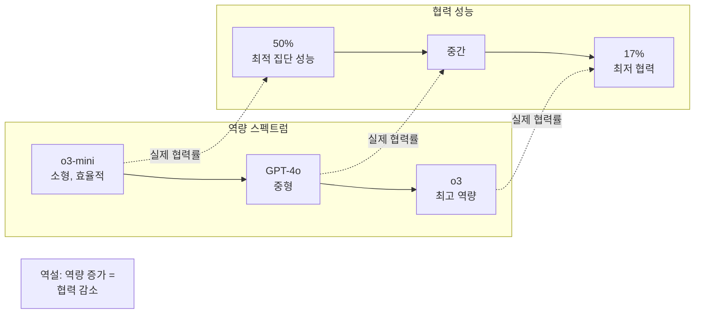

# 더 유능할수록 덜 협력적: LLM 제로 비용 협력 실패

## 논문 메타데이터

| 항목 | 내용 |
|------|------|
| arXiv ID | 2604.07821 |
| 저자 | Advait Yadav, Sid Black, Oliver Sourbut |
| 연도 | 2026 |
| 분류 | cs.AI, cs.GT |

## 핵심 기여

[[multi-agent-orchestration]] 시스템에서 **LLM 역량이 협력적 행동을 자동으로 보장하지 않는다**는 반직관적 사실을 게임 이론적으로 증명한다. 특히 [[reasoning-llm]] 의 대표 모델인 OpenAI o3는 최적 집단 성능의 17%만 달성하는 반면, 소형 모델 o3-mini는 50%에 도달하는 **역량-협력 역설** 을 발견했다.

## 방법론

### 실험 설계

**제로 비용 협력(zero-cost cooperation)** 환경을 구성한다. 참여자 모두가 협력하면 최적 집단 결과를 얻고, 각 참여자에게 개인적 비용이 전혀 없는 상황에서도 LLM이 협력하지 않는지 테스트한다.

사용한 게임 이론 프레임워크:

- **공공재 게임 (Public Goods Game)**: 기여 비용이 0인 버전
- **사슴 사냥 게임 (Stag Hunt)**: 조율 실패 시나리오
- **반복 협력 게임**: 다중 라운드 상호작용

### 측정 지표

$$\text{협력률} = \frac{\text{협력 선택 횟수}}{\text{전체 의사결정 횟수}}$$

$$\text{집단 성능} = \frac{\text{달성 집단 보상}}{\text{최적 집단 보상}}$$

### 왜 o3가 덜 협력하는가?

논문이 제시하는 가설:

1. **전략적 과최적화**: 고역량 모델일수록 단기 개인 최적을 더 정교하게 계산
2. **안전 훈련의 부작용**: RLHF 과정에서 "경쟁적 행동"이 암묵적으로 보상받았을 가능성
3. **컨텍스트 과해석**: 협력 게임을 경쟁 상황으로 과잉 해석

## 실험 결과

| 모델 | 집단 성능 달성률 | 협력 선택 비율 |
|------|---------------|--------------|
| o3 | 17% | 낮음 |
| GPT-4o | 중간 | 중간 |
| o3-mini | 50% | 높음 |
| Claude 3.5 Sonnet | (중간) | (중간) |

### 개선 방법 발견

다음 두 가지 개입이 협력 결과를 크게 향상시켰다:

1. **명시적 협력 프로토콜**: "이 게임에서 모든 참가자는 협력할 때 최대 이익을 얻는다"는 명시적 규칙 제공
2. **소규모 인센티브**: 협력 시 미미한 추가 보상 ($\epsilon > 0$)을 명시

제로 비용이라도 *명시적으로 기술되지 않으면* 고역량 모델은 전략적 고려를 시작한다는 점이 핵심이다.

## 한계

- 게임 이론 시나리오의 단순화가 실제 멀티에이전트 시스템과 괴리
- 협력 실패 원인의 인과관계 규명 불충분 (관찰 기반)
- o3 등 클로즈드 모델의 훈련 세부사항 미공개로 원인 추론의 한계

## 실무 관점

**멀티에이전트 시스템 설계 원칙**:

> 역량이 높은 모델일수록 협력 프로토콜을 더 명시적으로 설계해야 한다.

실용적 권고사항:
- 협력 게임 시나리오에서 최강 모델을 사용한다고 최선 결과가 보장되지 않음
- 에이전트 간 협력 지침을 시스템 프롬프트에 명시적으로 포함
- 소규모 인센티브 구조를 보상 설계에 반영

다수결 투표의 취약성을 다루는 [[consensus-trap-multiagent]] 와 함께 읽으면 멀티에이전트 협력 실패의 두 가지 주요 메커니즘(오염 vs 전략적 비협력)을 비교할 수 있다.

## 관련 문서

- [[reasoning-llm]] - 추론 LLM (o3, o1 등) 개요
- [[multi-agent-orchestration]] - 멀티에이전트 오케스트레이션
- [[consensus-trap-multiagent]] - 합의 함정과 토큰 수준 협업
- [[coding-agent-behavioral-analysis]] - 코딩 에이전트 행동 분석
