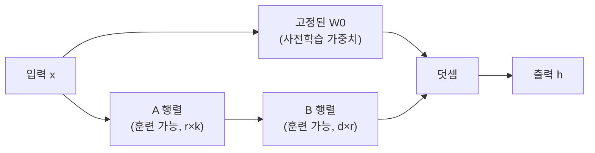

# LoRA: Low-Rank Adaptation of Large Language Models (Hu et al., 2021)

## 핵심 기여

Microsoft의 Hu 등이 2021년 제안한 LoRA(Low-Rank Adaptation)는 사전학습된 LLM을 파인튜닝할 때 **원본 가중치를 고정(freeze)하고 저랭크(low-rank) 분해 행렬만 추가로 학습**하는 파라미터 효율적 파인튜닝(PEFT, Parameter-Efficient Fine-Tuning) 방법이다. GPT-3 175B 기준 학습 파라미터를 **10,000분의 1 수준(0.01%)** 으로 줄이면서 풀 파인튜닝(full fine-tuning)에 필적하는 성능을 달성했다.

## 방법

### 핵심 아이디어: 저랭크 분해

사전학습 가중치 행렬 $W_0 \in \mathbb{R}^{d \times k}$를 고정하고, 업데이트를 저랭크 행렬의 곱으로 표현:

$$W = W_0 + \Delta W = W_0 + BA$$

- $B \in \mathbb{R}^{d \times r}$, $A \in \mathbb{R}^{r \times k}$ (여기서 $r \ll \min(d, k)$)
- 초기화: $A$는 랜덤 가우시안, $B$는 0 (초기에 $\Delta W = 0$)
- 스케일링 계수: $\frac{\alpha}{r}$ (보통 $\alpha = r$ 로 설정)

전방 패스(forward pass):

$$h = W_0 x + \frac{\alpha}{r} BAx$$

### 어디에 적용하나

원 논문에서는 Transformer 셀프 어텐션의 쿼리(Q)와 값(V) 프로젝션 행렬에만 LoRA를 적용. 이후 연구들은 모든 가중치 행렬에 적용하는 것이 더 효과적임을 확인.

### Rank 선택 가이드

| rank r | 파라미터 수 | 적합 사용 사례 |
|--------|------------|--------------|
| 4-8    | 매우 적음  | 가볍고 특화된 태스크 |
| 16-32  | 중간       | 일반 지시 파인튜닝 |
| 64-128 | 많음       | 복잡한 도메인 적응 |

## 결과 및 영향

- GPT-3 175B 파인튜닝 시 VRAM을 1.2TB에서 단일 GPU 수준으로 절감
- 다양한 NLU/NLG 벤치마크에서 풀 파인튜닝과 통계적으로 동등한 성능
- **서빙 효율화**: 기반 모델(base model) 하나에 다수의 LoRA 어댑터를 붙여 동시 서빙 가능
- QLoRA(Dettmers et al., 2023)가 4비트 양자화(quantization)와 결합해 7B 모델을 소비자 GPU에서 파인튜닝 가능하게 확장
- Hugging Face PEFT, Axolotl, LlamaFactory 등 대부분의 파인튜닝 프레임워크가 기본 지원

## 한계

- Rank `r`과 어떤 레이어에 적용할지 하이퍼파라미터 탐색 필요
- 참조 모델과 병합 시 어댑터 정보 손실 없이 통합되지만, 여러 어댑터를 동시에 조합하기는 어려움
- 도메인 변환이 매우 큰 경우(예: 의료 도메인 → 법률 도메인) 풀 파인튜닝에 비해 성능 저하 가능
- 적응적 랭크(adaptive rank) 선택 연구(AdaLoRA 등)가 진행 중

## 실무 적용 관점

- 소비자 GPU(RTX 3090, 4090)에서 7B~13B 모델 파인튜닝 시 LoRA + 4bit 양자화(QLoRA)가 사실상 필수
- `lora_alpha / lora_r = 2` 비율로 스케일링을 시작점으로 권장
- 학습 후 `merge_and_unload()`로 원본 모델에 병합하면 추론 시 추가 오버헤드 없음
- 멀티태스크 서빙 시 LoRA 어댑터 스왑핑으로 단일 기반 모델에서 수십 개 태스크 지원 가능

## 관련 문서
- [[sails-interpretable-safety-paper]] -- SAILS: Interpretable Safety Alignment via SAE-Constructed Low-Rank Subspace

- [[InstructGPT RLHF 파인튜닝]]
- [[dpo|DPO 직접 선호도 최적화]]
- [[quantization-model-compression]]
- [[lora-qlora-finetuning]]
