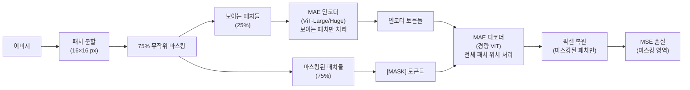
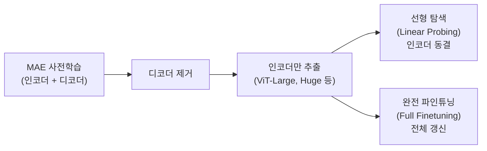

# MAE: 마스킹된 오토인코더는 확장 가능한 비전 학습기다

## 메타데이터

| 항목 | 내용 |
|------|------|
| 제목 | Masked Autoencoders Are Scalable Vision Learners |
| 저자 | Kaiming He, Xinlei Chen, Saining Xie, Yanghao Li, Piotr Dollar, Ross Girshick |
| 소속 | Facebook AI Research (FAIR) |
| 발표 연도 | 2022 |
| 학회 | CVPR 2022 |
| arXiv | [2111.06377](https://arxiv.org/abs/2111.06377) |

## 핵심 기여

- **75% 마스킹 비율**: 이미지의 4분의 3을 무작위 마스킹하는 공격적인 전략이 의미 있는 표현 학습을 강제함을 발견 (NLP의 15% 마스킹보다 훨씬 높음)
- **비대칭 인코더-디코더(asymmetric encoder-decoder)**: 인코더는 보이는 패치만 처리하고, 경량 디코더가 마스킹된 패치를 복원. 사전학습 계산 비용을 3배 이상 절감
- ViT 기반 자기지도 학습의 표준 사전학습 방식으로 자리잡음
- 파인튜닝 후 ImageNet 87.8% (ViT-H), 지도학습 대비 동등 또는 우수
- 마스킹 비율, 마스크 토큰 위치, 디코더 깊이 등 설계 선택의 체계적 분석

## 배경 및 문제 정의

NLP에서 마스킹 기반 자기지도 학습(BERT, GPT)은 대규모 언어 모델 사전학습의 표준이다. 비전에서도 같은 방식이 통할까?

### 비전과 NLP의 근본적 차이

NLP의 마스킹 언어 모델(Masked Language Model, MLM)을 비전에 그대로 적용하기 어려운 이유:

1. **정보 밀도(information density)**: 언어 토큰은 각각 높은 의미를 가지지만, 이미지 픽셀/패치는 공간적으로 중복 정보가 많다. 15% 마스킹으로는 인접 패치에서 쉽게 복원 가능 → 의미 없는 학습
2. **표현 불연속성**: 언어의 이산 토큰(단어)과 달리 이미지는 연속적. 마스킹 복원 목표 정의가 까다롭다
3. 픽셀 직접 복원은 고주파 세부사항(텍스처)에 집중하게 만들어 의미적 특성 학습에 비효율적

MAE는 이 문제를 **75% 고마스킹 비율**로 해결한다. 너무 많이 마스킹하면 인접 패치에서 단순 보간(interpolation)으로 복원이 불가능해져 모델이 이미지의 구조와 의미를 이해해야만 한다.

## 방법

### 전체 파이프라인



MAE는 보이는 25% 패치만 인코더로 처리하여 계산 효율을 극대화하고, 경량 디코더가 전체 패치 맵에서 마스킹 영역을 복원한다.

### 핵심 설계: 비대칭 인코더-디코더

**인코더 (Encoder)**:
- 표준 ViT 구조 (ViT-Base, Large, Huge 등)
- 마스킹된 패치는 처리하지 않음 → 입력이 보이는 25% 패치만
- 위치 임베딩(positional embedding) 추가 후 전체 ViT 처리
- 계산 비용이 전체 패치 처리 대비 ~25% (3-4배 빠름)

**디코더 (Decoder)**:
- 인코더보다 훨씬 작은 ViT (약 10% 크기)
- 인코더 출력 토큰 + [MASK] 토큰 + 위치 임베딩을 입력으로 받음
- [MASK] 토큰: 모든 마스킹된 위치에 공유되는 학습 가능한 벡터
- 픽셀 값을 직접 예측하는 선형 투영 레이어로 출력
- 파인튜닝 시 디코더는 제거하고 인코더만 사용

### 마스킹 전략

**무작위 균일 샘플링(random uniform sampling)**: 75% 패치를 무작위로 선택하여 마스킹. 구조적 패턴(블록 마스킹, 그리드 마스킹)보다 무작위 샘플링이 효과적임을 실험으로 확인.

무작위 샘플링의 장점:
- 공간적 중복 정보 활용을 차단 (인접 패치로 복원 불가)
- 모든 위치에서 균등하게 학습
- 구현이 단순

### 복원 목표

원본 이미지 픽셀 값의 MSE(평균 제곱 오차)를 마스킹된 패치에 대해서만 계산:

$$\mathcal{L} = \frac{1}{|\mathcal{M}|} \sum_{p \in \mathcal{M}} \left\| x_p - \hat{x}_p \right\|_2^2$$

여기서 $\mathcal{M}$은 마스킹된 패치 집합, $x_p$는 원본 픽셀, $\hat{x}_p$는 디코더 예측이다.

**픽셀 정규화(patch normalization)**: 각 패치 내의 픽셀 값을 패치 평균으로 빼고 분산으로 나눠 정규화하면 성능이 향상된다. 낮은 주파수 색상 정보보다 고주파 구조 정보에 집중하게 만든다.

### 인코더 전용 파인튜닝

사전학습 완료 후 디코더는 버리고 인코더만 다운스트림 태스크에 사용:



중요한 발견: MAE에서 학습된 표현은 선형 탐색보다 **완전 파인튜닝에서 훨씬 더 강한 성능**을 보인다. 이는 MAE의 표현이 비선형 변환을 통해 더 풍부한 정보를 담고 있음을 의미한다 (대조 학습 방법과의 근본적 차이).

## 실험 및 결과

### ImageNet 파인튜닝 성능

| 방법 | 아키텍처 | 사전학습 | 파인튜닝 Top-1 |
|------|---------|--------|--------------|
| 지도학습 | ViT-L/16 | - | 86.3% |
| DINO | ViT-B/16 | 자기지도 | 82.8% (FT) |
| BEiT | ViT-L/16 | 자기지도 | 87.4% |
| MAE | ViT-L/16 | 자기지도 | 86.9% |
| MAE | ViT-H/14 | 자기지도 | **87.8%** |
| MaskFeat | ViT-H/16 | 자기지도 | 87.7% |

ViT-H/14로 87.8%를 달성하여 당시 ImageNet 분류 SOTA를 기록했다.

### 선형 탐색(Linear Probing)

| 방법 | 아키텍처 | 선형 탐색 Top-1 |
|------|---------|--------------|
| SimCLR v2 | ResNet-50 | 71.7% |
| BYOL | ResNet-50 | 74.3% |
| DINO | ViT-B/16 | 78.2% |
| MAE | ViT-B/16 | 68.0% |
| MAE | ViT-L/16 | 76.0% |

흥미롭게도 MAE의 선형 탐색 성능은 대조 학습 방법(DINO 등)보다 낮다. 하지만 파인튜닝에서는 역전된다. MAE 표현이 선형적으로 분리 가능하지 않더라도 더 풍부한 정보를 담고 있음을 시사한다.

### 마스킹 비율의 영향 (핵심 실험)

| 마스킹 비율 | 선형 탐색 | 파인튜닝 |
|-----------|---------|--------|
| 40% | 59.1% | 82.4% |
| 60% | 63.0% | 83.0% |
| **75%** | **68.0%** | **83.1%** |
| 80% | 67.0% | 83.0% |
| 90% | 62.6% | 82.1% |
| 95% | 52.5% | 80.3% |

75%에서 최적 성능이 나타났다. 이보다 낮으면 태스크가 너무 쉬워 의미 있는 학습이 안 되고, 너무 높으면 복원에 필요한 맥락이 부족해진다.

### 디코더 깊이 및 너비

| 디코더 깊이 | 블록 수 | 파인튜닝 Top-1 |
|-----------|--------|--------------|
| 1 | - | 82.7% |
| 2 | - | 82.9% |
| **4** | - | **83.1%** |
| 8 | - | 83.1% |

디코더는 4 블록 이상이면 포화 상태. 경량 디코더로 충분함을 확인.

### 확장성 (Scalability)

MAE는 모델 크기와 사전학습 데이터 모두에서 잘 확장된다:

| 아키텍처 | 파라미터 | 파인튜닝 Top-1 |
|---------|---------|--------------|
| ViT-B/16 | 86M | 83.1% |
| ViT-L/16 | 307M | 86.9% |
| ViT-H/14 | 632M | 87.8% |

모델이 클수록 일관되게 성능이 향상된다. 대조 학습 방법들이 큰 모델에서 성능이 포화되는 경향과 달리 MAE는 스케일업에서 뚜렷한 이점을 보인다.

## 한계 및 후속 연구

### 한계점

1. **선형 탐색 약점**: 대조 학습(DINO, MoCo v3) 대비 선형 탐색 성능이 낮아, 파인튜닝 없이 표현을 직접 사용하는 시나리오에서 불리
2. **낮은 레벨 특성에 집중**: 픽셀 복원 목표가 텍스처나 엣지 같은 낮은 수준 특성에 집중할 가능성
3. **도메인 특정성**: 자연 이미지 패턴에 맞는 설계로, 의료 영상이나 위성 이미지 등 다른 도메인에서 마스킹 비율 재조정 필요
4. **픽셀 공간 복원**: 의미론적(semantic) 토큰 복원 대신 픽셀 복원을 목표로 하는 한계 (BEiT는 이산 시각 토큰 복원)

### 후속 연구

- **[[videomae-paper]]**: MAE 원리를 비디오에 적용, 시공간 마스킹. 90% 마스킹 비율
- **[[point-mae-paper]]**: 3D 포인트 클라우드에 MAE 원리 적용
- **MAE v2 / CMAE**: 대조 학습과 MAE를 결합한 하이브리드 방법
- **SparK**: CNN에 MAE 방식 적용
- **MVP**: 언어-비전 멀티모달 MAE
- **A-MAE (AudioMAE)**: 오디오 스펙트로그램에 MAE 적용

### MAE가 바꾼 패러다임

MAE 이전에는 대조 학습(SimCLR, MoCo, BYOL, DINO)이 자기지도 비전 학습의 주류였다. MAE는 **생성적(generative) 사전학습**이 비전에서도 대조 학습에 필적하거나 능가할 수 있음을 보여, NLP의 BERT처럼 비전의 표준 사전학습 방식으로 자리잡게 됐다.

## 실무 적용 관점

### MAE를 선택해야 할 때

| 상황 | 이유 |
|------|------|
| 파인튜닝 사용 가능한 경우 | 파인튜닝 성능이 선형 탐색보다 크게 우수 |
| 대형 ViT 스케일업 | 큰 모델에서 성능 향상 일관적 |
| 도메인 특정 사전학습 | 레이블 없는 도메인 데이터로 사전학습 후 소량 레이블 파인튜닝 |
| 탐지/분할 사전학습 | ViT-Det 등 조합으로 강력한 하류 탐지기 구성 |

### 구현 핵심 코드

```python
import torch
import torch.nn as nn
from timm.models.vision_transformer import VisionTransformer

class MAE(nn.Module):
    def __init__(
        self, 
        encoder,           # ViT 인코더
        decoder_dim=512,   # 디코더 차원
        decoder_depth=4,   # 디코더 깊이
        mask_ratio=0.75    # 마스킹 비율
    ):
        super().__init__()
        self.encoder = encoder
        self.mask_ratio = mask_ratio
        
        # 인코더 → 디코더 차원 투영
        self.encoder_to_decoder = nn.Linear(
            encoder.embed_dim, decoder_dim, bias=True
        )
        
        # [MASK] 토큰 (학습 가능)
        self.mask_token = nn.Parameter(torch.zeros(1, 1, decoder_dim))
        
        # 경량 디코더
        self.decoder = nn.ModuleList([
            nn.TransformerEncoderLayer(decoder_dim, nhead=16, 
                                        batch_first=True)
            for _ in range(decoder_depth)
        ])
        
        # 픽셀 복원 헤드
        patch_size = encoder.patch_embed.patch_size[0]
        num_pixels = patch_size ** 2 * 3
        self.decoder_pred = nn.Linear(decoder_dim, num_pixels)
    
    def random_masking(self, x, mask_ratio):
        """무작위 마스킹 + 언마스킹 인덱스 반환"""
        B, L, D = x.shape  # 배치, 패치 수, 차원
        keep_len = int(L * (1 - mask_ratio))
        
        # 무작위 순열로 마스킹할 패치 선택
        noise = torch.rand(B, L, device=x.device)
        ids_shuffle = torch.argsort(noise, dim=1)
        ids_restore = torch.argsort(ids_shuffle, dim=1)
        
        # 보이는 패치만 유지
        ids_keep = ids_shuffle[:, :keep_len]
        x_visible = torch.gather(
            x, dim=1, 
            index=ids_keep.unsqueeze(-1).expand(-1, -1, D)
        )
        
        # 마스크 생성 (0: 보임, 1: 마스킹)
        mask = torch.ones(B, L, device=x.device)
        mask[:, :keep_len] = 0
        mask = torch.gather(mask, dim=1, index=ids_restore)
        
        return x_visible, mask, ids_restore
```

### 사전학습된 MAE 모델 활용

HuggingFace를 통해 바로 사용 가능:

```python
from transformers import ViTMAEModel, ViTMAEConfig

# 사전학습된 MAE 인코더 로드
model = ViTMAEModel.from_pretrained("facebook/vit-mae-large")

# 파인튜닝용 분류기 추가
class MAEClassifier(nn.Module):
    def __init__(self, mae_encoder, num_classes):
        super().__init__()
        self.encoder = mae_encoder
        self.classifier = nn.Linear(
            mae_encoder.config.hidden_size, num_classes
        )
    
    def forward(self, pixel_values):
        # 마스킹 없이 인코더만 실행
        outputs = self.encoder(pixel_values, noise=None)
        # [CLS] 토큰 특성으로 분류
        cls_features = outputs.last_hidden_state[:, 0]
        return self.classifier(cls_features)
```

## 관련 문서

- [[videomae-paper]] - MAE를 비디오로 확장, 90% 마스킹으로 시공간 학습
- [[point-mae-paper]] - MAE를 3D 포인트 클라우드로 확장
- [[dino-original-paper]] - 대조 학습 기반 ViT 자기지도, MAE와 패러다임 비교
- [[simclr-original-paper]] - 대조 학습 자기지도 학습의 대표 방법
- [[transformer-architecture]] - ViT의 기반이 되는 Transformer 아키텍처
- [[masked-image-modeling]] - 마스킹 기반 이미지 모델링 개념 설명
