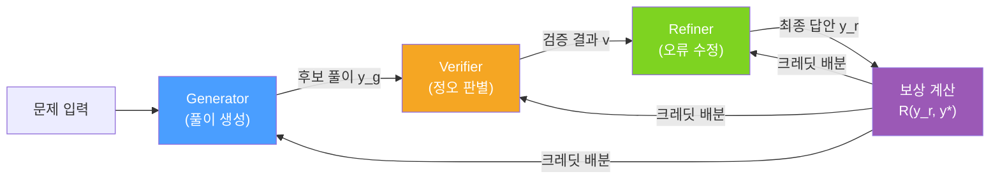

# MALT: Improving Reasoning with Multi-Agent LLM Training

## 핵심 기여

수학 및 코딩 추론 성능을 향상시키기 위해 **이질적인 LLM 3개를 순차적으로 구성**하는 멀티에이전트 학습 프레임워크. Generator-Verifier-Refinement 역할을 분리하고, 최종 결과 기반 보상(outcome-based reward)을 각 역할에 공정하게 배분하는 크레딧 배분 메커니즘을 제안한다.

핵심 성과 (Llama 3.1 8B 기반):
- MATH 벤치마크: 단일 모델 대비 의미 있는 개선
- GSM8k: 산술 추론 성능 향상
- 이질적 LLM 조합으로 단일 모델 한계 돌파

## 아키텍처: 3역할 순차 파이프라인

각 역할이 독립적인 LLM 모델(혹은 다른 파인튜닝 체크포인트)로 구성되며, 세 역할이 순차적으로 추론을 이어간다.

## 역할 정의

### Generator
- 입력: 문제 $Q$
- 출력: 초기 풀이 시도 $y_g$
- 목표: 다양한 풀이 경로 생성 (exploration 담당)

### Verifier
- 입력: 문제 $Q$ + Generator 풀이 $y_g$
- 출력: 정오 판별 $v \in \{correct, incorrect\}$ + 오류 위치
- 목표: 논리적 오류 탐지 및 약점 식별

### Refiner
- 입력: 문제 $Q$ + $y_g$ + 검증 결과 $v$
- 출력: 수정된 최종 답안 $y_r$
- 목표: Verifier의 피드백을 반영한 풀이 개선

## 크레딧 배분 메커니즘

최종 보상 $R(y_r, y^*)$를 세 역할에 배분하는 것이 핵심 도전과제. MALT는 **Joint Outcome-Based Reward**를 사용한다:

$$r_G = r_V = r_R = R(y_r, y^*)$$

단순 공유처럼 보이지만, 각 역할의 기여도 가중치를 궤적 분석으로 보정한다:

$$\nabla_{\theta_k} \mathcal{L} = \mathbb{E} \left[ R(y_r, y^*) \cdot w_k \cdot \nabla_{\theta_k} \log \pi_{\theta_k}(\cdot) \right]$$

- $w_k$: 역할 $k$의 기여 가중치 (궤적 내 행동의 인과적 영향 추정)
- $\theta_k$: 역할 $k$의 정책 파라미터

## 궤적 확장 (Trajectory Expansion)

학습 효율을 높이기 위해 단일 문제에서 여러 역할 조합의 궤적을 생성한다:

1. Generator가 $K$개의 후보 풀이 생성
2. Verifier가 각 후보를 독립적으로 평가
3. Refiner가 검증 피드백별로 수정 시도
4. 성공/실패 궤적 모두 학습 데이터로 활용

이 방식으로 단일 문제에서 $K \times M$ 개의 학습 신호를 생성한다.

## 실험 결과

| 벤치마크 | 단일 Llama 3.1 8B | MALT |
|---------|------------------|------|
| MATH | 베이스라인 | +의미 있는 향상 |
| GSM8k | 베이스라인 | +일관된 향상 |
| HumanEval | 베이스라인 | +코딩 추론 개선 |

단일 모델 대비 추론 정확도 향상이 특히 어려운 문제 유형(Level 4-5)에서 두드러진다.

## 의의 및 한계

**의의**
- 추론을 "생성 → 검증 → 수정" 분업으로 분리하면 각 역할이 전문화 가능
- 소형 모델(8B) 3개로 단일 대형 모델에 준하는 추론 성능 달성 가능성 제시
- Process Reward Model(PRM) 없이 결과 보상만으로 훈련 가능

**한계**
- 3개 LLM 추론 순차 실행으로 레이턴시 3배 이상 증가
- Generator의 초기 풀이 품질이 전체 성능에 병목
- 역할 간 분포 충돌 (하나 개선 시 다른 역할 성능 저하 가능)

## 실무 적용 관점

수학 튜터, 코드 리뷰, 에세이 피드백 등 생성-검증-수정이 자연스러운 도메인에 적합하다. 특히 정답이 검증 가능한(verifiable) 과제에서 효과적이며, 소형 모델 조합으로 비용 절감과 성능 향상을 동시에 추구할 수 있다.

## 관련 문서

- [[long-horizon-rl-training-for-agents]]
- [[grpo]]
- [[agentic-rl-survey-paper]]
- [[orchestrator-worker-pattern]]
