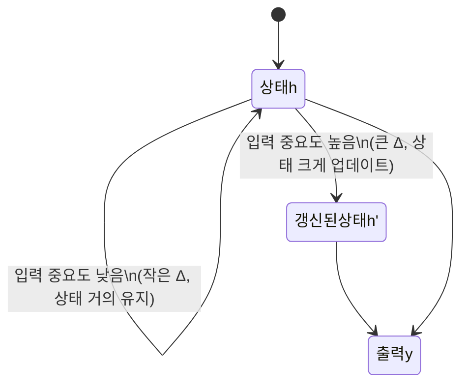
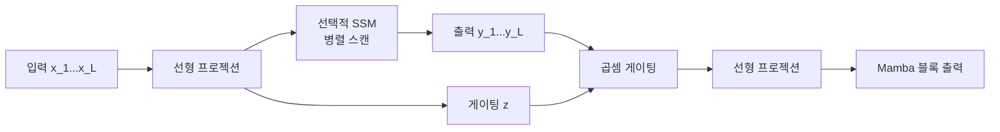

# Mamba: Linear-Time Sequence Modeling with Selective State Spaces (Gu & Dao, 2023)

## 핵심 기여

Albert Gu와 Tri Dao가 2023년 12월 발표한 Mamba는 **Attention을 완전히 제거한 선형 시간 시퀀스 모델링**을 제안하여 NLP 커뮤니티에 큰 충격을 줬다. 핵심 아이디어는 상태 공간 모델(SSM)에 **선택성(Selectivity)**을 부여하는 것이다 - 입력에 따라 SSM의 파라미터가 동적으로 변하여 관련 정보를 선택적으로 기억하고 불필요한 정보를 잊을 수 있다.

기존 Transformer의 $O(L^2)$ Attention 복잡도 대신 **$O(L)$ 선형 복잡도**를 달성하면서, 언어 모델링 perplexity에서 동급 크기 Transformer와 대등하거나 우세한 성능을 보였다. [[mamba-3]]과 이후 Mamba-2 등으로 발전하는 새로운 아키텍처 계보를 열었다. [[mamba-3]]를 이해하는 데 이 논문이 출발점이다.

## 방법

### 상태 공간 모델(SSM) 기초

연속 시간 SSM은 다음 선형 미분 방정식으로 정의된다:

$$\dot{h}(t) = Ah(t) + Bx(t), \quad y(t) = Ch(t)$$

이를 이산화하면:

$$h_t = \bar{A}h_{t-1} + \bar{B}x_t, \quad y_t = Ch_t$$

여기서 $h_t \in \mathbb{R}^N$는 숨겨진 상태, $A, B, C$는 학습 파라미터다. 이전 S4 등의 SSM은 $A, B, C$가 **입력에 무관한 고정 행렬**이었다.

### 선택적 SSM (Selective SSM)

Mamba의 핵심 혁신: $B, C, \Delta$를 **입력 $x_t$의 함수**로 만든다:

$$B_t = s_B(x_t), \quad C_t = s_C(x_t), \quad \Delta_t = \text{softplus}(s_\Delta(x_t))$$

$\Delta_t$ (이산화 스텝 크기)가 입력에 따라 달라지므로, 중요한 토큰에서는 $\Delta$가 커져 상태가 크게 업데이트되고, 불필요한 토큰에서는 $\Delta$가 작아져 상태가 유지된다.

### HiPPO 행렬 초기화

$A$ 행렬은 HiPPO(High-order Polynomial Projection Operator) 이론에 기반한 구조화된 행렬로 초기화된다. HiPPO는 과거 입력을 직교 다항식 기저로 압축 표현하는 수학적 프레임워크로, 장거리 의존성(long-range dependency) 학습에 유리한 스펙트럼 특성을 제공한다.

### 하드웨어 인식 병렬 알고리즘

선택적 SSM은 행렬 $A$가 입력 의존적이므로 기존 SSM처럼 FFT로 병렬화할 수 없다는 문제가 있다. Mamba는 **병렬 스캔(Parallel Scan)** 알고리즘을 GPU SRAM에서 커널 퓨전(Kernel Fusion)으로 구현하여 이를 해결했다.

### Mamba 블록 구조

Mamba 블록은 Transformer의 Attention + FFN을 대체한다:
- 입력 → 두 갈래 선형 프로젝션
- 한 갈래: Conv1D → 선택적 SSM
- 다른 갈래: SiLU 활성화 (게이팅)
- 두 갈래 곱셈 후 선형 프로젝션으로 합산

## 결과

### 언어 모델링 perplexity

Pile 데이터셋에서 동일 파라미터 수 기준:

| 모델 크기 | Mamba | Transformer++ |
|----------|-------|---------------|
| 130M | 10.56 | 10.65 |
| 370M | 8.28 | 8.69 |
| 1.3B | 6.22 | 6.46 |
| 2.8B | 5.59 | 5.78 |

Mamba가 Transformer보다 일관되게 낮은 perplexity를 달성한다.

### 추론 속도

- 시퀀스 길이 $L$에 대해 Attention의 $O(L^2)$ 대비 **$O(L)$ 선형 복잡도**
- 상태 크기 $N = 16$ 고정으로 추론 시 **상수 시간 step**
- 2K 컨텍스트에서는 Transformer와 유사하지만, 100K 이상 긴 컨텍스트에서 5배 이상 빠른 추론

### 장거리 의존성 태스크

Long Range Arena(LRA) 벤치마크에서 Transformer보다 훨씬 효율적이며, Path-X (16K 시퀀스) 같은 극단적 장거리 태스크에서 Transformer는 무작위 수준인 반면 Mamba는 유의미한 성능을 보인다.

## 한계

- **In-context Learning**: Transformer의 Attention이 제공하는 유연한 in-context 검색 능력이 제한적이다. "특정 토큰을 다시 정확히 조회"하는 것이 어렵다.
- **대규모 멀티모달 검증 부재**: 논문은 주로 언어 모델링과 일부 합성 태스크에서 검증됐다. 이미지, 오디오 등 멀티모달 도메인의 대규모 검증은 후속 연구 과제다.
- **Attention 대비 프레임워크 성숙도**: Transformer 생태계(Flash Attention, vLLM 등)에 비해 최적화 라이브러리와 배포 도구가 아직 부족하다.
- **매우 큰 모델 확장성**: 논문에서 검증된 최대 규모는 2.8B로, 70B+ 규모에서의 확장성은 후속 연구가 필요하다.

## 실무 관점

Mamba가 열어준 가능성과 현실적 제약:

- **긴 컨텍스트 서비스**: DNA 서열, 오디오 파형, 극장편 영상처럼 수십만 이상의 긴 시퀀스를 다루는 분야에서 Mamba가 특히 유망하다.
- **하이브리드 아키텍처**: 실무에서는 Mamba 블록과 Attention 블록을 혼합한 하이브리드 모델(Jamba, Zamba 등)이 두 아키텍처의 장점을 결합하려는 시도가 활발하다.
- **추론 메모리**: KV 캐시가 없고 고정 크기 상태만 유지하므로, 긴 컨텍스트에서 추론 메모리가 시퀀스 길이에 무관하게 일정하다. 엣지 디바이스 배포에 유리하다.
- **학습 라이브러리**: `mamba-ssm` PyPI 패키지가 공식 CUDA 구현을 제공한다. triton-lang 기반 커뮤니티 구현도 존재한다.

## 관련 문서

- [[mamba-3]] - Mamba-2와 Mamba-3로 이어지는 후속 발전, 이론적 통합 강화
- [[mamba-3]] - SSM 수학적 기초, HiPPO, 이산화 과정 상세 설명
- [[attention-is-all-you-need-paper]] - Mamba가 대체하려는 Transformer Attention의 원조 논문
