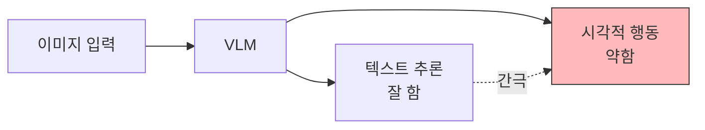

# MAPO: 멀티모달 에이전트 정책 최적화

## 핵심 기여

텍스트 추론과 시각적 행동 생성 사이의 **추론-행동 간극(reasoning-action gap)**을 해결하는 Multimodal Agentic Policy Optimization(MAPO) 프레임워크를 제안한다. 모델이 이미지를 통해 사고(thinking with images)하면서 동시에 행동을 생성할 수 있도록 한다.

핵심 성과:
- 텍스트 추론과 시각적 행동 사이의 간극을 정책 최적화�� 직접 공략
- "이미지로 사고하기" 능력을 에이전트 정책에 통합
- 멀티모달 에이전트의 행동 품질을 직접 최적화

## 문제 정의

기존 Vision-Language Model(VLM) 기��� 에이전트의 한계:

기존 VLM은 텍스트 추���은 잘 수행하지만, 추론 결과를 시각적 환경에서의 정확한 행동으로 변환하는 데 약점�� 있다.

| 문제 | 설명 |
|------|------|
| 추론-행동 불일치 | 올바르게 추론해도 잘못된 행동을 취함 |
| 텍스트 편향 | 시각 정보보다 텍스트 추론에 과도하게 의존 |
| 행동 품질 저하 | 추론 품질과 행동 품질의 상관관계가 낮음 |

## 방법론: MAPO

MAPO는 두 가지 핵심 혁신을 통해 추론-행동 간극을 해결한다:

### 1. 이미지 기반 사고 (Thinking with Images)

텍스트 추론 체인에만 의존하지 않고, **시각적 표현을 추론 과정에 직접 통합**:
- 이미지 특징을 추론 중간 단계에서 참조
- 시각적 근거(visual grounding)를 행동 결정에 직접 활용
- 텍스트-시각 정보의 동적 가중치 조절

### 2. 에이전트 정책 최적화

에이전트의 행동 품질을 직접 최적화하는 정책 학습:
- 행동 결과(reward)로부터 역전파
- 추론 체인과 행동 선택을 동시에 학습
- 멀티모달 환경에서의 end-to-end 최적화

## 실무 적용 관점

- **웹 에이전트**: 시각적 UI 요소를 정확히 인식하고 클릭/입력 행동 수행
- **로보틱스**: 시각 입력에서 물리적 행동으로의 변환 개선
- **GUI 자동화**: 스크린샷 기반 작업에서 추론과 행동의 일관성 향상

## 관련 문서

- [[VLM 서베이]] -- Vision-Language Model 전반 서베이
- [[에이전틱 강화학습 서베이]] -- LLM 에이전트 RL 지형도
- [[멀티모달 벤치��크]] -- MMBench/SEED-Bench/MMMU 비교
