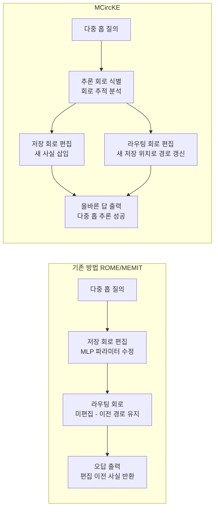

# MCircKE: 회로 기반 지식 편집으로 추론 간극 해소

## 개요

MCircKE(Mechanistic Circuit-Aware Knowledge Editing)는 기계적 해석가능성(mechanistic interpretability)과 지식 편집(knowledge editing)을 최초로 연결한 프레임워크다. 기존 ROME, MEMIT 같은 편집 방법이 "추론 간극(reasoning gap)" - 편집된 사실을 다중 홉 추론(multi-hop reasoning)에 적용하지 못하는 현상 - 을 발생시키는 원인을 회로 분석으로 밝히고, 저장과 라우팅을 동시에 편집하는 새로운 접근을 제안한다.

## 배경: 지식 편집의 미해결 문제

### 기존 지식 편집 방법

LLM의 파라미터에 직접 사실 정보를 갱신하는 지식 편집 연구는 빠르게 발전했다:

- **ROME(Rank-One Model Editing)**: 특정 MLP 레이어의 키-값(key-value) 파라미터를 직접 수정해 단일 사실을 편집
- **MEMIT(Mass-Editing Memory in a Transformer)**: ROME을 확장해 수천 개 사실을 동시에 편집 가능
- **GRACE**: 기억 저장소를 분리해 원본 파라미터 손상 없이 편집

이 방법들은 "A의 수도는 B다"와 같은 직접 질의(direct query)에서는 효과적이다. 편집 후 같은 형식의 질문에 대해 올바른 답을 반환한다.

### 추론 간극의 정체

그러나 다음과 같은 다중 홉 질의에서는 실패한다:

> "A의 수도에 있는 유명한 건물은?" → 수도가 B로 편집되었지만 이 질의에 대한 답은 여전히 이전 수도 기준으로 응답

이를 **추론 간극(reasoning gap)** 이라 한다. 편집된 사실이 직접 질의에는 반영되지만, 그 사실을 전제로 한 파생 추론에는 전파되지 않는다.

기존 연구는 이를 "편집의 불완전한 일반화" 문제로 보았다. MCircKE는 더 근본적인 원인을 밝힌다: **정보 저장과 정보 라우팅이 분리된 회로 구조 때문이다.**

## MCircKE의 핵심 인사이트: 저장 vs 라우팅 회로

기계적 해석가능성 연구는 LLM 내부에서 두 가지 다른 종류의 기능 회로를 식별했다:

- **저장 회로(storage circuit)**: 사실 정보를 파라미터에 인코딩하는 MLP 레이어 집합
- **라우팅 회로(routing circuit)**: 질의 맥락에 따라 저장된 정보를 올바른 위치에서 검색해 출력으로 연결하는 어텐션 헤드 경로

위 다이어그램은 기존 방법이 저장만 편집하고 라우팅을 방치하는 반면, MCircKE가 두 회로를 동시에 편집함을 보여준다.

ROME과 MEMIT의 실패 원인은 명확하다: 이 방법들은 저장 회로만 편집한다. 그러나 다중 홉 질의가 처리될 때 라우팅 회로는 **이전 저장 위치를 여전히 참조하도록 설정되어 있다.** 새로운 사실이 저장되었더라도 라우팅이 그곳을 가리키지 않으면 정보는 사실상 고립된다.

## MCircKE의 작동 방식

### 1단계: 추론 회로 식별

편집하려는 사실과 관련된 다중 홉 추론 과제에 대해 활성화 패칭(activation patching)으로 관여 회로를 추출한다. 어떤 어텐션 헤드와 MLP 레이어가 해당 추론 경로에 인과적으로 참여하는지 매핑한다.

### 2단계: 저장 회로 편집

기존 ROME/MEMIT 방식과 동일하게 새 사실을 MLP 파라미터에 주입한다.

### 3단계: 라우팅 회로 편집

1단계에서 식별한 라우팅 회로의 어텐션 헤드 파라미터를 수정해, 새로운 저장 위치로 경로가 갱신되도록 한다. 이 단계가 MCircKE의 핵심 기여다.

## 기존 방법과의 비교

| 방법 | 저장 편집 | 라우팅 편집 | 다중 홉 성능 | 훈련 필요 |
|------|---------|-----------|------------|---------|
| ROME | O | X | 낮음 | 없음 |
| MEMIT | O | X | 낮음 | 없음 |
| GRACE | O (외부 저장) | X | 중간 | 없음 |
| **MCircKE** | **O** | **O** | **높음** | **없음** |

MCircKE는 기존 방법들에 라우팅 편집을 추가하는 방식으로 구현되므로 ROME/MEMIT 위에 계층적으로 적용 가능하다.

## 해석가능성과 편집의 교차점

MCircKE가 갖는 더 넓은 의미는 **기계적 해석가능성 연구가 실용적 모델 수정 기법의 토대가 될 수 있음을 증명**했다는 점이다.

지금까지 회로 추적(circuit tracing) 연구는 주로 "모델이 어떻게 작동하는가"를 이해하는 데 집중되었고, 이 이해를 실제 모델 개입(intervention)에 연결하는 작업은 드물었다. MCircKE는 그 다리를 놓는다:

- 회로 분석 → 편집 목표 특정 → 정밀 수정

이는 [[circuit-tracing|회로 추적]]과 모델 편집 연구 흐름이 수렴하는 새로운 방향을 열었다.

## 실무 관점

**언제 유용한가?**
- 사실 관계가 바뀐 정보(인사 변동, 정책 갱신, 수치 업데이트)를 재훈련 없이 모델에 반영해야 할 때
- 편집 후 파생 추론의 일관성이 중요한 엔터프라이즈 지식 시스템

**한계:**
- 회로 식별 비용: 편집마다 활성화 패칭을 실행해야 하므로 대규모 배치 편집에 비용이 크다
- 편집 간 간섭: 다수의 편집이 누적될 때 라우팅 회로 간 충돌 가능성
- 복잡한 다중 홉 체인(4홉 이상)에 대한 검증 부족

## 핵심 기여 요약

1. 기계적 해석가능성과 지식 편집을 연결한 최초 프레임워크
2. 추론 간극의 원인을 "라우팅 회로 미편집"으로 정확히 진단
3. 저장 + 라우팅 동시 편집을 통한 다중 홉 추론 성능 대폭 향상
4. 회로 분석을 모델 수정 기법의 설계 기반으로 활용하는 새로운 연구 패러다임 제시

## 관련 문서

- [[모델 편집 기법]] - ROME, MEMIT, GRACE 등 지식 편집 방법 개요
- [[circuit-tracing|회로 추적]] - 기계적 해석가능성의 핵심 분석 기법
- [[Vi-CD: 비전 트랜스포머의 충실한 기계적 해석가능성]] - 회로 발견을 비전 도메인에 적용한 관련 논문
- [[기계적 해석가능성]] - Anthropic 등의 LLM 내부 구조 분석 연구 흐름
- [[사실 연상 및 저장]] - LLM이 사실 정보를 파라미터에 저장하는 방식
