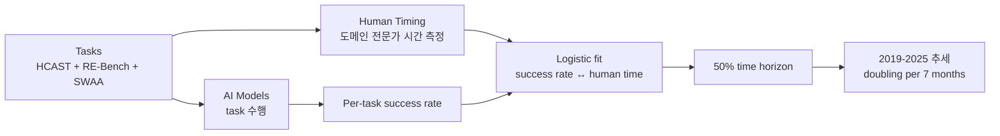

# Measuring AI Ability to Complete Long Software Tasks (METR, 2025)

## TL;DR

METR(Model Evaluation & Threat Research)이 제안한 **50%-task-completion time horizon** 메트릭은 "AI가 50% 성공률로 완수 가능한 task를 인간이 평균적으로 푸는 데 걸리는 시간"이다. **HCAST + RE-Bench + 66개 신규 단기 task** 결합 데이터셋에서 도메인 전문가의 시간을 정밀 측정하고 모델별 logistic fit으로 horizon을 추정한다. **Claude 3.7 Sonnet ≈ 50분 horizon**, 2019년 이래 **약 7개월마다 doubling**, 2024년 이후 가속화 시그널이 관찰됐다. 추세 외삽 시 5년 내 월 단위 task 자동화 가능성을 예측. NeurIPS 2025.

## 핵심 기여

1. **50%-task-completion time horizon 메트릭 제안** — AI가 50% 성공률로 완수 가능한 task의 인간 평균 소요 시간
2. **HCAST 데이터셋** — Human-Calibrated Autonomy Software Tasks, 사람이 도메인 전문성을 가지고 시간 측정한 task 모음
3. **세 데이터셋 결합** — HCAST + RE-Bench + 66개 신규 단기 task
4. **Doubling every 7 months** — 2019년 이래 AI time horizon이 약 7개월마다 2배
5. **Claude 3.7 Sonnet ≈ 50분 horizon** — 측정 시점 SOTA
6. **5년 내 월 단위 task 자동화 전망** — 추세 외삽

## 방법론

- **Human timing**: 도메인 전문가가 각 task 완수에 걸리는 시간 정밀 측정
- **HCAST 구성**: software engineering, ML 연구, cybersecurity 등 광범위한 long-horizon task
- **RE-Bench**: ML 연구 task 중심
- **SWAA (Software Atomic Actions)**: 짧은 task로 pre-2023 모델 측정용
- **Time horizon 추정**: 각 모델의 task별 success rate를 task의 인간 시간과 매핑하여 50% 성공 horizon을 logistic fit
- **Capability driver 분석**: 모델 행동을 사례별로 코딩 — reliability, mistake adaptation, logical reasoning, tool use가 주요 요인

## 실험/결과

- **Claude 3.7 Sonnet**: ~50분
- **o1**: ~30분 (당시 측정)
- **Doubling rate**: 2019년 이래 약 7개월마다 2배
- **2024년 이후 가속화 시그널** — 2024-2025년 데이터가 doubling rate를 7개월보다 더 짧게 줄이는 경향
- **Capability driver**: 새 모델일수록 mistake recovery와 tool use가 horizon 확장에 가장 크게 기여

## 하네스 엔지니어링 관점

- **Long-horizon task 평가의 표준화** — 단일 task 성공률이 아닌 "인간 시간 단위" 기준은 ROI 계산에 직접 활용 ([[long-horizon-agent-benchmarks]])
- **HCAST 자체가 harness 평가의 좋은 testbed** — 1분짜리부터 하루짜리까지 분포
- **Reliability가 horizon 확장의 핵심** — 단일 step 정확도보다 긴 chain에서 회복 능력이 결정적. harness 디자인에서 retry/reflection/checkpoint 중요 ([[reflexion-paper]], [[agent-fallback-strategies]])
- **Tool use 품질** — model 자체 능력뿐 아니라 ACI/tool design이 horizon에 영향 ([[swe-agent-paper]] 일관)
- **Production planning**: 사내 task의 인간 시간을 측정해두면 향후 모델 발전이 자동화 가능 영역을 확장하는 시점을 예측 가능
- **위험 시그널** — long-horizon 능력 확장은 dangerous capabilities (autonomy 위험)와 직접 연결 ([[ai-agent-security]])

## 한계 / 후속 연구

- **External validity** — HCAST/RE-Bench 외 task 일반화는 추가 연구 필요
- **인간 시간 측정의 노이즈** — 같은 task도 사람마다 큰 분산
- **Compute slowdown 시나리오 미반영** — 후속 페이퍼(arXiv:2511.19492)에서 다룸
- **Long-horizon = real autonomy** 가정의 한계 — multi-day task는 평가 자체가 어려움
- 후속:
  - "Forecasting AI Time Horizon Under Compute Slowdowns" (arXiv:2511.19492)
  - "How Does Time Horizon Vary Across Domains?" (METR 2025-07)

## 관련 자료

- METR 공식 블로그: metr.org/blog/2025-03-19-measuring-ai-ability-to-complete-long-tasks
- [[long-horizon-agent-benchmarks]]
- [[swe-bench-paper]] — long-horizon coding 벤치마크
- [[swe-agent-paper]] — tool use / ACI
- [[reflexion-paper]] — mistake recovery
- [[agent-evaluation-framework]]
- [[long-horizon-rl-training-for-agents]]
