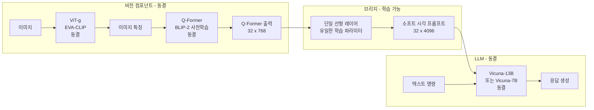
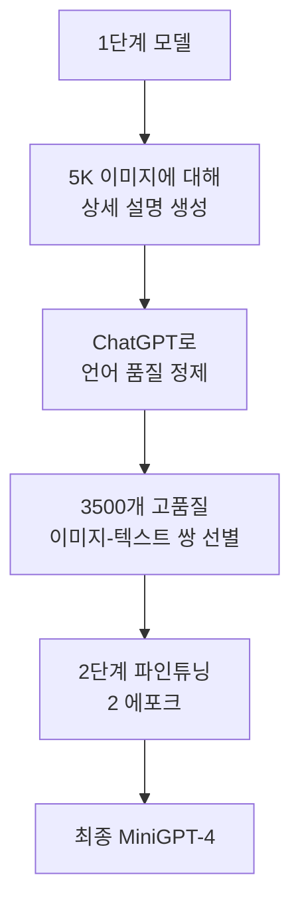
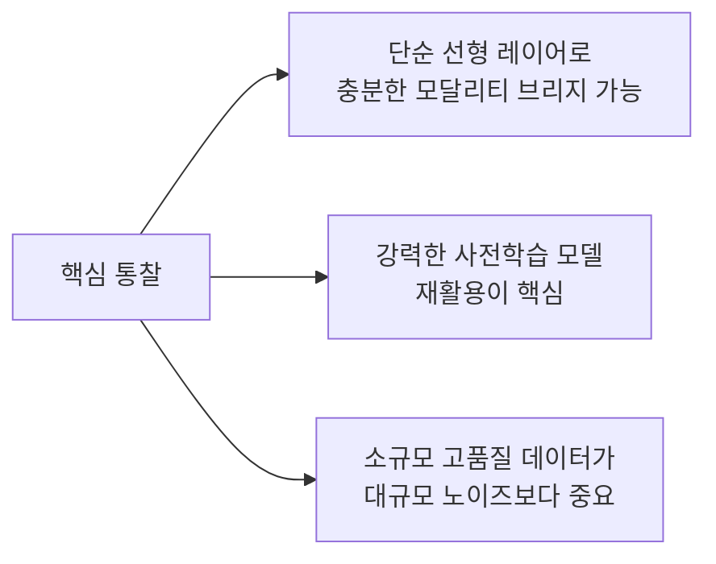

# MiniGPT-4: Enhancing Vision-Language Understanding with Advanced Large Language Models (Zhu et al., 2023)

## 메타데이터

| 항목 | 내용 |
|------|------|
| 저자 | Deyao Zhu, Jun Chen, Xiaoqian Shen, Xiang Li, Mohamed Elhoseiny (King Abdullah University of Science and Technology, KAUST) |
| 연도 | 2023 |
| 학회/저널 | ICLR 2024 |
| arXiv | 2304.10592 |
| 코드 | https://github.com/Vision-CAIR/MiniGPT-4 |

## 핵심 기여

- **단일 선형 프로젝션 레이어**: 복잡한 Q-Former나 크로스-어텐션 없이 단 하나의 선형 레이어로 ViT 출력을 Vicuna LLM 입력 공간에 연결
- **BLIP-2 비전 컴포넌트 재활용**: BLIP-2의 사전학습된 Q-Former + ViT를 그대로 사용하고 LLM만 Vicuna로 교체
- **2단계 학습 전략**: (1) 대규모 노이즈 데이터로 정렬(alignment), (2) 소규모 고품질 대화 데이터로 정제
- **GPT-4 유사 멀티모달 능력**: 이미지 설명, 시 작성, 코드 생성(이미지 기반), 광고 아이디어 등 GPT-4급 창의적 멀티모달 태스크 수행
- **초경량 학습**: 프로젝션 레이어만 학습하므로 A100 1대에서 수 시간 내 학습 완료

## 배경과 문제 정의

### GPT-4 멀티모달 능력의 놀라움

2023년 초 GPT-4 기술 보고서에서 공개된 멀티모달 예시들이 큰 충격을 주었다:
- 손으로 그린 웹사이트 스케치를 코드로 변환
- 밈(meme) 이미지의 유머 설명
- 이미지를 보고 레시피 제안

이를 오픈소스로 재현할 수 있는가? MiniGPT-4의 출발점이다.

### 왜 기존 방법이 부족했나

당시 오픈소스 시각-언어 모델들(BLIP-2 포함)은:
- 특정 태스크(VQA, 캡셔닝) 성능은 좋지만 **자유로운 대화형 멀티모달 상호작용**에 약함
- 복잡한 시각적 추론, 창의적 응용에 한계
- Vicuna 등 강력한 지시 튜닝 LLM과 결합하지 않음

MiniGPT-4의 가설: **강력한 지시 튜닝 LLM(Vicuna)과 강력한 비전 인코더(BLIP-2)를 최소한의 브리지로 연결하면 GPT-4 유사 멀티모달 능력이 나타날 것이다.**

## 방법

### 아키텍처



**파라미터 효율성**:
- ViT-g: 1.8B (동결)
- Q-Former: 188M (동결)
- 선형 레이어: 약 5M (학습 가능 - 전체의 0.2%)
- Vicuna-13B: 13B (동결)

**총 학습 파라미터: 약 5M** - 전체 시스템의 0.2% 미만

### 선형 프로젝션 레이어

수식으로 표현하면 매우 단순하다:

$$H_v = W \cdot f_{Q}(f_{ViT}(x_{img})) + b$$

여기서:
- $f_{ViT}$: 동결된 ViT 인코더 (이미지 → 특징)
- $f_Q$: 동결된 Q-Former (특징 → 32 쿼리 출력)
- $W \in \mathbb{R}^{d_{LLM} \times d_{Q}}$: 학습 가능한 프로젝션 행렬
- $H_v \in \mathbb{R}^{32 \times d_{LLM}}$: LLM 입력 공간의 시각 토큰

Vicuna-13B의 경우 $d_{LLM} = 5120$, Q-Former 출력 $d_Q = 768$.

### 프롬프트 포맷

```
시스템 메시지: "이것은 인간과 AI 어시스턴트 사이의 대화입니다..."

인간: <시각 토큰들></Img> {사용자 질문}
어시스턴트: {응답}
```

이미지 토큰은 `` 태그로 감싸 텍스트 시퀀스에 직접 삽입된다.

### 2단계 학습 전략

**1단계: 대규모 시각-언어 정렬 (Alignment Pre-training)**

| 항목 | 내용 |
|------|------|
| 데이터 | Conceptual Captions + SBU + LAION (총 약 5M 쌍) |
| 학습 파라미터 | 선형 프로젝션 레이어만 |
| 목표 | 비전 인코더 출력을 LLM 토큰 공간에 정렬 |
| 배치 | 64, 20K 스텝, A100 4대 |
| 문제 | 학습 후 반복적이고 단편적인 응답 생성 |

**2단계: 고품질 대화 데이터 파인튜닝 (Instruction Fine-tuning)**

1단계 후 모델이 유창하지 않은 텍스트를 생성하는 문제를 발견. 해결책:



2단계 데이터: 단 3,500 쌍의 고품질 대화 데이터로 최종 파인튜닝.

## 실험 및 결과

### 질적 능력 시연

MiniGPT-4는 다음 능력들을 시연했다:

| 능력 | 예시 |
|------|------|
| 상세 이미지 설명 | 이미지의 모든 요소를 자연스러운 단락으로 설명 |
| 시 작성 | 이미지를 보고 관련 시 창작 |
| 이미지 기반 코딩 | 손으로 그린 UI를 HTML/CSS 코드로 변환 |
| 광고 아이디어 | 제품 이미지 보고 마케팅 문구 생성 |
| 이야기 창작 | 이미지 속 상황에 맞는 짧은 이야기 작성 |
| 음식 레시피 | 음식 사진 보고 레시피 추천 |
| 문제 진단 | 식물 잎 사진 보고 병충해 진단 |

### 정량 평가 (대화 품질, GPT-4 채점)

| 모델 | 점수 (GPT-4 채점, 10점 만점) |
|------|---------------------------|
| InstructBLIP | 6.3 |
| BLIP-2 | 5.7 |
| MiniGPT-4 | 7.1 |
| LLaVA | 7.4 |

### 1단계 vs 2단계 비교

| 설정 | 응답 품질 |
|------|---------|
| 1단계만 (노이즈 데이터) | 반복적, 단편적, 비유창 |
| 2단계 추가 (고품질 3.5K) | 자연스럽고 상세한 응답 |

**핵심 발견**: 1단계에서 이미 멀티모달 능력이 형성되어 있으며, 2단계는 표현 품질만 다듬는다. 즉, **소규모 고품질 데이터가 대규모 노이즈 데이터보다 언어 유창성에 더 효과적**이다.

## 한계 및 후속 연구

### 한계

- **환각(hallucination)**: 이미지에 없는 내용을 자신 있게 생성하는 경향
- **고정 해상도**: 224x224 제한으로 작은 텍스트나 세밀한 시각 요소 처리 어려움
- **공간적 추론 한계**: 객체 상대 위치, 방향, 개수 등 세밀한 공간 이해 미흡
- **단일 이미지 제한**: 복수 이미지 비교 불가
- **비디오 지원 없음**: 정적 이미지만 처리 가능

### 후속 연구

- **MiniGPT-v2**: 더 많은 시각 태스크 지원, 고해상도 이미지 처리 개선
- **MiniGPT-5**: 텍스트-이미지 생성 통합 (이해 + 생성)
- LLaVA, InstructBLIP 등 유사 접근법이 더 체계적인 벤치마크와 데이터로 발전

## 실무 적용 관점

### 경량 멀티모달 파인튜닝의 선례

MiniGPT-4의 가장 큰 기여는 기술적 혁신보다 **"단순함이 통한다"는 증명**이다:



**도메인 특화 멀티모달 모델 구축 시 참고**:

1. 강력한 오픈소스 비전 인코더 (CLIP, EVA-CLIP) 재활용
2. 도메인 LLM과 단순 프로젝션 레이어로 연결
3. 도메인 데이터로 소규모 파인튜닝

```python
# MiniGPT-4 스타일 프로젝션 레이어 직접 구현
import torch
import torch.nn as nn

class VisionProjection(nn.Module):
    def __init__(self, vision_dim: int, llm_dim: int):
        super().__init__()
        # 단순 선형 레이어 - MiniGPT-4의 핵심
        self.linear = nn.Linear(vision_dim, llm_dim)

    def forward(self, vision_features: torch.Tensor) -> torch.Tensor:
        # vision_features: [batch, 32, vision_dim]
        # 반환: [batch, 32, llm_dim]
        return self.linear(vision_features)
```

### 연구 재현성

MiniGPT-4는 코드와 가중치를 완전히 공개했으며, 학술 연구자들이 제한된 자원으로도 멀티모달 연구를 할 수 있는 길을 열었다. 단 A100 GPU 4대, 수 시간의 학습으로 달성 가능한 성능이다.

## 관련 문서

- [[blip-2-paper]] - MiniGPT-4가 재활용하는 비전 컴포넌트 원천
- [[llava-original-paper]] - 유사한 접근법, GPT-4 합성 데이터 활용
- [[instructblip-paper]] - BLIP-2 기반 더 체계적인 명령 튜닝
- [[multimodal-llm]] - 멀티모달 LLM 개념 전반
- [[vit]] - 비전 트랜스포머 기반 인코더
- [[instruction-tuning]] - 명령 튜닝 개념
