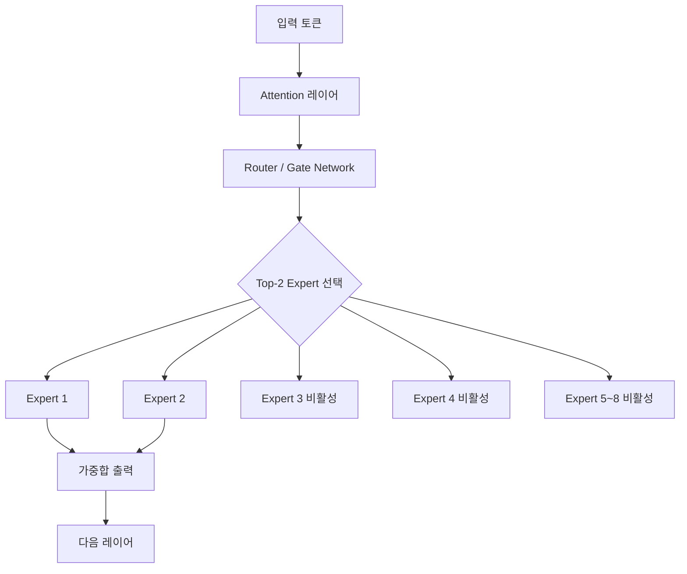
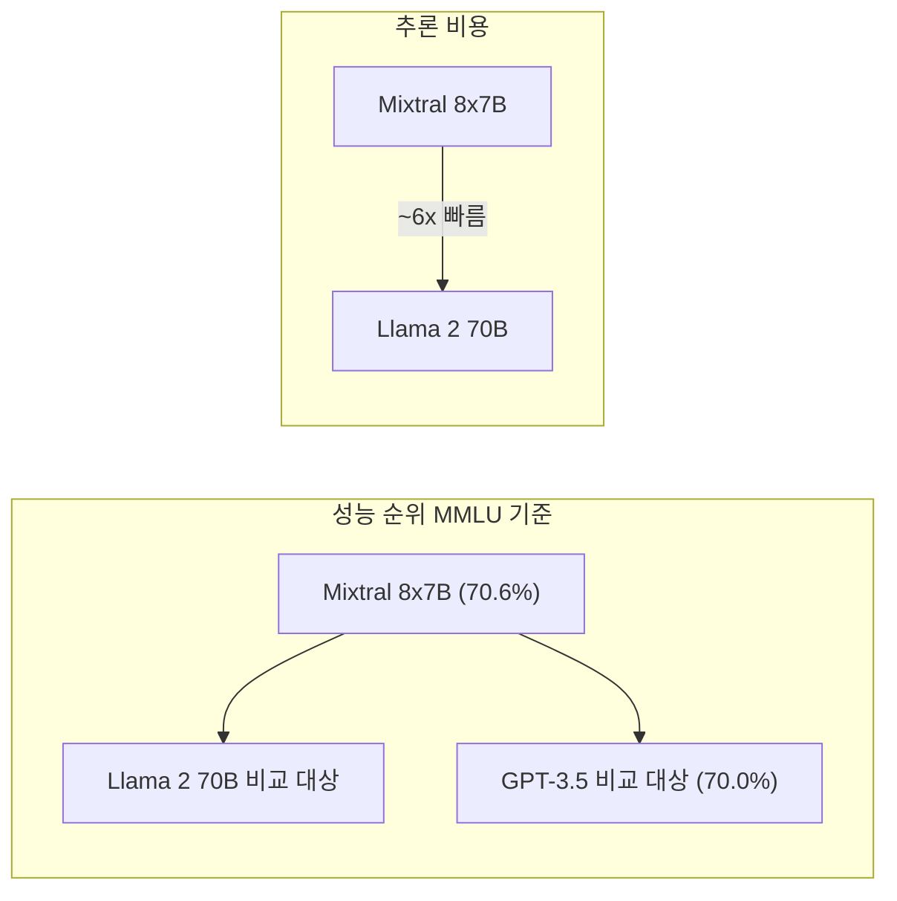

# Mixtral 8x7B: Sparse Mixture of Experts (Mistral AI, 2024)

## 핵심 기여

Mistral AI가 2024년 1월 공개한 Mixtral 8x7B는 **Sparse Mixture of Experts(MoE)** 아키텍처를 대형 오픈 웨이트 모델에 성공적으로 적용한 대표적 사례다. 총 46.7B 파라미터를 보유하지만 추론 시에는 토큰당 **12.9B 파라미터만 활성화**되어, Llama 2 70B 대비 6배 빠른 추론 속도를 달성하면서도 성능은 앞서거나 동등하다.

[[mixture-of-experts]] 아이디어는 [[moe-original-paper]]에서 시작됐으나, Mixtral은 이를 현대 대형 Transformer에 실용적으로 통합하여 "비용 대비 성능" 관점에서 새로운 기준을 제시했다.

## 방법

### Sparse MoE 아키텍처

기존 dense Transformer의 FFN(Feed-Forward Network) 레이어를 N개의 전문가(Expert) 네트워크로 교체하고, 각 토큰이 top-K개의 전문가만 활성화하는 구조다.

### Top-2 라우팅 메커니즘

각 MoE 레이어에서 토큰 $x$에 대한 출력은:

$$\text{MoE}(x) = \sum_{i \in \text{Top-2}} G_i(x) \cdot E_i(x)$$

여기서 $G_i(x)$는 게이팅 네트워크의 소프트맥스 가중치, $E_i(x)$는 $i$번째 전문가 FFN의 출력이다.

**라우터 설계**: 각 전문가는 독립적인 FFN이며, 게이팅 네트워크는 선형 레이어 + 소프트맥스로 구성된다. Mixtral은 **token-level 라우팅**을 사용하여 같은 문장 내에서도 토큰마다 다른 전문가 조합을 선택한다.

### 모델 구성

| 항목 | 값 |
|------|----|
| 총 파라미터 | 46.7B |
| 활성 파라미터 (토큰당) | 12.9B |
| 전문가 수 (레이어당) | 8개 |
| 활성 전문가 | 2개 (top-2) |
| 컨텍스트 길이 | 32K 토큰 |
| 어휘 크기 | 32,000 |
| 레이어 수 | 32 |

### 사전학습

- 32K 토큰 컨텍스트 윈도우로 사전학습 (Sliding Window Attention 미사용)
- 다국어 코퍼스 포함 (영어, 프랑스어, 이탈리아어, 독일어, 스페인어)
- 코드 품질을 위한 코드 데이터 별도 강화

## 결과

### 성능 비교

| 벤치마크 | Mixtral 8x7B | Llama 2 70B | GPT-3.5 |
|----------|-------------|------------|---------|
| MMLU | 70.6% | 69.8% | 70.0% |
| HellaSwag | 81.2% | 87.3% | - |
| HumanEval | 40.2% | 29.9% | 48.1% |
| MATH | 28.4% | 13.5% | 34.1% |
| BBH | 60.4% | 51.2% | - |

### 다국어 성능

프랑스어, 이탈리아어, 독일어 등 유럽 언어에서 Llama 2 70B를 상회한다. 이는 사전학습 데이터에 다국어 비중을 높인 결과다.

### Mixtral 8x7B Instruct

SFT + DPO로 정렬한 Instruct 버전은 MT-Bench에서 Claude 2.1과 동등하고 Llama 2 Chat 70B를 앞선다.

## 한계

- **로드 불균형(Load Imbalance)**: 특정 전문가에 토큰이 집중되는 현상이 발생할 수 있다. Mixtral은 auxiliary loss 없이 이를 완화했다고 주장하지만, 학습 안정성 보장 방법이 충분히 공개되지 않았다.
- **메모리 요구량**: 46.7B 전체 파라미터를 메모리에 로드해야 하므로 (추론 시 12.9B만 계산하더라도) VRAM 요구량은 70B 수준이다.
- **전문가 해석 가능성**: 어떤 전문가가 어떤 종류의 토큰/지식을 담당하는지 해석이 어렵다.
- **학습 세부사항 미공개**: 학습 데이터, 정확한 하이퍼파라미터, 전문가 분화 방식 등 핵심 세부사항을 Mistral이 공개하지 않았다.

## 실무 관점

Mixtral은 "MoE = 학술 실험"이라는 인식을 바꿔, 프로덕션에서 MoE가 실용적임을 증명했다:

- **비용 효율**: 동일한 VRAM으로 더 높은 품질의 모델을 구동할 수 있다. 70B dense 모델 대신 Mixtral을 쓰면 추론 속도가 6배 빠르다.
- **vLLM, Ollama 지원**: 주요 추론 프레임워크에서 빠르게 지원이 추가돼 배포 장벽이 낮다.
- **파인튜닝 주의**: MoE 모델의 파인튜닝은 전문가 라우팅 분포 변화가 발생하므로, 특히 적은 데이터로의 파인튜닝 시 성능 저하 위험이 있다.
- **Mixtral 8x22B 후속**: 2024년 4월 공개된 8x22B는 141B 총 파라미터로 GPT-4 수준의 성능을 목표로 했다.

DeepSeek-V3가 [[deepseek-v3-paper]]에서 더 발전된 MoE 설계를 도입했지만, Mixtral이 이 흐름의 대중화 기점이 됐다.

## 관련 문서

- [[mixture-of-experts]] - MoE 아키텍처의 원리와 변형에 대한 개념 문서
- [[moe-original-paper]] - Jacobs et al.의 원조 MoE 논문, Mixtral의 학문적 선조
- [[deepseek-v3-paper]] - MoE를 더 발전시킨 DeepSeek의 접근법, 보조 손실 없는 부하분산
- [[llama3-paper]] - 동시대 dense 모델과의 비교 기준점
