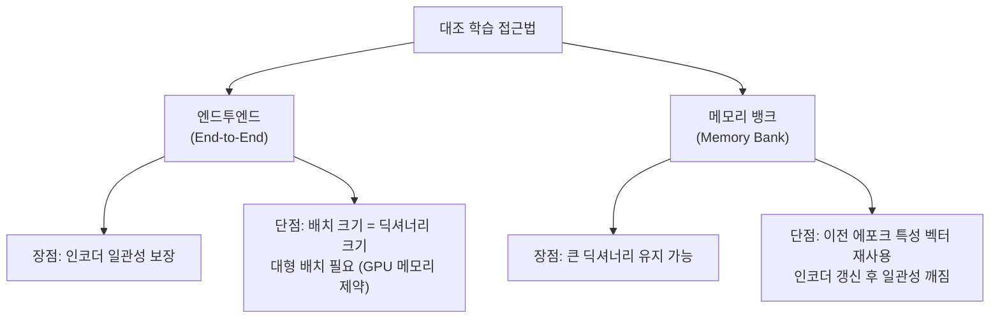
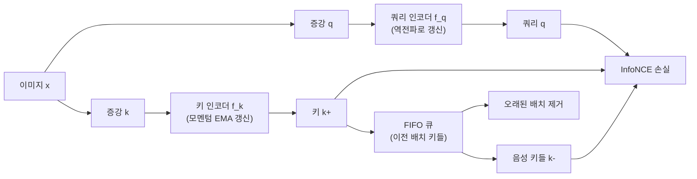

# MoCo: 비지도 시각 표현 학습을 위한 모멘텀 대조

## 메타데이터

| 항목 | 내용 |
|------|------|
| 제목 | Momentum Contrast for Unsupervised Visual Representation Learning |
| 저자 | Kaiming He, Haoqi Fan, Yuxin Wu, Saining Xie, Ross Girshick |
| 소속 | Facebook AI Research (FAIR) |
| 발표 연도 | 2020 |
| 학회 | CVPR 2020 |
| arXiv | [1911.05722](https://arxiv.org/abs/1911.05722) |

## 핵심 기여

- **동적 딕셔너리(dynamic dictionary)** 관점으로 비지도 대조 학습을 재정의 - 대규모 일관적 키 집합 유지가 핵심
- **모멘텀 인코더(momentum encoder)**: 키 인코더를 쿼리 인코더의 지수 이동 평균(EMA)으로 느리게 갱신하여 인코더 일관성 확보
- **FIFO 큐(First-In-First-Out queue)**: 배치 크기에 독립적으로 수천~수만 개의 음성 샘플 키를 유지
- ImageNet 7개 다운스트림 태스크에서 지도학습 사전학습(supervised pre-training)을 능가하는 최초의 비지도 방법
- 메모리 뱅크(memory bank) 방식의 일관성 문제와 엔드투엔드(end-to-end) 방식의 배치 크기 제약을 동시에 해결

## 배경 및 문제 정의

비지도 표현 학습에서 대조 학습의 핵심 도전은 **대규모 음성 샘플(negative sample) 딕셔너리**를 유지하면서도 **일관된 인코더**를 사용하는 것이다.

### 기존 접근법의 한계



- **엔드투엔드(end-to-end)**: 같은 배치에서 음성 샘플 추출. 배치가 곧 딕셔너리 크기여서 GPU 메모리 제한을 받음
- **메모리 뱅크(memory bank)**: Wu et al. 2018 방식. 모든 훈련 샘플의 최신 특성 벡터를 저장. 하지만 인코더가 갱신되면 오래된 벡터들이 현재 인코더와 일관성이 없어짐

MoCo는 이 두 방식의 장점만 취하는 새로운 설계를 제안한다.

### 핵심 통찰

> "우리는 딕셔너리를 FIFO 큐로 구축하고, 현재 미니배치 데이터를 큐에 넣고 가장 오래된 배치를 제거한다. 딕셔너리 크기가 미니배치 크기와 분리된다."

음성 샘플의 일관성을 위해 **모멘텀 업데이트**로 키 인코더를 천천히 변경한다. 빠르게 변하는 인코더가 만들어내는 키들은 일관성이 없지만, 느리게 변하는 모멘텀 인코더의 키들은 충분히 일관적이다.

## 방법

### 전체 아키텍처



MoCo는 두 개의 인코더를 사용한다: 역전파(backpropagation)로 갱신되는 쿼리 인코더 $f_q$와, 쿼리 인코더의 지수 이동 평균으로 갱신되는 키 인코더 $f_k$. 키 인코더의 출력이 FIFO 큐에 누적된다.

### 모멘텀 업데이트

키 인코더의 파라미터 $\theta_k$는 쿼리 인코더 파라미터 $\theta_q$의 EMA로 갱신된다:

$$\theta_k \leftarrow m \cdot \theta_k + (1 - m) \cdot \theta_q$$

모멘텀 계수 $m \in [0, 1)$는 보통 $0.999$로 설정한다. $m$이 클수록 $\theta_k$가 천천히 변하여 큐에 있는 키들과의 일관성이 높아진다. 키 인코더는 역전파를 받지 않고 오직 이 EMA 수식으로만 갱신된다.

### InfoNCE 손실 (대조 손실)

쿼리 $q$에 대해 하나의 긍정 키 $k_+$와 $K$개의 음성 키 $\{k_0, k_1, \ldots, k_{K-1}\}$가 있을 때:

$$\mathcal{L}_q = -\log \frac{\exp(q \cdot k_+ / \tau)}{\exp(q \cdot k_+ / \tau) + \sum_{i=0}^{K-1} \exp(q \cdot k_i / \tau)}$$

여기서 $\tau$는 온도 파라미터다. 이는 $K+1$개 클래스에 대한 소프트맥스 분류 문제로 해석할 수 있다 - 쿼리가 긍정 키 클래스로 분류되도록 학습.

### 큐(Queue) 동작

배치 크기 $N$으로 학습할 때:
1. 현재 배치의 키 인코더 출력 $N$개를 큐의 끝에 추가
2. 큐 앞에서 $N$개의 오래된 키를 제거 (FIFO)
3. 큐 크기 $K$는 배치 크기와 무관하게 설정 가능 (보통 65536)

큐 크기가 크면 더 많은 음성 샘플을 제공하지만, 아주 오래된 키는 현재 인코더와 불일치할 수 있다. 모멘텀 업데이트의 느린 속도가 이 문제를 완화한다.

### MoCo v2 개선점

MoCo v2 (Chen et al. 2020, SimCLR의 트릭 통합):
- 투영 헤드(MLP) 추가: SimCLR에서 도입한 비선형 투영 헤드
- 강화된 데이터 증강: SimCLR 증강 전략 적용 (색상 왜곡, 가우시안 블러)
- 코사인 학습률 스케줄
- 결과: 동일 에포크에서 SimCLR 대비 우수한 성능을 더 작은 배치로 달성

## 실험 및 결과

### ImageNet 선형 평가

| 방법 | 파라미터 | Top-1 |
|------|---------|-------|
| 지도학습 (ResNet-50) | 25M | 76.5% |
| 메모리 뱅크 | - | 58.0% |
| AMDIM | - | 68.1% |
| MoCo (ResNet-50) | 25M | 60.6% |
| MoCo v2 (ResNet-50) | 25M | 71.1% |
| MoCo (ResNet-50w4) | 375M | 68.6% |

MoCo v2는 SimCLR의 기법을 흡수하면서도 배치 크기 256으로 SimCLR(배치 4096-8192) 대비 동등하거나 우수한 성능을 달성했다.

### 다운스트림 태스크 (PASCAL VOC)

VOC 객체 탐지(object detection) 파인튜닝 결과:

| 사전학습 방법 | AP50 | AP |
|------------|------|-----|
| ImageNet 지도학습 | 81.3 | 53.5 |
| 스크래치(scratch) | 60.2 | 33.8 |
| MoCo v1 | 81.5 | 55.9 |
| MoCo v2 | 82.5 | 57.4 |

MoCo가 ImageNet 지도학습 사전학습을 처음으로 능가한 비지도 방법이 됐다. 특히 탐지처럼 밀집 예측(dense prediction) 태스크에서 이점이 두드러졌다.

### 모멘텀 계수의 영향

| 모멘텀 $m$ | Top-1 정확도 |
|-----------|------------|
| 0 (업데이트 없음) | 55.2% |
| 0.9 | 62.6% |
| 0.99 | 63.4% |
| 0.999 | 64.5% (최적) |
| 0.9999 | 63.1% |

$m = 0.999$ 근방에서 최적 성능을 보인다. 너무 낮으면 키 일관성 부족, 너무 높으면 키 인코더가 쿼리 인코더를 제대로 따라가지 못한다.

### 큐 크기의 영향

| 큐 크기 $K$ | Top-1 정확도 |
|-----------|------------|
| 256 | 60.9% |
| 1024 | 62.6% |
| 4096 | 63.2% |
| 16384 | 63.8% |
| 65536 | 64.5% (최적) |

더 큰 딕셔너리가 더 좋은 성능을 냈다. 배치 크기에 독립적으로 큰 딕셔너리를 유지하는 MoCo의 핵심 강점이다.

## 한계 및 후속 연구

### 한계점

1. **증강 의존성**: 초기 MoCo v1은 SimCLR의 강력한 증강 전략을 사용하지 않아 성능이 낮았음 (v2에서 해결)
2. **큐 하이퍼파라미터 민감도**: 큐 크기, 모멘텀 계수 선택이 성능에 영향
3. **음성 쌍 가정**: SimCLR과 동일하게 같은 클래스 이미지를 음성으로 취급하는 false negative 문제
4. **복잡한 구현**: 동기화된 배치 정규화(synchronized BN)와 셔플링(shuffling) 등 구현 시 주의사항이 많음

### 후속 연구

- **MoCo v3**: ViT 아키텍처에 대한 MoCo 방식 적용
- **[[byol-original-paper]]**: 음성 샘플 없이도 학습 가능함을 보여 MoCo/SimCLR 패러다임을 넘어섬
- **[[dino-original-paper]]**: 자기 증류 방식, MoCo의 모멘텀 인코더 개념을 ViT와 결합
- **SwAV**: 클러스터링과 대조 학습의 결합

### MoCo의 역사적 의의

MoCo는 비지도 시각 표현 학습이 처음으로 지도학습 사전학습을 탐지 태스크에서 능가한 방법이다. "비지도 학습이 ImageNet 지도학습을 대체할 수 있다"는 가능성을 실증적으로 보여준 이정표 논문이다.

## 실무 적용 관점

### MoCo vs SimCLR 선택 기준

| 상황 | 권장 |
|------|------|
| GPU 메모리 제약 (소배치만 가능) | MoCo |
| 대형 클러스터 (큰 배치 가능) | SimCLR |
| 탐지/세그멘테이션 사전학습 | MoCo (밀집 태스크에 강함) |
| 분류 사전학습 | 둘 다 유사 |

### 구현 핵심 주의사항

1. **배치 정규화 셔플링(shuffled BN)**: 같은 배치 내 쿼리와 키가 같은 배치 통계를 공유하면 "단축키(shortcut)"를 학습할 수 있다. 멀티-GPU 환경에서 키의 배치 정규화는 GPU 간 샘플을 셔플링하여 적용

2. **그래디언트 흐름 차단**: 키 인코더는 역전파를 받지 않는다:
```python
# 올바른 구현
with torch.no_grad():
    # 모멘텀 업데이트
    for param_q, param_k in zip(encoder_q.parameters(), encoder_k.parameters()):
        param_k.data = param_k.data * m + param_q.data * (1.0 - m)
    
    # 키 계산 (그래디언트 없음)
    k = encoder_k(x_k)
```

3. **큐 초기화**: 학습 초기 큐가 채워지지 않은 상태에서도 안정적 학습을 위해 랜덤 초기화된 키로 큐를 미리 채우거나 워밍업 처리

### 실무 파이프라인 예시

```python
class MoCoModel(torch.nn.Module):
    def __init__(self, base_encoder, K=65536, m=0.999, T=0.07):
        super().__init__()
        self.K = K  # 큐 크기
        self.m = m  # 모멘텀 계수
        self.T = T  # 온도
        
        # 쿼리/키 인코더 (동일 초기화)
        self.encoder_q = base_encoder()
        self.encoder_k = base_encoder()
        
        # 키 인코더 파라미터 동결 (모멘텀으로만 갱신)
        for param in self.encoder_k.parameters():
            param.requires_grad = False
        
        # FIFO 큐 초기화
        self.register_buffer("queue", torch.randn(128, K))
        self.queue = F.normalize(self.queue, dim=0)
        self.register_buffer("queue_ptr", torch.zeros(1, dtype=torch.long))
    
    @torch.no_grad()
    def _momentum_update(self):
        """키 인코더 모멘텀 업데이트"""
        for param_q, param_k in zip(
            self.encoder_q.parameters(), self.encoder_k.parameters()
        ):
            param_k.data = param_k.data * self.m + param_q.data * (1.0 - self.m)
```

## 관련 문서

- [[simclr-original-paper]] - 큰 배치 기반 대조 학습, MoCo와 설계 철학 비교
- [[byol-original-paper]] - 음성 샘플 없는 자기지도 학습, 모멘텀 인코더 개념 계승
- [[dino-original-paper]] - 모멘텀 인코더를 자기 증류에 활용한 ViT 자기지도 학습
- [[barlow-twins-redundancy]] - 대조 손실 없는 자기지도 학습 대안
- [[byol-bootstrap]] - BYOL 아키텍처 상세 설명
