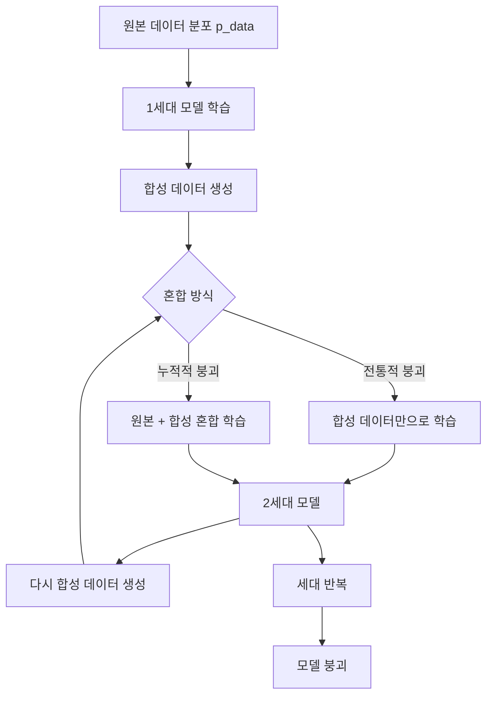
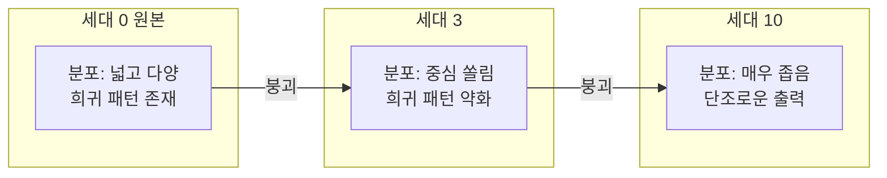
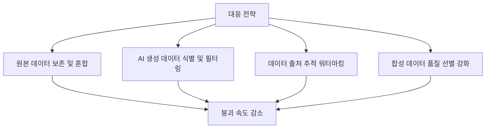

# Model Collapse: The Curse of Recursion in LLM Training on AI-Generated Data (Nature 2024)

## 핵심 기여

Ilia Shumailov 등이 2024년 Nature에 발표한 이 논문은 **AI가 생성한 데이터로 다음 세대 AI를 학습시키는 반복 과정(recursive training)에서 필연적으로 품질이 저하**된다는 "모델 붕괴(model collapse)" 현상을 이론적으로 증명하고 실험적으로 검증했다.

인터넷에 AI 생성 콘텐츠가 폭발적으로 증가하면서, 미래의 LLM은 이런 합성 데이터를 무의식적으로 학습 데이터에 포함시킬 위험이 있다. 이 논문은 그 결과가 단순한 품질 저하가 아닌 **희귀하지만 진실한 데이터 분포의 점진적 소멸**로 이어진다는 것을 보여준다. [[model-collapse-synthetic]] 개념의 핵심 이론적 근거이며, [[synthetic-data-training]] 전략 설계에 필수적 경고를 제공한다.

## 방법

### 모델 붕괴의 두 가지 메커니즘

**오류 1 - 통계적 근사 오류 (Statistical Approximation Error)**: 유한한 샘플로 학습할 때 원본 분포의 꼬리(tail) 부분이 과소 표현된다. 합성 데이터는 이 꼬리 부분을 더 심하게 누락시킨다.

**오류 2 - 함수 근사 오류 (Functional Approximation Error)**: 모델의 용량 한계로 인해 분포의 복잡한 부분(희귀 패턴, 다양성)이 뭉개진다.

두 오류가 세대를 거치며 **누적(compound)**되면서 결국 분포가 단순하고 동질적인 형태로 수렴한다.

### 수학적 분석

세대 $n$에서 모델이 학습한 분포 $p_n$과 원본 분포 $p_0$ 사이의 KL 발산이 세대에 따라 증가함을 증명:

$$D_{KL}(p_0 \| p_n) \geq D_{KL}(p_0 \| p_{n-1})$$

즉, 원본 분포로부터 멀어지는 것은 단조 증가(monotonically increasing)한다. 어떤 조건에서도 자연적 회복은 없다.

### 분산 분석 관점

붕괴 과정에서 분포의 **분산(variance)이 점진적으로 감소**하는 것이 핵심이다:

### 실험 구성

- **모델**: OPT-125M부터 GPT-2 계열까지
- **언어 데이터**: 위키피디아, 학술 논문(arXiv) 등 다양한 도메인
- **이미지 데이터**: VAE 기반 이미지 생성 모델로도 검증
- **세대 수**: 5~10세대의 반복 학습

## 결과

### 언어 모델에서의 붕괴

5세대 반복 학습 후 텍스트 생성 결과 변화:

**0세대 (원본)**:
> "The economic situation in the 1800s was complex, with regional disparities affecting..."

**5세대 (붕괴 후)**:
> "The the the the the the the... economic economic economic..."

단어 반복, 문법 붕괴, 의미 손실이 나타났다. perplexity가 세대에 따라 단조 증가하며 생성 다양성이 급감했다.

### 희귀 정보의 우선적 소멸

붕괴는 균일하게 발생하지 않는다. **분포의 꼬리(tail), 즉 희귀하지만 진실한 사실들이 가장 먼저 소멸**된다. 흔한 패턴("The cat sat on the mat")은 오래 유지되지만, 역사적 사실의 세부사항, 지역적 지식, 전문 분야 용어 등이 먼저 사라진다.

### 원본 데이터 보존의 효과

원본 데이터를 소량이라도 유지하면 붕괴 속도가 크게 줄어든다. 그러나 원본 대비 합성 데이터 비율이 높아질수록 효과가 약해진다.

## 한계

- **단방향 실험**: 논문은 붕괴 현상 자체에 집중하며, 붕괴를 완전히 방지하는 효과적인 방법은 제시하지 않는다.
- **소규모 모델 실험**: 실험에 사용된 모델이 최대 수백 M 파라미터로, 수십 B 파라미터 이상의 실제 프론티어 모델에서 동일한 속도로 붕괴가 발생하는지는 명확하지 않다.
- **데이터 선별 효과 미검토**: 고품질 합성 데이터만 선별할 경우 붕괴가 억제될 가능성이 있으나, 이 논문에서는 다루지 않는다.
- **세대 정의의 모호성**: 실제 인터넷에서는 AI 생성 콘텐츠와 인간 생성 콘텐츠가 뒤섞여 있으며, "몇 세대째 학습인가"를 정의하기 어렵다.

## 실무 관점

모델 붕괴는 현재 진행형 위협이다:

- **인터넷 데이터 오염**: GPT-4, Claude 등 강력한 모델이 콘텐츠 생성에 광범위하게 사용되면서, 2024년 이후 크롤링된 데이터에는 AI 생성 텍스트가 상당 비율로 포함될 가능성이 높다. 차세대 모델 학습에 이 데이터가 포함되면 자연스럽게 붕괴 위험이 증가한다.
- **합성 데이터 전략 재검토**: 데이터 부족 문제를 합성 데이터로 해결하려는 시도(수학, 코드, 과학 분야)가 많다. 이때 원본 데이터를 반드시 혼합하고, 세대 구분과 품질 필터링이 필수적이다.
- **워터마킹과 출처 추적**: AI 생성 콘텐츠를 식별하고 제거하는 기술(워터마킹, C2PA 등)의 중요성이 더욱 부각됐다.
- **데이터 큐레이션의 가치 상승**: 고품질 인간 생성 데이터의 가치가 장기적으로 상승할 것으로 예상된다. 전문가 데이터, 학술 논문, 검증된 코드 등이 프리미엄 학습 자원이 된다.

## 관련 문서

- [[model-collapse-synthetic]] - 모델 붕괴 개념 문서, 실무적 대응 전략과 변형 현상 정리
- [[synthetic-data-training]] - 합성 데이터를 활용한 학습 전략, 붕괴 방지를 포함한 best practice
- [[scaling-laws-paper]] - 데이터 규모와 품질이 모델 성능에 미치는 영향의 이론적 기반
- [[chinchilla-scaling-paper]] - 데이터 품질과 양의 최적 비율 논의, 붕괴 위험과 연결
