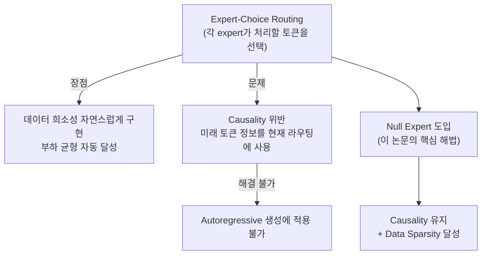
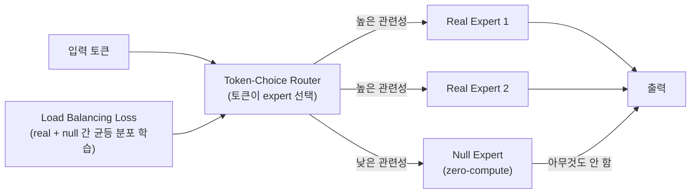

# MoE 연산 효율 개선: 가중치 희소성과 데이터 희소성의 결합

- arXiv: 2601.15370
- 발표: 2026-01-21
- 저자: Maciej Kilian, Oleg Mkrtchyan, Luke Zettlemoyer, Akshat Shrivastava, Armen Aghajanyan

## 핵심 기여

MoE(Mixture-of-Experts)의 연산 효율성을 개선하기 위해 **두 종류의 희소성을 결합**하는 방법을 제안하며, 이를 autoregressive 언어 모델 설정에서 causality를 위반하지 않고 구현하는 방법을 제시한다.

- **가중치 희소성(Weight Sparsity)**: 각 토큰이 전체 expert 중 일부만 활성화 (기존 MoE의 핵심)
- **데이터 희소성(Data Sparsity)**: 각 expert가 전체 토큰 중 일부만 처리 (이 논문의 신규 기여)

두 희소성의 조합으로 FLOP-loss 트레이드오프를 개선하고, 멀티모달 설정에서 modality-aware routing이 자발적으로 등장하는 현상을 발견했다.

## 문제 설정: Expert-Choice Routing의 딜레마

기존 expert-choice routing은 expert가 자신이 처리할 토큰을 선택하는 방식이다. 이는 데이터 희소성을 자연스럽게 구현하지만 **미래 토큰 정보가 현재 라우팅 결정에 스며드는 causality 위반** 문제가 있어 autoregressive 모델에 적용할 수 없었다.

## 핵심 메커니즘: Null Expert

### 구조

기존 MoE의 라우팅 풀에 zero-compute "null expert"를 추가한다.

| Expert 유형 | 연산 비용 | 역할 |
|------------|---------|------|
| Real Expert | 정상 FLOP | 실제 특징 변환 수행 |
| **Null Expert** | **0 (zero-compute)** | 토큰을 사실상 스킵 |

### 작동 원리

표준 load balancing objective가 real expert와 null expert 사이의 **균등한 사용**을 학습하도록 유도한다. 그 결과:
1. 일부 토큰이 null expert로 라우팅됨 → 해당 토큰에 대한 연산 zero
2. Expectation 기준으로 데이터 희소성 달성
3. Token-choice 라우팅을 유지하므로 causality 위반 없음

Null expert는 "skip connection의 MoE 버전"처럼 작동한다. 모델이 "이 토큰에는 변환이 필요 없다"고 판단할 때 null expert를 선택하는 방식이다.

## 가중치 희소성 vs 데이터 희소성 비교

| 속성 | 가중치 희소성 (기존 MoE) | 데이터 희소성 (이 논문) |
|------|----------------------|----------------------|
| 희소성 단위 | 파라미터 (expert 단위) | 데이터 (토큰 단위) |
| 메커니즘 | 토큰당 일부 expert만 활성화 | 일부 토큰만 실제 연산 수행 |
| 결과 | 전체 파라미터 대비 활성 FLOP 절감 | 토큰별 연산량 추가 절감 |
| Autoregressive 호환 | 기본 호환 | null expert로 해결 |

두 희소성을 결합하면 더 낮은 FLOP 예산에서 동일한 loss를 달성하는 compute-efficient frontier를 이동시킨다.

## 주요 실험 결과

**정량적 개선:**
- 가중치 희소성 단독 대비 compute-efficient frontier 개선
- Training loss와 downstream task 성능 모두 개선
- 동일 FLOP 예산에서 더 낮은 loss 달성

**예상치 못한 발견 - Modality-Aware Routing:**

> 멀티모달 설정에서 explicit한 modality label 없이도, vision token이 text token보다 null expert로 훨씬 더 자주 라우팅됨

이는 모델이 자동으로 "시각 토큰은 덜 처리해도 된다" 혹은 "시각-언어 통합 지점에서만 처리하면 된다"는 패턴을 학습한다는 의미다. Modality-specific compute 할당이 외부 지시 없이 자발적으로 등장한 것이다.

## 핵심 시사점

**Autoregressive + Expert-Choice의 오랜 긴장 해결:**
Expert-choice routing과 autoregressive 생성의 비호환성은 오랜 제약이었다. Null expert는 token-choice 방식을 유지하면서도 expert-choice의 핵심 이점(데이터 희소성)을 누릴 수 있는 우아한 해법이다.

**멀티모달 MoE 자동 compute 할당:**
멀티모달 모델에서 modality별 연산량을 어떻게 배분할지는 비자명한 문제였다. Null expert routing이 이를 데이터 기반으로 자동 결정한다는 발견은 멀티모달 아키텍처 설계에 중요한 함의를 갖는다.

## 실무 관점

- 멀티모달 MoE 모델(예: 텍스트+비전 통합 모델) 학습 시 null expert를 도입하면 modality별 compute 배분을 별도로 설계하지 않아도 됨
- 기존 MoE 학습 파이프라인에서 변경이 최소화됨: routing pool에 null expert를 추가하고 기존 load balancing loss를 그대로 적용
- Autoregressive 서빙 시 null expert로 라우팅되는 토큰은 연산이 없으므로 배치 추론 효율 개선 가능

## 관련 문서

- [[moe-original-paper]] -- Shazeer et al. (2017). 희소 게이팅 MoE 원논문. load balancing auxiliary loss 원형
- [[moe-scaling-laws-paper]] -- MoE 스케일링 법칙 이론 프레임워크. 활성 용량 vs 라우팅 조합론
- [[mixtral-paper]] -- 실전 Sparse MoE 구현. Top-2 라우팅
- [[deepseek-v3-paper]] -- 보조 손실 없는 부하분산 MoE 최신 구현
