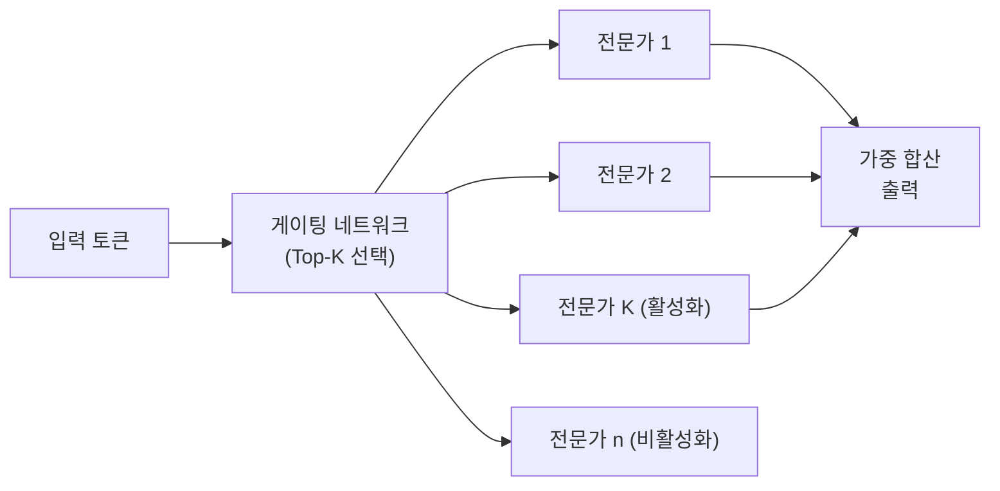

# Outrageously Large Neural Networks: The Sparsely-Gated MoE Layer (Shazeer et al., 2017)

## 핵심 기여

Google의 Noam Shazeer 등이 2017년 발표한 이 논문은 **수천 개의 전문가(expert) 서브네트워크 중 소수만 활성화**하는 희소 게이팅(sparsely-gated) MoE(Mixture of Experts) 레이어를 LSTM 기반 언어 모델에 적용해 당시 최대 규모인 137B 파라미터 모델을 효율적으로 학습하는 방법을 제안했다. GPT-4, Mixtral, DeepSeek-MoE 등 현대 대형 MoE LLM의 직접 원형이다.

## 방법

### MoE 레이어 구조

각 MoE 레이어는 $n$개의 전문가(feed-forward 서브네트워크) $E_1, ..., E_n$과 게이팅 네트워크(gating network) $G$로 구성:

$$\text{MoE}(x) = \sum_{i=1}^{n} G(x)_i \cdot E_i(x)$$

### 희소 게이팅 (Noisy Top-K Gating)

게이팅 네트워크가 소수의 전문가(Top-K, 보통 K=1 또는 K=2)만 선택:

$$G(x) = \text{Softmax}(\text{TopK}(H(x), k))$$

$$H(x)_i = (x \cdot W_g)_i + \epsilon \cdot \text{Softplus}((x \cdot W_{noise})_i)$$

- $\epsilon$: 탐험(exploration)을 위한 표준 정규 노이즈 (훈련 시에만 적용)
- 비선택된 전문가: -∞로 마스킹 (softmax 후 0이 됨)

### 부하 분산 (Load Balancing)

**핵심 과제**: 모든 입력이 특정 전문가에 몰리는 "승자 독식" 문제.

**해결책 - 보조 손실(auxiliary loss)**:
$$L_{aux} = \text{CV}(\text{load})^2$$
각 전문가의 처리량 분산을 최소화하는 보조 손실 항으로 부하 균등 분산을 유도.

## 결과 및 영향

- 1370억(137B) 파라미터 모델이 당시 LSTM 언어 모델 SOTA 달성
- 동일 연산량에서 희소 MoE가 밀집(dense) 모델보다 월등히 우수한 성능 (조건부 연산의 효율)
- **현대 MoE LLM의 원형**: Google Switch Transformer(2021), GPT-4(MoE 추정), Mixtral 8x7B(2023), DeepSeek-MoE(2024)로 이어지는 계보
- "전문가 병렬성(expert parallelism)"이라는 새로운 분산 학습 패러다임 제시

## 한계

- 전문가 부하 불균형(load imbalance) 문제 - 보조 손실로 완화하지만 완전히 해결되지 않음
- 전문가 간 통신 오버헤드가 분산 학습에서 병목 (All-to-All 통신)
- Top-K 게이팅이 미분 불가능 - 보조 손실로 우회하는 방식
- 전문가 수가 많을수록 메모리 요구량이 선형적으로 증가

## 실무 적용 관점

- MoE의 핵심 장점: **활성 파라미터는 적게(추론 비용 절감)**, **전체 파라미터는 많게(표현력 확보)**
- Mixtral 8x7B는 7B 모델의 추론 비용으로 40B+ 수준의 성능 - 실용적 MoE의 대표 사례
- 프로덕션 MoE 서빙 시 전문가 배치(placement)와 라우팅 효율이 지연 시간(latency)에 직접 영향
- K=2가 K=1보다 성능이 높지만 통신 오버헤드도 증가 - 트레이드오프 고려 필요

## 관련 문서

- [[Mixture of Experts (MoE)]]
- [[expert-parallelism]]
- [[DeepSeek-R1 논문]]
- [[moe-routing-advances]]
