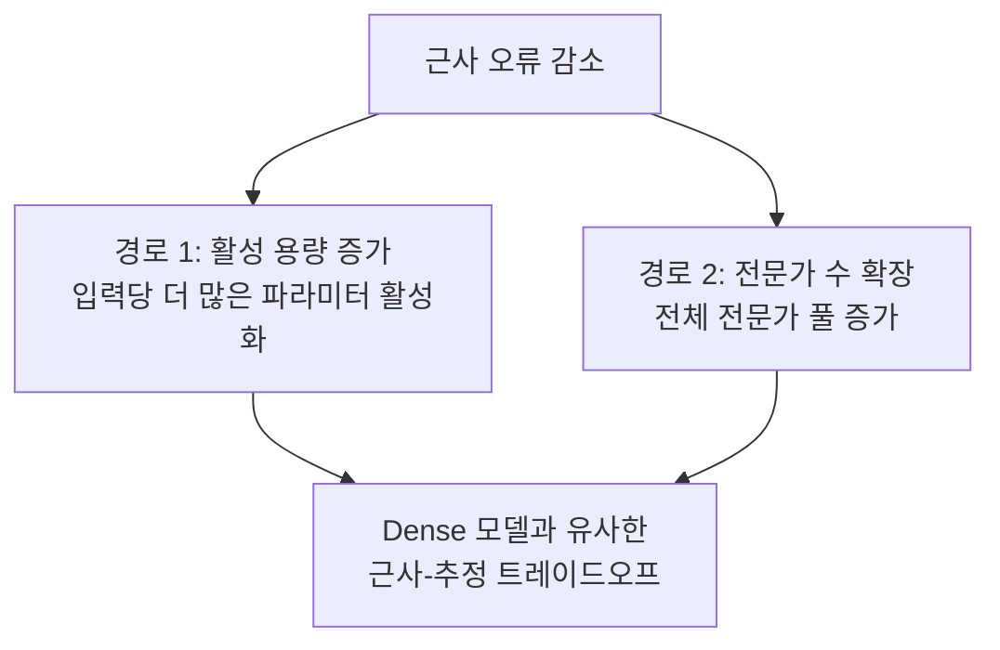

# MoE Transformer의 일반화와 스케일링 법칙

## 핵심 기여

Mixture-of-Experts(MoE) Transformer에 대한 **일반화 경계, 근사 이론, 스케일링 법칙을 통합**하는 이론적 프레임워크를 개발한다. 핵심 구분은 입력별 활성 용량(active capacity)과 라우팅 조합론(routing combinatorics)의 분리다.

핵심 성과:
- MoE 특유의 라우팅 비용을 포함한 일반화 경계(covering-number bounds) 도출
- 활성 용량 증가 또는 전문가 수 확장을 통한 오류 감소를 구성적으로 증명
- 모델 크기/데이터 크기/계산량의 최적 트레이드오프 관계 수립

## 문제 정의

기존 dense Transformer의 스케일링 법칙(Kaplan et al., Chinchilla)은 잘 확립되어 있지만, MoE 아키텍처에서는:
- 전체 파라미터 수 vs 입력별 활성 파라미터 수의 구분이 이론에 반영되지 않음
- 라우터(gating network)의 조합적 선택이 일반화에 미치는 영향이 불분명
- "전문가를 늘리면 항상 좋은가?"에 대한 이론적 답이 없음

## 이론적 프레임워크

### 1. 일반화 경계 (Generalization Bounds)

Covering-number 경계를 도출하되, MoE 특유의 구조를 반영:
- 메트릭 엔트로피가 **활성 파라미터 예산**에 의존
- 고정 라우팅 패턴에 대한 조건부 분석(conditioning) + 라우팅 패턴 전체에 대한 union bound
- 라우팅 비용이 일반화 경계에 추가적 항으로 등장

### 2. 근사 이론 (Approximation Theory)

구성적 증명(constructive proof)으로 두 가지 오류 감소 경로를 입증:

MoE에서 오류 감소는 활성 용량 증가와 전문가 수 확장 두 경로를 통해 달성되며, dense 모델과 유사한 근사-추정 트레이드오프를 보인다.

### 3. Neural Scaling Laws

모델 크기($N$), 데이터 크기($D$), 계산량($C$) 간의 관계를 MoE 맥락에서 수립:
- Dense 모델의 Chinchilla 법칙을 MoE로 확장
- 활성 파라미터 / 전체 파라미터 비율이 새로운 변수로 등장
- Compute-optimal 배분에서 전문가 수와 활성 용량의 최적 비율 제시

## 실무 적용 관점

- **MoE 아키텍처 설계 가이드**: 전문가 수 vs 활성 용량의 이론적 최적점 참조 가능
- **Worst-case vs Data-dependent**: 이론적 보장이 있는 행동과 데이터/최적화에 의존하는 행동을 구분하는 기준 제공
- DeepSeek-V3, Mixtral 같은 실전 MoE 모델의 설계 결정에 이론적 근거 부여

**구현 측면 보완 연구**: Kilian et al. (arXiv 2601.15370)은 null expert를 도입해 가중치 희소성에 데이터 희소성을 결합함으로써 compute-efficient frontier를 추가로 개선한다. 이 논문의 이론적 프레임워크가 제시하는 활성 용량 최적화와 상보적인 구현 접근법이다.

## 관련 문서

- [[neural-scaling-laws|Neural Scaling Laws]] -- Kaplan/Chinchilla 스케일링 법칙 기초
- [[Sparsely-Gated MoE]] -- MoE 원논문
- [[Mixtral 8x7B]] -- 실전 Sparse MoE 모델
- [[DeepSeek-V3]] -- MLA + 보조 손실 없는 MoE 최신 구현
- [[moe-null-expert-paper]] -- Null expert로 데이터 희소성 도입. Autoregressive MoE + Expert-choice 결합
