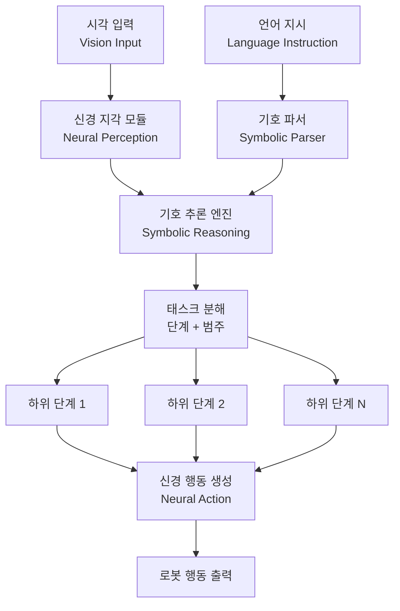

# NS-VLA: 뉴로-심볼릭 비전-언어-행동 모델

## 핵심 기여

신경망(neural network)과 기호 추론(symbolic reasoning)을 결합한 **뉴로-심볼릭(neuro-symbolic) VLA 모델**을 제안한다. 기존 순수 신경망 기반 VLA가 대규모 연산과 데이터를 요구하면서도 낮은 성공률을 보이는 문제를 해결하여, 극적인 성능 향상과 에너지 절감을 동시에 달성한다.

핵심 성과:
- **성공률 95%** (표준 VLA 34% 대비, 약 2.8배)
- **에너지 100x 절감**: 학습 시 1%, 추론 시 5%의 에너지만 사용
- 실제 로봇 태스크에서 검증

## 문제 정의

VLA(Vision-Language-Action) 모델은 시각 입력과 언어 지시를 받아 로봇 행동을 생성하는 멀티모달 시스템이다. 기존 접근의 한계:

| 문제 | 설명 |
|------|------|
| 낮은 성공률 | 표준 VLA 시스템의 로봇 태스크 성공률이 34% 수준 |
| 과도한 에너지 소비 | 대형 신경망의 학습/추론에 막대한 연산 자원 필요 |
| 블랙박스 의사결정 | 순수 신경망 기반이라 로봇의 행동 근거를 설명할 수 없음 |
| 일반화 한계 | 학습 분포 밖의 새로운 상황에 취약 |

## 방법론: 뉴로-심볼릭 통합

NS-VLA는 인간이 문제를 해결하는 방식에서 영감을 받아, 복잡한 태스크를 **단계와 범주로 분해하는 기호 추론**과 **지각/행동을 처리하는 신경망**을 결합한다.

위 다이어그램은 시각/언어 입력이 신경망과 기호 추론 엔진을 거쳐 로봇 행동으로 변환되는 과정을 보여준다.

### 뉴로-심볼릭 분업

| 모듈 | 역할 | 방식 |
|------|------|------|
| **신경 지각(Neural Perception)** | 시각 입력에서 객체/관계 인식 | 신경망 |
| **기호 파서(Symbolic Parser)** | 언어 지시를 구조화된 목표로 변환 | 기호 처리 |
| **기호 추론(Symbolic Reasoning)** | 태스크를 논리적 단계로 분해 | 규칙 기반 추론 |
| **신경 행동(Neural Action)** | 각 단계에 대한 저수준 행동 생성 | 신경망 |

### 에너지 효율의 원리

기존 VLA가 전체 파이프라인을 하나의 거대 신경망으로 처리하는 반면, NS-VLA는:

- **기호 추론 부분**: 연산량이 매우 적음 (규칙 기반 처리)
- **신경망 부분**: 축소된 범위의 하위 태스크만 처리하므로 소형 모델로 충분
- 결과적으로 학습 에너지 1%, 추론 에너지 5%로 대폭 절감

## 실험 결과

| 지표 | NS-VLA | 표준 VLA |
|------|--------|----------|
| 태스크 성공률 | **95%** | 34% |
| 학습 에너지 | **1%** (100x 절감) | 100% (기준) |
| 추론 에너지 | **5%** (20x 절감) | 100% (기준) |

실제 로봇 환경에서 조작(manipulation) 태스크로 검증되었으며, 기호 추론의 태스크 분해가 올바른 경우 거의 항상 성공하는 패턴을 보인다.

## 한계 및 향후 연구

- 기호 추론의 규칙 설계가 도메인 특화적이므로 새로운 태스크 영역으로의 전이에 추가 작업 필요
- 매우 동적이고 예측 불가능한 환경에서 기호 추론의 한계 가능성
- 기호 표현과 신경망 표현 간의 인터페이스 설계에 추가 연구 필요
- 더 복잡한 장기 태스크(long-horizon task)에서의 확장성 검증 필요

## 실무 관점

- **로보틱스 배포**: 에너지 100x 절감은 배터리 기반 로봇에서 운용 시간을 극적으로 늘릴 수 있음
- **설명 가능한 AI**: 기호 추론 계층이 로봇의 의사결정 근거를 명시적으로 제공하므로, 안전 인증이 필요한 산업용 로봇에 적합
- **소규모 학습 데이터**: 기호 추론이 구조를 제공하므로 순수 신경망 대비 적은 데이터로 학습 가능
- LLM 에이전트의 도구 사용 패턴과 유사한 "계획 후 실행" 구조로, [[subagents]]의 로보틱스 버전으로 볼 수 있음

## 관련 문서

- [[subagents]] - 에이전트의 태스크 분해 패턴과의 유사성
- [[agent-trees]] - 에이전트 트리 구조와의 아키텍처적 유사점
- [[how-coding-agents-work]] - 계획-실행 분리 패턴의 소프트웨어 버전
- [[plan-and-act-paper]] - 계획과 행동 분리의 이론적 기초
