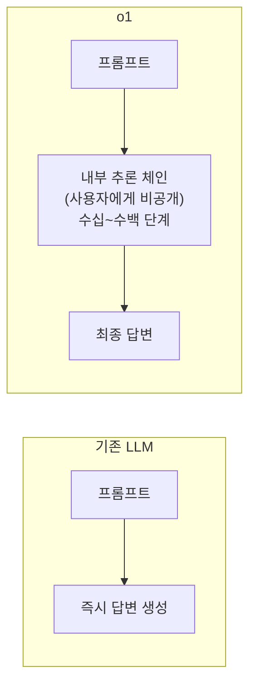

# OpenAI o1 System Card (OpenAI, 2024)

## 핵심 기여

OpenAI가 2024년 9월 발표한 o1(코드명 "strawberry")은 **Chain-of-Thought(CoT)를 모델 내부에 내재화**한 최초의 대규모 추론 모델이다. 기존 LLM이 한 번의 전방 패스로 답을 출력하는 것과 달리, o1은 답변 전 수십~수백 단계의 내부 추론 과정을 거친다. 수학, 코드, 과학적 추론에서 전문가 수준을 달성했으며, **테스트 타임 컴퓨트(test-time compute) 스케일링** 패러다임 전환을 이끌었다.

## 방법

### 핵심 접근법: 내재화된 CoT

기존 프롬프팅 기반 CoT(Wei et al., 2022)와 달리:

- **숨겨진 CoT(Hidden Chain-of-Thought)**: 추론 과정이 실제로 실행되지만 사용자에게 표시되지 않음 (요약만 표시)
- **강화학습으로 추론 학습**: "더 오래 생각할수록 더 좋은 답"이 나오도록 RL로 최적화
- **추론 토큰 예산(Reasoning Token Budget)**: 추론에 사용할 토큰 수 조절 가능 (저/중/고 사고 모드)

### 성능 - 추론 시간 컴퓨트 스케일링

테스트 시간 컴퓨트를 늘릴수록 성능이 향상되는 스케일링 법칙 적용:

$$\text{성능} \propto f(\text{추론 토큰 수})$$

### 안전 평가 항목 (System Card)

| 위험 분류 | 평가 내용 |
|-----------|----------|
| CBRN | 화학/생물/방사선/핵 무기 정보 제공 위험 |
| 설득 조작 | 허위 정보 생성 및 대규모 설득 능력 |
| 사이버 보안 | 악성 코드 생성, 취약점 악용 |
| 자율성 | 인간 감독 없는 독립적 행동 추구 |

**안전 등급**: o1이 최초로 Medium risk 카테고리 평가 적용. 이전 모델들은 Low.

## 결과 및 영향

- **수학 경쟁(AIME 2024)**: 83.3% (GPT-4o 13.4% 대비)
- **코딩(Codeforces)**: Elo 1673점 (상위 ~11%)
- **과학(GPQA Diamond)**: 78% (인간 전문가 69.7% 초과)
- 테스트 타임 컴퓨트 스케일링이 파라미터 스케일링과 동등하거나 더 효율적임을 실증
- o3(2024.12), o4-mini(2025.4) 등 추론 모델 계열 확립
- Anthropic Claude의 Extended Thinking, Google Gemini Thinking과 경쟁 구도 형성

## 한계

- 추론 과정이 사용자에게 불투명 (숨겨진 CoT) - 디버깅 어려움
- 단순 태스크에서도 과도한 추론 토큰 소비 - 비용 비효율
- 지식 커트오프(knowledge cutoff) 이후 사실에 대한 추론은 여전히 환각 발생
- 대화 맥락 유지보다 단일 복잡 문제 해결에 최적화 - 멀티턴 대화 품질은 GPT-4o보다 낮음
- API 비용이 GPT-4o 대비 3-10배 높음

## 실무 적용 관점

- **언제 o1 계열을 쓸 것인가**: 수학 증명, 복잡한 코드 디버깅, 과학적 분석, 멀티스텝 계획 수립
- **언제 일반 LLM을 쓸 것인가**: 단순 QA, 글쓰기, 코드 자동완성, 비용 민감 대량 처리
- 추론 토큰 예산 조절로 정확도 vs. 비용 트레이드오프 관리 가능
- o1 모델의 CoT 모니터링 필요성 - 숨겨진 추론에서 안전 위반이 발생할 경우 탐지 어려움
- Chain-of-Thought 내재화 패러다임은 에이전트 자율 추론 능력 향상의 핵심 방향

## 관련 문서

- [[Chain-of-Thought 프롬프팅 (Wei et al.)]]
- [[test-time-compute]]
- [[scaling-laws]]
- [[cot-monitoring-safety]]
- [[ai-reasoning-models]]
