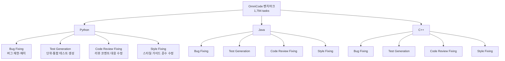

# OmniCode: 소프트웨어 엔지니어링 에이전트 다국어 종합 벤치마크

- arXiv: 2602.02262
- 발표: 2026-02-02 (개정 2026-02-06)
- 소속: Cornell University 및 공동 연구 기관
- 주요 저자: Atharv Sonwane, Eng-Shen Tu, Wei-Chung Lu, Claas Beger, Kevin Ellis, Saikat Dutta 외 8명

## 핵심 기여

HumanEval, SWE-Bench 등 기존 코딩 에이전트 벤치마크의 두 가지 구조적 한계를 동시에 해결한다.

1. **범위의 편협성**: 경쟁 프로그래밍 문제(HumanEval)나 버그 패치 단일 과제(SWE-Bench)에 국한
2. **언어 편향**: 거의 전적으로 Python만 평가

OmniCode는 **1,794개 과제, 3개 언어(Python/Java/C++), 4개 범주**로 구성된 포괄적 SWE 에이전트 벤치마크다. 멀티링구얼·멀티태스크 평가가 에이전트의 실제 역량을 측정하는 데 필수적임을 실증한다.

## 벤치마크 구조

4개 범주 × 3개 언어 = 12개 평가 축으로 에이전트 성능의 다차원 프로파일을 도출한다.

### 4가지 과제 범주

| 범주 | 설명 | 기존 벤치마크 대비 |
|------|------|-------------------|
| Bug Fixing | 버그 재현 + 패치 생성 | SWE-Bench와 유사하지만 다국어 |
| Test Generation | 기존 코드에 단위/통합 테스트 작성 | 대부분 벤치마크에 없음 |
| Code Review Fixing | 코드 리뷰 코멘트에 맞게 수정 | 신규 |
| Style Fixing | 스타일 가이드 준수 변환 | 신규 |

## 방법론적 강점

**데이터 품질 보장:**
- **수동 검증(Manual Validation)**: 정의가 불명확하거나 애매한 과제를 전문가가 직접 제거
- **합성 과제 생성(Synthetic Task Generation)**: 학습 데이터 누설(data leakage) 방지. 기존 공개 데이터셋에서 단순 추출하지 않음

**평가 설계:**
- SWE-Agent 등 기존 에이전트 프레임워크와 다양한 LLM(DeepSeek-V3.1 포함) 조합 평가
- 언어 × 범주 조합별 세분화 성능 측정으로 모델별 강약점 프로파일 파악 가능

## 주요 실험 결과

SWE-Agent + DeepSeek-V3.1 조합을 대표 사례로 분석한 결과:

| 언어 | 범주 | 성능 | 비고 |
|------|------|------|------|
| Python | Bug Fixing | 상대적으로 양호 | 학습 데이터 풍부 |
| Java | Bug Fixing | 낮음 | 언어 간 격차 명확 |
| Java | Test Generation | **최고 20.9%** | 전 조합 최저 수준 |

- 모든 모델에서 **영역별 성능 편차가 극심**하게 관찰됨
- Python bug fix에 특화된 성능과 그 외 조합의 성능 사이에 현저한 격차

## 핵심 시사점

**"Python bug fix specialist" 한계:**
현재 코딩 에이전트는 Python 버그 수정 전문가에 가깝다. Java test generation 최고 20.9%라는 수치는 멀티링구얼 SWE 역량이 실질적으로 부재함을 의미한다. Python 편향 학습 데이터가 멀티링구얼 일반화를 가로막고 있다는 강력한 증거다.

**벤치마크 과적합 경고:**
SWE-Bench에서 높은 성능이 실제 SWE 역량을 반영하지 않을 수 있다. OmniCode는 벤치마크 과적합에 대한 반례로, 포괄적 멀티태스크·멀티링구얼 평가의 필요성을 제기한다.

**향후 에이전트 학습 방향:**
- Test generation, code review fixing이 미개척 집중 영역
- 다국어 코드 생성 데이터 균형 확보가 선결 과제

## 실무 관점

- 코딩 에이전트를 프로덕션에 배치할 때 Python 외 언어(Java, C++)의 bug fix·test gen 성능은 별도 검증 필요
- 벤치마크 리포트에서 SWE-Bench 단일 수치만 참조하는 것은 불충분
- OmniCode 기반 평가를 모델 선택 기준에 포함하면 실제 다국어 코드베이스 환경과의 간극을 줄일 수 있음

## 관련 문서

- [[coding-agents-general-agents-paper]] -- ERP 도메인 자동화 평가. 코딩 에이전트의 범용화 한계를 다른 각도에서 조명
- [[featbench-paper]] -- 기능 수준 코드 생성 벤치마크. 최고 모델 29.94% 해결률
- [[long-horizon-agent-benchmarks]] -- 복잡 과제 평가를 위한 에이전트 벤치마크 연구 흐름
