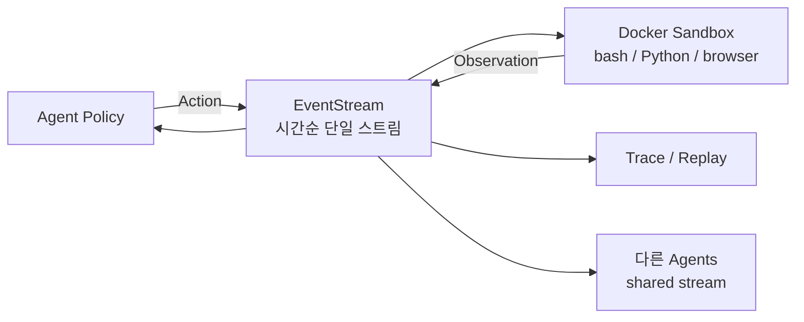

# OpenHands: An Open Platform for AI Software Developers as Generalist Agents (Wang et al., 2024)

## TL;DR

OpenHands(구 OpenDevin)는 **AI 소프트웨어 엔지니어링 에이전트를 위한 통합 개발/실행/평가 플랫폼**이다. 핵심은 **EventStream 아키텍처** — 에이전트의 액션과 환경 관찰을 단일 시간순 스트림으로 모델링해 디버깅·재현·다중 에이전트 협력을 단일 추상화로 처리한다. Docker 기반 sandbox에서 코드 실행, 15+ 평가 벤치마크(SWE-Bench, WebArena, GAIA, MINT 등) 통합, MIT 라이선스로 188+ 기여자, 2.1K+ 기여(논문 시점)의 활발한 커뮤니티 프로젝트.

## 핵심 기여

1. **OpenHands(구 OpenDevin) 오픈소스 플랫폼** — AI 소프트웨어 엔지니어링 에이전트를 위한 통합 개발/실행/평가 환경
2. **EventStream 아키텍처** — 에이전트의 액션과 환경 관찰을 단일 시간순 스트림으로 모델링
3. **샌드박스 코드 실행** — Docker 기반 격리 환경
4. **멀티 에이전트 협력 지원** — 여러 에이전트가 공유 EventStream을 통해 상호작용
5. **15+ 평가 벤치마크 통합** — SWE-Bench, WebArena, GAIA, MINT 등을 단일 인터페이스
6. **커뮤니티**: 188명+ 기여자, 2.1K+ 기여 (논문 시점), MIT 라이선스

## 방법론

- **EventStream**: `Action`(에이전트 출력)과 `Observation`(환경 응답)을 동일 이벤트 스트림에 기록. 모든 상태 변화는 이벤트
- **Action types**: `CmdRun`, `IPythonRun`, `BrowserNavigate`, `FileEdit`, `MessageAction` 등
- **Observation types**: `CmdOutput`, `FileRead`, `BrowserOutput` 등
- **Runtime sandbox**: Docker 컨테이너에서 bash/Python/browser 실행, 네트워크/파일시스템 격리
- **Agent abstraction**: `Agent` 클래스 상속해 새 전략 추가
- **Evaluation harness**: 벤치마크별 task adapter로 동일 ExecutionEngine에서 평가

## 실험/결과

- **15개 벤치마크 통합 실험** — SWE-Bench, WebArena, MINT, GAIA, GorillaAPIBench, HumanEvalFix, BIRD, ToolQA 등
- 다양한 LLM (GPT-4, Claude, DeepSeek 등) 및 에이전트 전략을 동일 플랫폼에서 비교
- SWE-Bench Lite에서 CodeAct 에이전트 기반 경쟁력 있는 결과 보고
- 후속 PR로 SWE-bench 점수가 빠르게 50%+ 까지 개선

## 하네스 엔지니어링 관점

- **EventStream 추상화 가치** — 에이전트 trajectory를 일관된 형식으로 저장/재현 가능. 디버깅·평가·multi-agent에 동일 구조 적용 ([[agent-event-driven-pattern]], [[agent-observability-tracing]])
- **샌드박스 분리** — 호스트 시스템과의 격리는 production agent harness의 필수 요건 ([[ai-agent-security]])
- **Runtime ↔ Agent 분리** — 실행 환경과 정책(에이전트)을 분리하면 멀티 모델/멀티 전략 비교 용이
- **MIT 라이선스 + 활발한 커뮤니티** — 자체 harness를 처음부터 만들기보다 OpenHands를 fork하거나 plugin으로 확장하는 전략이 합리적
- **Plugin 아키텍처** — 새 도구·새 액션 타입을 정의하면 EventStream에 자연스럽게 합류

## 한계 / 후속 연구

- 초기 SWE-Bench 점수는 [[swe-agent-paper]] 등 specialized harness 대비 낮았으나 후속 PR에서 빠르게 개선
- 브라우저 자동화는 여전히 신뢰도 낮음
- Long-horizon task에서 EventStream이 길어지면 컨텍스트 관리가 도전 — context folding/summary 후속 연구 필요

## 관련 자료

- 공식: all-hands.dev
- GitHub: All-Hands-AI/OpenHands
- [[swe-agent-paper]] — ACI 개념 비교
- [[swe-bench-paper]] — 1차 평가 대상
- [[autogen-paper]] — 멀티 에이전트 추상화 비교
- [[langgraph-mt-paper]] — graph-based 비교
- [[agent-event-driven-pattern]]
- [[agent-observability-tracing]]
- [[anthropic-harness-design]]
- [[swe-bench-ecosystem-2026]]
